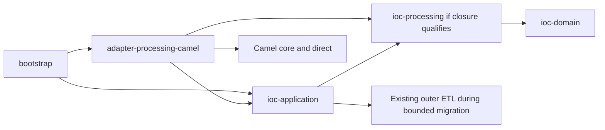

# Camel applicability and adjacent-module migration

Task-level mapping and source-backed work packages: [Camel task design](camel-task-design.md).

Status: research and proposed qualification plan, 2026-09-27. Source inspected
at `f43037ee87ef`, branch `module/platform/router`; no implementation, dependency
resolution experiment or benchmark has been performed. This reopens the earlier
JDK-only recommendation: existing code is an asset to evaluate, not a reason to
exclude replacing execution mechanisms. NiFi/Beam remain pattern references.

## Conclusion

Camel is a credible candidate for execution of configured processing plans,
not merely an alternative implementation of `Router.select`. Compare two targets:
(A) bounded JDK selection with the current executor, and (B) a Camel execution
adapter replacing sequencing/fan-out in the migrated processing scope. Do not
build a new generic JDK routing module before this decision. A Camel selector
wrapped by a second custom dispatcher is the least attractive target unless
measurements or contracts demonstrate a specific benefit.

The [task-level follow-up](camel-task-design.md) refines B: the final document
entry must precede deduplication/classification, and processed import needs split
input admission and output finalization. Replacing PrepareArtifactsStage alone
is a mechanics experiment, not requirement completion.

The recommended next qualification target is B, starting with side-effect-free
preparation shared by extraction and processed import. Existing durable use cases
remain outside Camel. Adoption is conditional on behavioral parity and a real
reduction in custom execution code. The result may still favor A if the Camel
adapter merely adds conversion and wrappers around unchanged loops.

## Actual repository seams

| Source owner | Observed responsibility | Migration consequence |
|---|---|---|
| `IocExtractionService` | Builds a fixed pipeline and directly holds PipelineRunner; constructs metadata and translates ExtractionResult | Introduce a narrow application-owned execution/preparation port rather than injecting Camel into application |
| `PipelineRunner` | Stage sequencing, run/stage scopes, bounded diagnostic accumulation, append-only delta checks, policy after each stage | Sequencing can move; diagnostic semantics require an explicit single owner, not generic Camel logging |
| `PrepareArtifactsStage` | Sequentially calls each preparer over retained and occurrence batches | Natural first replacement seam; replace this dispatch in migrated scope rather than invoke it inside another fan-out |
| `CsvArtifactPreparer` / ConfigurableRowMapper | Mapping and filters interleaved with configured candidate selection | Extract pure mapping once; key/winner policies remain existing application owners |
| `CsvProcessedImportRowPreparer` | Structured-cell conversion and derived-value preparation | Share typed operations with extraction, retain row/cardinality and ABSENT/NULL/VALUE semantics |
| `WriteArtifactsStage` | Iterates artifact plans, writes canonical data then projects per artifact | Do not infer one document-wide transaction; preserve existing write/recovery boundaries |
| `DataframeImportProcessingService` | Durable staging/promotion state transitions and receipt-based recovery | Keep outside Camel processing routes; do not replace with in-memory route state |

Important correction to broad transaction shorthand: document WriteArtifactsStage
writes/projects plans in a loop, whereas managed import has a cross-artifact
promotion transaction. A successful preparation barrier is not proof of a single
transaction over the whole document. Migration must preserve each flow's actual
contract, including recovery after canonical commit and projection failure.

## Alternatives and ownership

| Option | What changes | Benefit | Principal cost / verdict |
|---|---|---|---|
| A: JDK Router + current ETL | New bounded selector and configuration bindings | Small initial change; neutral contracts | We maintain future execution extensions; keep as comparison baseline |
| B: Camel preparation runtime | Replace branch/operation execution in shared preparation | Established composition mechanisms with bounded migration | Adapter, plan compilation and diagnostic bridge; preferred qualification target |
| C: Camel full extraction runtime | Replace linear PipelineRunner path for extraction, retaining application write operations | One execution owner across extraction | Wider parity surface: every stage, CLI outcomes, dry-run and observer behavior; follow B only with evidence |
| D: Camel also owns intake/import recovery/sync | Replace pollers, scheduling and durable coordination | Potential eventual transport consolidation | Unproven benefit and broad lifecycle/SMB/recovery impact; separate future project |

B is a valid bounded target if outer application orchestration only calls one
preparation port and retains intake/commit control. It is not valid to have both
PipelineRunner and Camel drive the same inner operations, collect their same
diagnostics or retry the same work. Temporary comparison implementations are
allowed; production selects one implementation per flow. Never dual-run writes.

## Dependency and module design for B

Arrows are compile-time dependencies. Application declares the required port;
the adapter implements it. At runtime application calls the port and the adapter
invokes pure operations. This is dependency inversion, not a Maven cycle.
`Exchange`, Processor, CamelContext, endpoint URIs and RouteBuilder never enter
application/domain contracts. Add explicit Camel bans to architecture/build
checks rather than exploiting the current Enforcer list's omissions.

Start with an application-specific preparation contract over typed inputs and
outputs; do not preemptively extract a public generic FlowEngine. A document
batch and an import row need distinct entry contracts, while sharing view,
classification and field-mapping operations. Do not flatten both to Object or
make a record route hold a whole unbounded import. The placement of reusable
operation values in ioc-processing remains subject to the existing dependency
closure audit. Its types must not depend back on application write plans.

Inside the adapter, separate plan compilation, typed operation bridges, runtime
lifecycle and result/error adaptation. Bootstrap binds the agreed parameterized
predicate catalog and AND/OR/NOT, validates configuration, and supplies operation
bindings. Adapter compilation generates Camel routes from that admitted plan.
The operator does not gain unrestricted Camel YAML, Simple, bean reflection or
arbitrary endpoint URIs. Camel DSL is an implementation detail. Permit only
registered local destinations; input data never constructs endpoint addresses.

No platform-routing implementation is automatically required for B. Keep a
small neutral selector only if EXCLUSIVE/preselection semantics justify it;
place it locally first and avoid both a Camel condition tree and a second JDK
tree evaluating the same conditions. Revisit separate module admission based
on the selected responsibilities, rather than preserving a module name at any cost.

## Mapping requirements to Camel

[Direct](https://camel.apache.org/components/4.22.x/direct-component.html) supports
in-context invocation. Use synchronous request/reply boundaries with explicitly
configured missing-consumer failure (no startup wait), stable internal endpoints
and bounded shutdown. Bootstrap owns start/stop; readiness requires routes to be
ready before intake. No SEDA, broker or new worker pool is needed for the first
experiment. This does not claim Camel has no internal resources.

FIRST can use [Choice](https://camel.apache.org/components/4.22.x/eips/choice-eip.html).
ALL can dispatch an already selected ordered recipient list. EXCLUSIVE requires
evaluating enough conditions to establish uniqueness before any branch executes;
it is not equivalent to Choice. Selection-before-dispatch is also necessary when
an ALL predicate can fail: earlier branches must not have executed already.
One small preselection step may therefore remain custom even with Camel.

[Recipient List](https://camel.apache.org/components/4.22.x/eips/recipientList-eip.html)
provides routing to computed recipients and configurable aggregation. Bind only
validated local destination IDs, with explicit ordering/failure options. Missing
recipients must fail; do not silently ignore invalid endpoints. Preserve default,
unmatched and ambiguous outcomes from the Router proposal. The earlier unique
regular-destination restriction is still a design choice, not a Camel limitation.

[Multicast](https://camel.apache.org/components/4.22.x/eips/multicast-eip.html)
defaults do not implement our contract automatically: its default result is the
last reply, copies are shallow, and failure does not by default stop remaining
branches. Supply an aggregation strategy that collects branch-local results and
diagnostic deltas, preserving configured order and occurrence metadata. Start
sequentially; use explicit failure options. A timeout is not proof that remaining
parallel tasks have terminated. Business candidate reduction is separate from
Camel reply aggregation and stays with existing policies.

Camel route composition does not prove our typed operation edges, cardinality,
view availability or import authority. Startup validation must still establish
those properties; automatic type conversion must not conceal a bad plan. Start
with validated sequences and branches, not arbitrary cycles or a general graph DSL.

## Failure and persistence contracts

- Expected mapping failures return typed result diagnostics. They are not
  automatically exceptions eligible for retry. Existing failure-policy rules
  remain the authority for accepting a preparation result.
- Unexpected failures stop the preparation invocation and propagate a typed
  application failure. Do not use `handled(true)` or `continued(true)` to make a
  failed computation appear successful.
- Explicitly disable Camel redelivery in the initial runtime. When redelivery
  is enabled, Camel normally retries from the failing processor, not from our
  durable observation boundary. Source: [redelivery semantics](https://camel.apache.org/manual/exception-redelivery.html).
  Existing ledgers retain retry/replay authority. Any later pure-operation retry
  requires a separately reviewed scope.
- During B, Camel returns diagnostics without delivering them; the document
  outer runner/import boundary remains the single delivery owner. During C,
  extract/reuse the current bounded diagnostic mechanics in one common owner
  rather than copying PipelineRunner's implementation into a Camel handler.
  Preserve stage policy checkpoints, error suppression summaries and observer
  close-failure behavior. Camel route completion alone is not CompletionStatus.
- Canonical writing stays behind existing application ports after the preparation
  checkpoint. Camel UnitOfWork is not a replacement for canonical receipts or
  an automatic transaction across DBs and CSV projection. Camel's
  [transactional client](https://camel.apache.org/components/4.22.x/eips/transactional-client.html)
  requires transaction infrastructure; adding `.transacted()` is not the migration
  plan for these existing persistence contracts.
- A branch never confirms TTL, reserves public/canonical identities or writes a
  partial result independently. Import promotion, post-commit recovery, registered
  order and reusable export slots retain their current owners.

## Adjacent modules: retain, adapt, retire

| Module | Necessary or candidate change |
|---|---|
| platform-etl | B retains outer runner; C retires its migrated execution path after consumer inventory. Reuse Stage/Envelope temporarily if useful; do not preserve two permanent schedulers |
| platform-diagnostics / observability | Reuse codes, bounded summaries and sinks; establish one delivery path and map stable stage IDs. Do not log Exchange bodies by default |
| ioc-application | Add inward execution/preparation port; preserve use cases, canonical policies and recovery; remove replaced dispatch |
| ioc-processing candidate | Extract shared pure operation semantics once; engine-independent typed data |
| adapter-csv | Retain CSV parsing/serialization and cell translation; move shared pure mapping out only where dependency closure is sound |
| adapter-processing-camel candidate | Own Camel compile/run bridge, aggregation and lifecycle integration |
| bootstrap | Compile admitted config, inject one runtime, integrate lifecycle/health, pin plan fingerprint |
| adapter-ingest | Keep Spring Integration polling initially; it handles intake, Camel handles processing. No competing poller on the same directory |
| adapter-store-jdbc | Preserve transactions, receipts and migrations; no new engine-owned persistence schema needed |
| adapter-transport-smb | Preserve proven transport behavior. A Camel SMB component is not proof of equivalent encryption, namespace, notify or retention contracts |
| platform-events / concurrency | Retain hint events and keyed execution. Do not add Camel queues/retry that bypass existing serialization |

## Dependency compatibility and operational cost

Repository parent is Boot 4.0.8, Java 21. Camel 4.18 documentation used in the
initial investigation is useful for EIP semantics but is not a matching starter
baseline: the [4.19 upgrade guide](https://camel.apache.org/manual/camel-4x-upgrade-guide-4_19.html)
identifies 4.19 as the first Boot 4 release, with Spring 7 and test-framework
changes. [4.22.1 release notes](https://camel.apache.org/releases/release-4.22.1/)
record a Boot 4.1.1 upgrade. Neither establishes exact compatibility with our
Boot 4.0.8. Do not silently upgrade Boot or import a BOM that overrides existing
security-managed versions merely to make a prototype compile.

The primary qualification version is **Camel 4.22.1 (4.22.x LTS)**,
[announced on 2026-09-17](https://camel.apache.org/blog/2026/09/RELEASE-4.22.1/). Its release
notes confirm Java 17/21/25 support, so our Java 21 is within the declared range.
Record the resolved dependency tree for that exact version. Earlier 4.18/4.19
references are historical compatibility context, not recommended candidates. Compare minimal embedded Camel (core engine, model
and required direct component) with the matching Boot starter. Exact artifact
closure is to be measured, not assumed. Embedded core can reduce Spring starter
coupling but leaves context lifecycle/health integration to us. Prefer Java DSL
route generation; YAML and scripting components are not initial dependencies.

Record dependency convergence, JDK/test compatibility, vulnerability scan,
startup/shutdown time, retained heap, allocation and throughput on the same corpus.
Include Camel startup failure and readiness behavior in oneshot, daemon and
lightweight CLI help. A new runtime must not start merely to print `--help`.
No performance or dependency qualification has yet been executed.

## Migration and decision gates

1. **Contract fixtures:** establish legacy output, diagnostics, policy checkpoints
   and recovery outcomes before refactoring. Define identical original/cleaned
   document and import cases, multi-destination output and synthetic composite
   keys (country is not a current feed requirement).
2. **Isolated preparation experiment:** implement B against the narrow port using
   existing pure operations. Exercise FIRST/ALL/EXCLUSIVE, fallback, predicate
   failure before dispatch, branch failure and unchanged ranking. No production
   dual writes; compare prepared values and diagnostic summaries offline.
3. **Prove integration seams:** import missing/null cells, row expansion limits,
   source authority, sealed-workspace streaming, fingerprint pinning and crash
   after commit/before completion. Force failure in the second branch and before
   write; count diagnostics and assert canonical side effects at each boundary.
4. **Measure replacement value:** list classes/loops removed, adapter/compiler
   code added, dependencies and resource costs. If dispatch remains duplicated or
   most code becomes Camel wrappers with no useful composition gain, prefer A.
5. **Select and migrate one scope:** new ADR, one production runtime binding,
   documentation and module/analyzer scope updates, focused tests plus final
   verify/PMD/security evidence. Retire the replaced path in that scope.
6. **Evaluate C separately:** expand to full extraction execution only if B
   demonstrates value. Preserve policy checkpoints and existing write recovery.
   D remains separate and needs transport/lifecycle-specific evidence.

Advance B if it supports configured operation composition without a parallel
custom dispatcher, passes the stated contracts and has acceptable measured
cost. Retain A if requirements remain a few selectors or the bridge costs exceed
removed mechanisms. Reject both implementations if they cannot preserve commit,
authority or diagnostic contracts; do not lower those contracts to fit a framework.

## Draft decision C1

**Context:** the user requested evaluation of Camel with adjacent migration,
not just insertion into the earlier selection-only design. **Proposed decision:**
reopen runtime selection; qualify a Camel preparation adapter against the JDK
baseline, postponing new routing-module implementation. **Alternatives:** retain
A immediately; replace all ingestion/storage coordination in one step.
**Consequences:** additional parity/dependency experiment before adoption, but
an explicit deletion path for replaced code and no forced preservation of the
current runner. This supersedes the earlier worknote's claim that an engine
comparison is unnecessary; it does not supersede an accepted project ADR.
