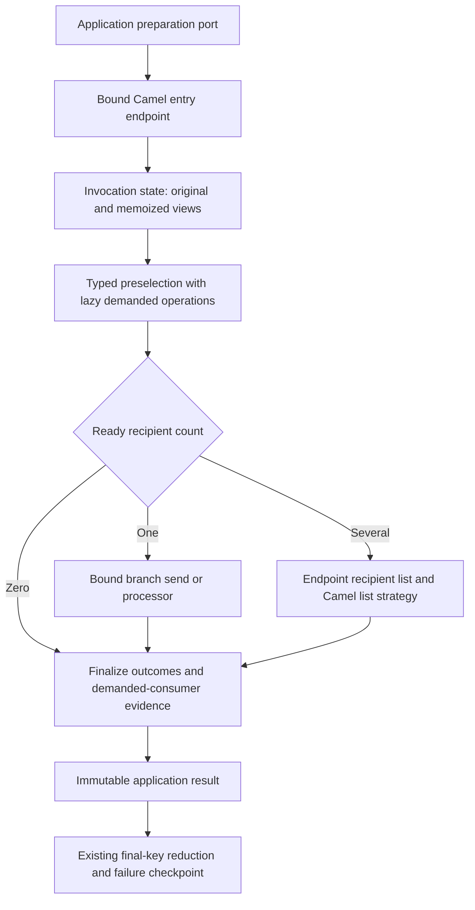

# Camel optimization mechanisms and their applicability

Date: 2026-10-01. Application revision: `08d30621`. Framework examined:
**Apache Camel 4.22.1**, as pinned by the parent POM. This supplements the
[implementation cost analysis](router-cost-and-architecture-analysis.md).
It is an investigation and proposed experiment sequence, not an implementation
approval or an accepted replacement for ADR 0031.

## Conclusion

Camel provides concrete opportunities to improve this implementation while
retaining the framework. The first investigation focused too heavily on the
cost of the current integration and insufficiently on the alternatives Camel
already supplies. The next architectural experiment should be an optimized
Camel implementation, with direct Java execution only as a control if needed.

Three different opportunities must be separated:

1. **Use the same Camel mechanism more efficiently:** bind endpoints once,
   retain producer reuse, replace quadratic reply accumulation with a framework
   list strategy, and specialize zero/one-recipient paths.
2. **Compile a better Camel execution graph:** reduce nested template requests,
   use static sends and processor chains where topology is fixed, and retain
   dynamic recipient selection only where the recipient subset is dynamic.
3. **Remove redundant application work:** classification reuse, prebound
   predicate arguments and incremental final-key reduction. Camel does not
   automatically infer purity, provenance dependencies or canonical identity.

A local six-variant experiment confirms that the first two directions can
reduce dispatch allocations substantially without removing Camel. It does not
establish an end-to-end IOC speedup or justify replacing custom semantics with
superficially similar EIPs.

## Scope and verification method

Inspected the current compiler, selector, view evaluator, runtime, reply
aggregation, Spring lifecycle wiring and IOC operation bindings. Compared them
with official Camel documentation and source pinned to the `camel-4.22.1` tag.
The unversioned manual can describe later releases: the exchange-pooling
deprecation is explicitly treated as a **4.23 migration concern**, not a claim
that the pinned 4.22.1 code has removed that capability.

Executed an isolated source-launch Java probe against the existing dependency
JARs. Production code and application configuration were not modified. The probe
tests dispatch mechanisms, not the full application or all failure contracts.
Links next to each mechanism identify the supporting primary source; statements
about suitability for IOC processing are this analysis's conclusions.

## What is already appropriate

The application already reuses one embedded context and producer template,
uses local `direct:` endpoints, disables framework error handling for these
preparation routes, stops recipient dispatch on unexpected exceptions, and
does not enable parallel processing. It does not create a context or producer
template per IOC. Recommending those basics as missing optimizations would be
incorrect.

`CompiledSelector` also compiles the condition structure, and `InvocationViews`
memoizes views within an invocation. The optimization gap is not “no compilation
and no cache”; it is incomplete binding of invariant parameters, repeated work
across observations, and unnecessary execution boundaries.

## 1. Endpoints, producer reuse and static sends

### Prebind admitted endpoints

Current sites: `InvocationViews.evaluateOperation:79` and
`CamelRouteRuntime.executeAdmitted:107`. They call the string overload of
`requestBody`; dispatch also supplies a list of branch URI strings.

In Camel 4.22.1, the string overload resolves an endpoint before sending. The
endpoint overload avoids that step. Bind view, dispatch and branch endpoint
references after route installation; keep them inside the Camel adapter and
owned by its context. Do not expose them in inward application contracts.
The exact overloads are visible in
[DefaultProducerTemplate](https://raw.githubusercontent.com/apache/camel/camel-4.22.1/core/camel-base-engine/src/main/java/org/apache/camel/impl/engine/DefaultProducerTemplate.java).

Recipient List accepts endpoint objects. Its implementation first checks for an
existing endpoint, acquires a producer and then constructs recipient exchanges.
Thus prebinding can avoid string resolution without removing recipient dispatch
or producer reuse. It does not remove branch exchange creation. Preserve the
admitted-endpoint boundary and the `direct` scheme restriction; never accept
endpoint objects or addresses from input data.
[RecipientListProcessor source](https://raw.githubusercontent.com/apache/camel/camel-4.22.1/core/camel-core-processor/src/main/java/org/apache/camel/processor/RecipientListProcessor.java).

### Prefer static sends when the destination is static

A generated `.to(fixedEndpoint)` uses Camel's send processor. The fixed-version
implementation can retain a singleton producer established at startup, rather
than resolve a destination afresh through a template request. This makes a
generated route containing static sends a distinct alternative to repeatedly
entering Camel from the custom evaluator.
[SendProcessor source](https://raw.githubusercontent.com/apache/camel/camel-4.22.1/core/camel-core-processor/src/main/java/org/apache/camel/processor/SendProcessor.java).

This does not mean every selected plan should become static multicast. The
catalog is static, but the selected subset can depend on each observation.
Keep that distinction explicit.

### Do not confuse three caches

- Endpoint/producer reuse caches infrastructure, not IOC classification.
- Per-invocation view memoization avoids repeated evaluation of a demanded view.
- A bounded classification cache shares pure semantic results across inputs.

Recipient List producer caching is already available; setting `cacheSize=-1`
would disable reuse and is inappropriate for repeatedly used fixed routes.
If many admitted plans are active, size caches against reachable endpoints and
measure churn rather than blindly enlarging them. Raising a cache limit does
not by itself remove string normalization.
[Recipient List options](https://camel.apache.org/components/4.22.x/eips/recipientList-eip.html).

## 2. Replace reply-list mechanics with Camel's list strategy

Our `BranchReplyAggregationStrategy.aggregate:17–31` copies the accumulated
prefix for every reply. Camel's `AbstractListAggregationStrategy<V>` retains
one list on the exchange, appends extracted values, and moves the result to
the body on completion. A thin subclass can extract the branch ID and typed
`BranchOutcome` into `BranchReply`; freeze the list once at the public result
boundary. This removes custom collection mechanics while preserving the
application-specific reply type.

Do not return `null` for a malformed outcome: the base implementation skips
null values. Preserve the current fail-fast checks. Avoid collecting full
`Exchange` objects when only branch results are needed; that retains unnecessary
metadata and can conflict with future exchange reuse. Verify completion with
Recipient List, empty selection, filtered/unavailable replies and exceptions.
[AbstractListAggregationStrategy source](https://raw.githubusercontent.com/apache/camel/camel-4.22.1/core/camel-core-processor/src/main/java/org/apache/camel/processor/aggregate/AbstractListAggregationStrategy.java).

This is not a reason to introduce the separate **Aggregate EIP**. That EIP
correlates messages across arrivals and manages completion/repository concerns.
We need a bounded result from one invocation, not another long-lived state owner.
Document winner selection and canonical import receipts should stay with their
existing owners. [Aggregate EIP](https://camel.apache.org/components/4.22.x/eips/aggregate-eip.html).

## 3. Better execution granularity inside Camel

### One entry exchange for an invocation

Today the Java runtime performs selection and then enters Camel separately for
demanded operations and branch dispatch. For a bare domain in the measured
plan, that includes one host-operation request and one dispatch request.

An alternative is one admitted entry route carrying invocation state. Generated
processors resolve/memoize views, store the immutable selection result, dispatch
the selected branches and finalize evidence. Ordinary processor chains can stay
on the same exchange; they need not enter a new endpoint for every small function.
This uses Camel's pipeline execution rather than replacing Camel with a custom
loop. [Pipeline](https://camel.apache.org/components/4.22.x/eips/pipeline-eip.html),
[Processor](https://camel.apache.org/manual/processor.html).

The hard part is state ownership, not DSL syntax. Keep original input,
resolved views, outcomes and branch-local body separate. A branch must see its
declared input, not a preceding branch's output. If callbacks share mutable
invocation state through shallow exchange copies, explicitly retain sequential
execution; immutable snapshots are preferable at fan-out boundaries.

Do not eagerly run every configured view just to make a straight pipeline.
FIRST and short-circuit conditions may never demand a costly or failing view.
A shared view must still run at most once per invocation. Inlining the entire
dependency graph independently for every branch would reintroduce repeated work.

### Static multicast versus dynamic recipient list

Static multicast is useful when all recipients are known and required for each
input. Dynamic Recipient List is useful when a precomputed subset varies.
Both support result aggregation; multicast still creates branch exchanges.
Replacing a dynamic list with “multicast to every branch, then filter” can
increase work when few branches are selected. It also adds a second membership
pass, although membership checks need not repeat the business predicates.
[Multicast](https://camel.apache.org/components/4.22.x/eips/multicast-eip.html).

For our small admitted plans, compare two candidates:

- Dynamic subset as endpoint objects with a list strategy.
- Generated sequential conditional branch processors reading the completed
  selection, restoring the declared input and appending typed replies.

The second can avoid fan-out exchange copies, but must explicitly preserve
branch input isolation, output ordering and failure behavior. It is a proposed
compiler specialization, not something proven by the microprobe below.

### Zero and one recipient

The runtime already returns directly for zero recipients. A single selected
branch can use a direct static/bound send and wrap one reply, bypassing the
recipient-list aggregator. This is especially relevant to the import fixture,
which has one destination. Specialize **after** complete selection and required
view resolution: EXCLUSIVE still has to establish uniqueness before dispatch.

## 4. Which selection semantics can move to standard EIPs?

| Existing requirement | Camel candidate | Applicability |
|---|---|---|
| FIRST on boolean conditions | Choice | Natural match, provided BLOCKED and expected failures are represented explicitly. |
| ALL after successful preselection | Recipient List | Already appropriate; improve endpoint/result handling rather than duplicate selection. |
| Execute preselected branch conditionally | Filter | Useful as a generated membership guard, not a replacement for three-state evaluation. |
| EXCLUSIVE with no dispatch on ambiguity | Selection processor followed by dispatch | Standard Choice does not prove uniqueness. Keep the small explicit decision phase. |
| Lazy shared derived views | Invocation state plus generated processors/routes | Camel executes steps; the application-specific dependency and memoization contract remains necessary. |
| Explicit expected-failure fallback view | Typed recovery processor | Requires reason matching and demanded-consumer evidence; not equivalent to exception redelivery. |

Choice chooses the first matching boolean condition. `precondition` evaluates
configuration-based choice during initialization; it cannot select a different
branch for each IOC. FIRST could be compiled into a Choice over explicit
decision states, but that removes only the outer branch loop, not the typed
condition semantics. [Choice](https://camel.apache.org/components/4.22.x/eips/choice-eip.html).

A Filter is a boolean guard for its nested steps. In ALL mode, immediately
executing each matching filter as conditions are evaluated would dispatch early
branches before a later unexpected predicate error. Current preselection avoids
that. Retain a selection phase and let filters inspect its result.
[Filter](https://camel.apache.org/components/4.22.x/eips/filter-eip.html).

Three counterexamples for any proposed replacement:

1. FIRST: branch A is BLOCKED, branch B matches. B must not execute as though A
   were merely false.
2. EXCLUSIVE: A and B match. Neither destination may execute before ambiguity
   is returned.
3. ALL: A matches, B's predicate throws unexpectedly. No destination should
   already have run. Expected BLOCKED outcomes are different: independent
   selected branches may prepare.

Replacing our selector with a plain Choice/Filter graph without proving these
cases would simplify syntax at the cost of changing the contract.

## 5. Other Camel capabilities: use, defer or reject

| Capability | Decision for this workload | Reason |
|---|---|---|
| Route templates | Consider for compiler maintainability | Parameterized route definitions may reduce repeated builders; no inherent per-record speedup is established. Keep typed admission and fingerprint ownership. |
| Routing Slip | Not a direct replacement for view evaluation | It expresses an ordered itinerary where output feeds the next step; our branches can require different immutable views and lazy dependencies. |
| Dynamic Router EIP | No demonstrated need | Repeatedly asking for the next destination does not remove the existing dependency/decision semantics and adds a different routing protocol. |
| Enrich | Defer until actual external enrichment exists | Request/reply enrichment does not itself memoize classification or implement our typed fallback ledger. |
| Idempotent Consumer | Do not use to skip repeated IOC rows | Duplicate suppression is different from pure-result caching; skipped occurrences can lose source/order/warnings/COALESCE evidence. |
| Stream caching | Not relevant to the current inner route bodies | Current bodies are typed in-memory objects, not streams needing rereads. |
| Parallel multicast / executor / SEDA | Do not enable for this optimization slice | The current operations are small synchronous CPU work. Scheduling, concurrent state and failure ordering need separate evidence. |
| `shareUnitOfWork` | Do not treat as an allocation switch | It changes completion/error ownership; it does not eliminate correlated branch exchange copies or replace canonical transactions. |
| Camel shutdown strategy | Retain; potentially simplify wrapper after entry-route redesign | It tracks in-flight exchanges; today's Java selection/preparation also runs outside those exchanges and remains covered by `activeCalls`. |
| AdviceWith / mock endpoints | Useful for conformance experiments | Can observe or intercept execution without adding durable work; test dependencies only if admitted. |

Sources for these distinct mechanisms:
[Route Template](https://camel.apache.org/manual/route-template.html),
[Routing Slip](https://camel.apache.org/components/4.22.x/eips/routingSlip-eip.html),
[Dynamic Router](https://camel.apache.org/components/4.22.x/eips/dynamicRouter-eip.html),
[Enrich](https://camel.apache.org/components/4.22.x/eips/enrich-eip.html),
[Idempotent Consumer](https://camel.apache.org/components/4.22.x/eips/idempotentConsumer-eip.html),
[Stream caching](https://camel.apache.org/manual/stream-caching.html),
[Graceful shutdown](https://camel.apache.org/manual/graceful-shutdown.html),
[AdviceWith](https://camel.apache.org/manual/advice-with.html).

`onException`, handled/continued exceptions, retries and dead-letter handling
are useful integration tools, but our expected view failures are values.
Converting them to exceptions would require rebuilding recovery evidence and
could re-execute preparation. Keep unexpected exceptions aborting the invocation
and expected unavailability represented by typed outcomes. There is no missing
retry policy to enable here.
[Exception Clause](https://camel.apache.org/manual/exception-clause.html).

### Exchange pooling needs more care than a configuration toggle

Pooling exists in 4.22.1, but applicability depends on the exchange creation
path. Here `ProducerTemplate` creates the initial exchange through an endpoint;
`DefaultEndpoint.createExchange` directly creates a default exchange. Merely
installing a pooled consumer exchange factory does not prove that these initial
template exchanges are pooled. Recipient copies use a separate processor
exchange factory. Inspect and measure both paths before making savings claims.
[DefaultEndpoint source](https://raw.githubusercontent.com/apache/camel/camel-4.22.1/core/camel-support/src/main/java/org/apache/camel/support/DefaultEndpoint.java),
[MulticastProcessor source](https://raw.githubusercontent.com/apache/camel/camel-4.22.1/core/camel-core-processor/src/main/java/org/apache/camel/processor/MulticastProcessor.java).

The current manual and 4.23 upgrade guide announce deprecation of exchange and
processor-exchange pooling. Consequently it is a low-priority version-specific
experiment, not the foundation of the optimization plan. This application also
constructs `DefaultCamelContext` explicitly; a `camel.main.*` property should
not be assumed to configure it without the corresponding runtime wiring.
[Exchange pooling](https://camel.apache.org/manual/exchange-pooling.html),
[4.23 upgrade guide](https://camel.apache.org/manual/camel-4x-upgrade-guide-4_23.html).

## 6. Executed mechanism comparison

Local artifacts: `.dev/camel-capability-analysis/CamelOptionsProbe.java`,
`run.py`, `report.json`, eighteen per-fork logs and pinned framework sources.
The harness source and report remain local diagnostic evidence, not a new
versioned benchmark facility. Re-running `python3
.dev/camel-capability-analysis/run.py` reproduces this local probe while those
artifacts and the retained dependency directory are present.

Each input performs one deterministic numeric transformation and four ordered
branch computations. All variants check every output value and order, produce
an immutable result list and yield the same measured checksum, `800160000`.
Use 10,000 warm-up inputs and 20,000 measured inputs per fresh JVM,
`-Xms128m -Xmx512m`, three JVMs per variant, reversing variant order in the
middle round. Time uses `nanoTime`; allocation uses the calling thread's
`ThreadMXBean`. Compilation, context startup and warm-up are outside measurement.
Branch execution is sequential; no I/O, IOC classification or database is used.

| Variant | Mechanism | Median ns/input | Median caller bytes/input |
|---|---|---:|---:|
| `strings` | Two template requests by fixed URI; URI recipients; prefix-copy reply strategy | 13,827.0 | 17,827.2 |
| `endpoints` | Two template requests by bound endpoint; endpoint recipients; same reply strategy | 9,678.0 | 10,025.9 |
| `list` | Bound endpoints plus Camel list aggregation | 9,056.5 | 9,530.2 |
| `static` | Separate view request, then static multicast to four branch routes | 9,071.1 | 9,112.4 |
| `fused` | One entry request, inline view processor, static multicast to branch routes | 7,804.3 | 7,904.6 |
| `inline` | One entry request, inline view processor, multicast directly to four processors | 6,307.2 | 6,423.4 |

Interpretation:

- Binding the two template destinations **and** recipient endpoints reduced
  allocations by about 44% in this probe. These were changed together; this is
  not an isolated estimate for only the template overload.
- Framework list aggregation further reduced allocation. Static multicast
  reduced allocation slightly more but did not improve median time relative to
  `list` in this run: lower allocation is not automatically lower latency.
- One entry and fewer route boundaries reduced measured dispatch cost further.
  The last variant still uses Camel multicast, not a direct Java executor.
- All four branches always run here. Static variants are not equivalent to a
  general dynamic-subset plan without additional selection/membership handling.

These are small mechanism probes, not JMH-quality performance claims or IOC
acceptance evidence. The baseline mirrors request/recipient/copy structure but
does not instantiate the production Router, its selector, MDC scopes, typed
recovery or candidate mapping. Three short forks do not establish statistical
confidence. The result supports experiment prioritization; **it does not promise
a 44% allocation reduction or a particular speedup for the real application**.

## 7. Proposed optimized Camel architecture

This is a proposal, not a diagram of the current implementation. First implement
endpoint/list improvements without moving all control flow. Then test a single
entry exchange with compiled operation processors. Keep the explicit selection
and failure-evidence objects until equivalence is demonstrated; avoid a large
rewrite that changes semantics, execution granularity and caching together.

| Current custom piece | Proposed disposition |
|---|---|
| Prefix-copy reply collection | Replace with thin typed Camel list strategy |
| String endpoint lookup on hot path | Replace with runtime-bound endpoint references |
| Nested template requests for tiny fixed operations | Reduce with generated processor chains/static sends |
| Three-state selection | Retain initially; specialize only proven boolean subcases |
| View memoization and demanded-consumer evidence | Retain semantic state; move execution into Camel incrementally if beneficial |
| Source authority, identity, winner selection, checkpoint and receipts | Keep with application/storage owners |

A useful success criterion is fewer custom collection/lifecycle mechanisms and
fewer exchange boundaries **without** a larger custom state machine hidden in
processors. “More Camel DSL” is not itself a performance or maintainability goal.

## 8. Implementation order and acceptance checks

1. Prebind endpoints and parameterized predicates; retain producer reuse.
   Measure URI-resolution stacks, allocation and throughput on the real P6 probe.
2. Adopt the list strategy and specialize one-recipient dispatch. Compare exact
   typed replies, ordering and exception propagation, including the import path.
3. Prototype one entry exchange and coarser operation execution. Compare current
   and generated plans using the same semantic operations, not different work.
4. Combine with independent application optimizations: bounded classification
   reuse and incremental candidate winners. Report each change separately before
   the combined result so improvement attribution remains possible.
5. Only if the optimized Camel result remains inadequate, compare a direct
   evaluator as a controlled architecture alternative and revisit ADR 0031.

For every execution redesign, retain this conformance set:

- FIRST stops on BLOCKED; EXCLUSIVE ambiguity dispatches nothing; ALL handles
  expected blockage separately from an unexpected predicate exception.
- Predicates run once in declared short-circuit order; shared views run once
  when demanded; unused views and fallback alternatives remain unevaluated.
- Selected failure never reselects a later FIRST branch; recovery severity
  reflects all demanded consumers; alternate-view failure evidence survives.
- Filtered branches and unexpected null results remain distinguishable; typed
  replies stay in declaration order; branch input cannot be contaminated by
  a previous branch's body/headers.
- Concurrent invocations have independent memoization and accumulation; MDC
  restores after success/failure; no exchange escapes a recyclable lifetime.
- Closing rejects new invocations and bounds outstanding work, including work
  performed before/after Camel exchange processing.
- Document fields, final keys, source/position winner rules, import cell states,
  COALESCE warnings and receipt-based recovery remain unchanged.

Run the complete production composition comparison after semantic tests, with
both duplicate-heavy and mostly unique input, one/four/wide branch sets and
first-file versus warmed-daemon modes. Do not replace the canonical receipt or
failure checkpoint with framework aggregation, redelivery or idempotency state.

## Validation status

Completed: current-source review, official fixed-version source/manual research,
eighteen synthetic mechanism runs with value/order assertions, and document/link
validation. Not completed: production implementation of these alternatives,
full Router semantic equivalence for a replacement graph, or an end-to-end
optimized IOC benchmark. No production Java changes were made and no full
`verify`/PMD rerun is claimed for this documentation investigation.
