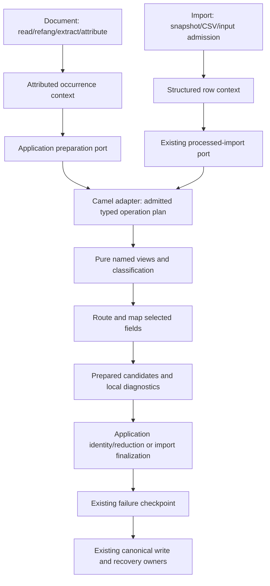

# Camel mapped to IOC processing requirements

Concrete configuration and compiled route proposal: [configuration/execution design](configuration-execution-design.md).

Status: proposed implementation design, 2026-09-27, source `f43037ee87ef` on
`module/platform/router`. Extends [Camel migration assessment](camel-migration-assessment.md).
Code inspection is evidence of current behavior; target APIs/configuration below
are proposals. No Camel implementation, resolved dependency experiment or
performance measurement is claimed.

## Requirements mapped to actual work

| Requirement / example | Current limitation | Required implementation | Camel responsibility |
|---|---|---|---|
| `https://best-malware.com/troyan.exe` becomes `best-malware.com` in selected fields | String transforms follow artifact/column gates and one classification | Derive named host view, retain original, bind fields to a view | Execute configured operation sequence |
| `10.93.12.187:9090/clean-prometheus/no-virus/true` becomes bare IPv4 | ip_list accepts IPV4 plus is-bare-ip before mapping | Derive host and effective type before terminal artifact gating | Route on prepared view facts |
| `https://10.93.12.187/path` enters ip_list after cleanup | Original URL type fails IPV4 acceptance | Preserve original URL and create a separate IPV4 view | Dispatch selected branch; no IOC type logic in adapter |
| Same occurrence produces cleaned masks and original address_blacklist | Single classified input passed to current preparers | Independent view/field bindings and branch results | Ordered recipient dispatch and result collection |
| Operator changes match codes | RuleBasedMatchPolicy is already configurable | Bind classification to explicit original/effective view; reuse evaluator | Invoke classification operation, not encode match codes |
| `/a` and `/b` collapse to one host | Different original values converge only after mapping | Compute artifact identity on final fields, apply existing candidate policy | Return candidates, not deduplicate exchanges |
| Synthetic `(IP,country)` retains two rows | Early global dedup cannot represent arbitrary future record identity | Preserve complete observations through mapping, use configured composite key | Preserve context; no country feature is added |
| Imported address is cleaned with the same policy | Input validation/type gates/key checks precede processed preparation | Separate input admission from output validation and use shared view operations | Execute the same admitted operation plan within the import contract |

The first two examples are customer requirements. URL-to-IP and dual-output are
necessary boundary fixtures for the same model. Country is only a synthetic
extensibility test, not an existing feed or a new enrichment requirement.

## Findings from the current implementation

### 1. The correct entry seam is earlier than PrepareArtifactsStage

`IocExtractionService.pipeline` currently assembles attribution, deduplication,
classification, preparation and write. `DeduplicateIndicatorsStage` uses
`Indicator.dedupKey()` (type plus value), but also retains a separate occurrence
list with source positions. `ClassifyIndicatorsStage` classifies retained items
and occurrences before any target-specific processing. `CsvArtifactPreparer`
uses retained values for KEEP_FIRST and all occurrences for LAST_NONEMPTY.

Replacing only PrepareArtifactsStage leaves original-view classification and its
policy checkpoint before a route can derive its host. It also leaves selection
of retained versus occurrence input outside the new scenario model. Therefore:

- The compatibility experiment may start at PrepareArtifactsStage to prove the
  adapter mechanics, but it cannot be the final acceptance slice for new flows.
- The new document path should enter a processing/preparation port after source
  attribution, carrying all attributed occurrences and stable positions. Derive,
  classify, route and map inside the admitted processing plan.
- Legacy configuration compiles to a compatibility plan preserving the existing
  dedup/classification diagnostics, ordering and policy checkpoints. These are
  intentional compatibility behaviors, not global constraints on new plans.
- Existing Deduplicate/Classify/Prepare stages must not remain as an unconditional
  prefix to a new plan doing those same jobs. Extract reusable behavior and remove
  replaced execution in the migrated path. Read/refang/extract/attribute and write
  can remain outer stages initially.

Do not infer a current loss of all duplicate provenance: the occurrence list
already exists and should be reused. The gap is when and how a scenario consumes
it. Completion counters must keep their documented meanings; route fan-out does
not multiply the source extracted count. New candidate counts need separate names.

### 2. Host derivation is a domain parsing task, not a Camel transform

`DefaultIndicatorFeatureExtractor` splits authority at slash/query and recognizes
a numeric port; it does not separately parse user-info or fragments. Introduce
one shared parsed network-address representation for feature extraction and host
derivation. Extend the existing parsing boundary instead of adding a second
independent parser in a Camel Processor. Preserve subdomains; PSL classification
is not host truncation. No DNS or URI dereference is needed.

The current default patterns recognize HTTP(S) URLs, IPv4 with optional detail,
and domains with optional slash-path. `RegexIndicatorExtractor` claims overlapping
spans in configured priority order. Structured processed import requires exactly
one extraction covering the whole cell. Consequently `domain.test:443/path` and
fragment/user-info cases need explicit lexical fixtures: extracting a valid prefix
is not proof of a valid complete input. Keep RE2/J and JDK pattern parity.

Define supported syntax before widening patterns: scheme-bearing and scheme-less
IPv4/domain addresses, port bounds, fragments, query, bracketed/Unicode cases and
trailing document punctuation. IPv6 is not silently introduced into the current
IPV4 model. Reject unsupported/malformed input with typed diagnostics; do not
repair arbitrary strings by splitting at the first colon. URI is an implementation
candidate, not an IOC validator by itself.

### 3. Mapping and reduction are currently coupled in the CSV preparer

`CsvArtifactPreparer.accepted` checks type and filters before `toRow`.
`ConfigurableRowMapper.applies` checks column type/conditions before provider and
ordered transforms. A new `host` string transform cannot change either decision.
Move pure column/provider/transform evaluation to the shared preparation owner,
with an explicit view binding per column and default view per artifact branch.
Keep CSV delimiter/NULL encoding and serialization in the CSV adapter.

`prepareOccurrences` already maps final fields, calculates ArtifactRowKey and
calls ArtifactOccurrenceSelector. Reuse this identity and reduction semantics,
relocating orchestration where necessary. KEEP_FIRST currently follows a different
path and does not use that local grouping loop. Any unification needs fixtures
for diagnostics, ID reservations, provenance and insertion counts; output bytes
alone do not prove equivalence.

LAST_NONEMPTY selects a whole candidate using its configured selection column,
falling back to the first when all values are blank. It is not universal durable
last-row-wins. Registered field precedence and import merge policies are separate
existing contracts. A new whole-row latest policy, if needed, extends that policy
family with explicit rank; Camel aggregation arrival order cannot implement it.

### 4. Import requires a two-phase mapping contract

`DataframeImportRowMapper.map` currently transforms/validates cells, validates
row shape, demands a record key and builds match keys before calling
ProcessedImportRowPreparer. `CsvProcessedImportRowPreparer` then extracts each
recognized IOC-provider cell, checks original column applicability, applies
artifact filters, remaps derived fields and recomputes keys. Multiple different
derived values for a target produce PROCESSED_COMPOUND_CONFLICT.

For new processed plans, introduce an intermediate mapped input without mandatory
final canonical keys. Keep transport/dialect, formula, declared input validation,
source columns and requested-slot parsing at input admission. Derive views and
map outputs next; then validate final field types, exactly-one constraints,
record/match keys and contract-authorized destinations. Existing input validators
must not silently change meaning to output validators: add explicit output
validation/view semantics through a versioned contract/config extension.

Reuse ProcessedImportRowPreparer as the existing application port; evolve its
input away from a prematurely finalized ImportLogicalRow rather than invent a
parallel import API. AS_IS remains an explicit contract behavior. Applying cleanup
to it requires selecting processed behavior or an explicit contract transform;
there is no global override of imported fields. Existing processed contracts keep
their admitted semantics until migrated/versioned.

A source row stays one atomic logical row across its authorized artifact branches.
Do not split it into independent commits or cross-product the IOC-bearing cells.
Use explicit input-cell/view bindings instead of extending the current hardcoded
IOC_PROVIDERS inference indefinitely. Initially preserve conflict rejection for
multiple incompatible outputs of one target. Source authority, requested slots,
merge policy and ABSENT/NULL/VALUE distinctions survive the shared processing
call. Final validation also checks derived outputs, including formula policy
where applicable, rather than assuming input checks cover every transformation.

## Confirmed view-binding flexibility

The operator confirmed this scope on 2026-09-27:

- Each artifact branch has a default view.
- Individual fields can explicitly select a different view.
- Classification explicitly identifies the view whose features it evaluates.

This confirms configuration expressiveness, not concrete YAML keys or Camel API
choices. For example, a masks branch can default to host while an individual
address field reads original. Source and occurrence metadata remain observation
context; selecting a view does not overwrite them. Mapping different views does
not itself authorize multiple output rows or change artifact identity rules.

Field conditions evaluating the field's selected view and startup validation of
required view dependencies remain proposed details.

## Confirmed expected-operation failure behavior

The operator confirmed the following behavior on 2026-09-27:

- An operation returns a result or a typed expected failure.
- A branch requiring a failed derived view produces no output row. It does not
  silently substitute original; fallback requires explicit configuration.
- Independent branches may complete preparation.
- The existing failure-policy checkpoint determines whether prepared results
  may be written. Successful sibling preparation alone does not authorize writes.

This agreement covers expected transformation/mapping failures. Unexpected
exceptions, invalid plans and routing ambiguity remain stopping failures under
the proposed runtime contract; they are not automatically downgraded to a missing
view. Expected branch outcomes must be collected as data in the Camel adapter,
not hidden using a general handled/continued exception policy. Deliver each
operation diagnostic once; dependent branches may refer to that failure without
re-emitting it. One failed host derivation shared by several branches is one
failure occurrence.

Managed import keeps its existing logical-row atomicity and promotion policy.
Independent branch preparation does not authorize staging or committing only
part of a rejected logical row. Translate expected failures into existing import
row issues and apply its admission/promotion rules. Global failure policy cannot
bypass source authority, identity validity or other mandatory validation.

Acceptance fixtures must cover a failed host branch alongside a successful
original branch under both accepting and rejecting failure policies, explicit
fallback, shared-view diagnostic delivery, and import logical-row rejection.

## Confirmed v1 operation cardinality

The operator confirmed this initial scope on 2026-09-27:

- A transformation creates one derived view on success; it does not expand an
  input into several observations.
- Filtering explicitly skips an input for the affected branch.
- Routing may select several independent branches.
- One input produces at most one row candidate in each selected branch. Existing
  artifact-key and winner policies subsequently reduce candidates as configured.

For document preparation, input means one attributed IOC occurrence, not the
whole source document. Document extraction may still discover many occurrences.
For processed import, input means one logical source row; several IOC-bearing
cells remain within that row and do not create a Cartesian product. Existing
compound-conflict checks continue to reject incompatible values for one target.

These are branch cardinality limits, not a global uniqueness rule. Several
branches can target the same artifact and contribute candidates to its existing
identity/reduction owner. The compiler must keep branch identity explicit and
must not introduce implicit per-branch canonical namespaces.

One-to-many expansion inside an individual branch is outside v1. Any later
extension must define child provenance/ordering, expansion bounds and failure
semantics before adding an expansion operation. Camel Split capability alone
is not authorization to widen the application's cardinality contract.

Acceptance fixtures cover explicit filtering, two selected branches, one candidate
per branch, many source occurrences, structured rows with multiple IOC cells,
and rejection of unsupported expansion declarations during configuration admission.

## Proposed execution shape



The diagram shows data flow, not compile-time dependencies. Adapter depends
inward on application ports and pure processing contracts. Application never
imports Camel. A document preparation port takes attributed occurrences and
returns application preparation results; internally the adapter uses pure field
candidates and delegates application-owned finalization. The processed-import
port accepts admitted structured cells and returns finalized logical row results.
The two ports share operation code, not a forced universal payload shape.

Each processing context needs original observation, immutable named views,
source/position, scenario/plan identity and branch-local result. Classification
is attached to a specified view. Original and effective types are distinct.
No global mutable current-value/current-classification pair is shared by branches.
Camel Exchange is only the adapter carrier; it does not replace these contracts.

For a document batch, a sequential Split over occurrences may execute the
per-occurrence plan. For import, the existing reader/workspace loop remains the
streaming owner and invokes processing for one logical row. Camel's
[Splitter](https://camel.apache.org/components/4.22.x/eips/split-eip.html) supports
on-demand iteration, but that does not bound downstream aggregation memory.
Do not load the whole CSV into Exchanges or add a second splitter over its cells.

Selection computes ordered destination IDs before dispatch where ALL/EXCLUSIVE
require it. [Recipient List](https://camel.apache.org/components/4.22.x/eips/recipientList-eip.html)
then executes registered local branches sequentially with explicit aggregation.
Collect branch results without inheriting/concatenating ancestor diagnostics.
No correlated cross-run Aggregate EIP, completion timer or Camel idempotent
repository replaces artifact grouping or canonical receipts.

Example admitted sequence (notation, not supported YAML):

```text
original occurrence
  -> derive view host from original
  -> branch masks: classify host -> gate on host -> map mask from host
  -> branch address_blacklist: gate on original -> map fields from original
  -> application: final artifact keys -> configured candidate policy
  -> failure checkpoint -> existing write path
```

For the second example, host derivation yields `(IPV4, 10.93.12.187)` and ip_list
checks that view. A field retaining the full address explicitly binds original.
Changing mask codes uses the existing classification rules; choosing original
features versus host features is a separate explicit configuration decision.

## Concrete work packages and acceptance evidence

Dependencies are sequential unless stated otherwise; estimates are relative
scope, not calendar promises. Names of new contracts are illustrative.

| Work | Existing files/owners | Deliverable and acceptance | Scope |
|---|---|---|---|
| T1: Parsing grammar and views | RegexIndicatorExtractor, DefaultIndicatorFeatureExtractor, IndicatorNormalizer, HostClassifier | Shared parse/host derivation; customer examples, full-cell versus document spans, invalid input and both regex engines | Medium |
| T2: Pure mapping boundary | ConfigurableRowMapper, ColumnSpec, ValueProvider, Transform, IndicatorClassifier, ClassifiedIndicator | One view-aware evaluator used by both flows; CSV adapter owns wire format; no dependency back from processing to application | Large |
| T3: Document entry and finalization | IocExtractionService, DeduplicateIndicatorsStage, ClassifyIndicatorsStage, PrepareArtifactsStage, CsvArtifactPreparer | Occurrence entry before destructive selection; legacy compatibility plan; reuse key/selector; preserve counts, ranks and checkpoints | Large |
| T4: Import admission/finalization | DataframeImportRowMapper, ProcessedImportRowPreparer, CsvProcessedImportRowPreparer, DataframeImportCatalogCompiler | Intermediate input without final key; explicit input/output checks and view bindings; source-row atomicity and compound-conflict tests | Large |
| T5: Configuration compilation | IocProperties, ConfigRegistryCatalog, IocSemanticConfigurationCheck, DataframeImportPropertyMapper | Typed plans, AND/OR/NOT, view/type/cardinality checks, unique bindings, limits; unknown keys rejected across all channels | Medium/large |
| T6: Camel runtime | New adapter-processing-camel, bootstrap wiring | Minimal compatible dependency closure; route compilation, synchronous dispatch, result bridge, no duplicate executor/diagnostic owner | Medium plus qualification uncertainty |
| T7: Policy identity and cutover | ProcessingPolicyFingerprint, DataframeImportCatalogCompiler, identity resolver/store, recovery services | Pin new descriptors and semantic versions; old in-flight work cannot silently acquire new semantics; explicit existing-data disposition | Medium/large |
| T8: Proof and removal | Existing mapper/preparer/import tests, golden fixtures, application TCK and bootstrap ITs | One runtime per flow, replaced paths removed, crash/failure parity, memory/startup/throughput evidence, architecture and release gates | Large |

T1/T2/T5 establish operations and admitted plans for either runtime. A bounded
T6 prototype can follow their minimal contracts without completing all relocation.
T3/T4 are required before claiming customer coverage; T7 precedes enabling it on
persisted data. Do not call a successful Camel route demo completion of T1–T8.

Candidate new Maven modules remain ioc-processing (pure semantics, after closure)
and adapter-processing-camel (one integration family). A separate platform-routing
is conditional, not automatically a third new module. Initially keep adapter
compiler/bridges internal; extract a generic framework only with concrete reuse.
Build changes include parent dependency management, transitive Camel bans inward,
module README/maps, test lifecycle and analyzer/coverage scopes without relaxed
floors. Existing report tools must count the new production module correctly.

## Delivery structure: two capabilities, four milestones

Executable work breakdown: [Router plan](router-implementation-plan.md) and
[IOC processing plan](ioc-processing-implementation-plan.md). Their R/P identifiers
refine T1–T8 above; they are not additional parallel implementations.

Retain two implementation workstreams: **Router/execution** (technical plan
validation, ordered selection and execution, failure/result protocol and runtime
lifecycle) and **configurable IOC processing** (parsing, views, classification,
mapping and scenario-specific identity/reduction through existing owners).
These are responsibility boundaries, not a promise of exactly two Maven modules.
The router must not own IOC parsing, match codes, artifact schemas or canonical
storage. The application-facing Camel bridge may adapt those contracts without
moving their semantics into the generic routing mechanism.

Use four delivery milestones to expose the required adjacent work:

1. **Admission and minimal contracts:** agree the proposed resolution contract;
   prove the selected Camel/JDK/Boot dependency closure and lifecycle; establish
   minimal T1/T2/T5 contracts and module boundaries. Include build-quality admission
   with the first module addition. A prototype is qualification evidence, not a
   second production execution engine.
2. **Router runtime:** T6 plus the technical part of T5; compile the bounded plan,
   prove FIRST/ALL/EXCLUSIVE, explicit recovery, diagnostic ownership and concurrent
   invocation isolation using domain-independent operation fixtures.
3. **IOC integration and activation:** T1/T2 and the IOC part of T5, T3 document
   entry, T4 processed import and T7 policy identity/cutover. Include accepted-row
   warnings, final output validation and reuse of canonical key/winner policies.
   Preserve AS_IS and legacy behavior; change only new observations, with no backfill.
4. **End-to-end qualification and retirement:** T8; prove both input paths,
   recovery/checkpoint/receipt behavior and bounded resource use, remove replaced
   execution paths, and promote durable decisions into published documentation.

Milestones overlap only where their admitted contracts allow it. In particular,
Router qualification needs a small operation contract before full IOC relocation;
the two workstreams are not independent sequential waterfall projects. Import,
bootstrap/configuration, observability and policy cutover are mandatory integration
work, not optional follow-up features. No additional broker, scheduler, storage
engine or general ingestion migration is required for this scope.

## Build-quality admission: required in every module-adding slice

Follow [build-quality](../../../dev/build-quality.md) and
[testing policy](../../../TESTING.md). Quality integration is part of each
milestone's completion, not work deferred to milestone 4.

| Control | Required change and evidence |
|---|---|
| Maven reactor and dependencies | Register each actual module in the parent reactor/dependencyManagement; preserve dependency order and common plugin policy. Keep Camel dependencies behind the adapter; only bootstrap is bootable. |
| Architectural boundaries | Extend applicable ArchUnit coverage and dependency checks to the new packages/modules; prove no IOC coupling in generic routing and no Camel/Spring leakage inward. Update module README and maps. |
| Test lifecycle | Surefire unit/contract suites and Failsafe integration suites with accepted tags; deliberately reconcile `build-support/test-quality/test-lifecycle.properties` and verifier evidence when the suite universe changes. No silently skipped new suites. |
| JaCoCo | Update `build-support/coverage-report/coverage-scope.tsv`, report POM dependencies, `coverage-ratchets.tsv` and `coverage-floors.tsv` for the admitted production scope. Verify local reports, aggregate membership and execution data. Retain aggregate 75/80 and domain/application 85/90 line/branch floors; establish explicit new-module floor disposition and measured ratchet without reducing existing controls. Review coverage movement when relocating code. |
| SpotBugs | Update `build-support/spotbugs-report/spotbugs-scope.tsv` and report ordering dependencies; inspect raw module/aggregate reports and exact finding drift. New production modules participate in analysis. |
| CPD and PMD | Update `cpd-scope.tsv` and `pmd-scope.tsv` in their report directories, report ordering dependencies and exact source roots. Inspect cross-module duplication and adopted PMD findings, including same-count replacements. |
| Scope integrity | Exercise existing verifier fixtures and fail-closed scope/report checks; update any explicit reactor/suite inventories affected by the new modules, including diagnostic pilot discovery. Do not expand the domain-only PIT scope implicitly. |
| Final evidence | Focused tests first, then `make verify` and separately `make pmd-analysis` on the final worktree; inspect reports, not only exit codes. Run `make pmd-watchlist` for exception/resource ownership and size changes; runtime lifecycle/compiler work is likely to require it. |

Adding a module to `<modules>` alone is insufficient. Analyzer/coverage manifest
changes and report dependencies belong in the same implementation change. Do not
exclude the router because it is technical infrastructure, lower coverage floors,
or accept analyzer baseline drift merely to obtain green status. Legitimate new
scope/ratchet entries require review and evidence. Keep the test-support module
outside the production denominator under its existing policy.

Completion evidence must identify the final commit/worktree, executed suites,
coverage and analyzer outcomes, reviewed dispositions and unavailable checks.
Use the current local CI facade and freshness checks from the build-quality guide;
historical green reports are not evidence for newly added modules. At this design
stage no Maven module or analyzer scope has been changed and no new runtime gate
has been claimed.

## Policy activation and existing records

Host cleanup changes values feeding identity even if the configured key column
list stays the same. ProcessingPolicyFingerprint currently includes source,
refang, engine, patterns, classify, sink, pipeline and artifactIdentity; new plan,
view bindings and semantic parser versions must participate. Compiler fingerprints
already incorporate the processing-policy fingerprint: extend this owner.
A hash detects a mismatch; it does not serialize an executable old plan. Verify
actual recovery behavior for pinned/staged deliveries and refuse or explicitly
migrate incompatible unfinished work rather than promising old-plan replay.

The operator confirmed new observations only on 2026-09-27: do not backfill or
rekey accumulated records. With active fixed lifecycle, old URL-valued rows remain
until their existing TTL expires; newly admitted observations use the new plan.
Temporary coexistence of old URL and new host records is expected. Do not renew
old URL lifecycles merely because a new host observation arrives. Existing rows
retain their identities, provenance and export-slot behavior until normal expiry.
When lifecycle is disabled, old records do not expire automatically: rollout must
report this explicitly rather than promise TTL cleanup. In-flight deliveries
remain subject to their pinned-policy/recovery contract, not automatic rebinding.
No backfill, destructive migration or edits to generated CSV are in scope.

Likewise distinguish processing-plan changes from canonical identity-definition
drift. Existing guard behavior must be tested with the actual new configuration;
do not assume changing a fingerprint alone authorizes rekeying stored records.

## Qualification scenarios

- Two original URLs yield one cleaned masks record but two original records in
  another configured artifact; adding a key field changes only that artifact's
  grouping. Verify full row values and provenance, not just row count.
- HTTP URL containing IP becomes bare IPV4 for a configured ip_list branch;
  source URL remains intact in another branch. Hash outputs remain unchanged.
- Same host in two occurrences preserves distinct source/rank context until the
  configured winner policy runs; equal-rank contradiction is not resolved by
  route completion order.
- Imported non-bare address is admitted by an appropriate input contract, cleaned,
  and passes bare-IP output validation. An AS_IS contract does not change behavior.
- Missing input, explicit NULL, several IOC fields and conflicting derived outputs
  preserve documented rejection/merge behavior. A derived key may be absent before
  processing but must exist at finalization.
- A predicate exception before ALL dispatch produces zero branch execution;
  a typed mapping issue follows configured failure policy; unexpected branch
  failure prevents write. Diagnostics are emitted once at the established owner.
- Fail after canonical commit but before projection/delivery completion; recover
  from existing receipts without Camel redelivery. Test document and import
  boundaries separately.
- Pin a delivery then change a plan: prove controlled mismatch handling. Test
  startup, CLI help, shutdown under active preparation and concurrent independent
  invocations with bounded worker cleanup.

Measure overhead with the same corpus: per-occurrence Exchanges, original plus
host views, per-artifact candidate retention, and row-by-row import staging.
Sequential execution avoids new scheduling races but does not by itself prove
thread safety under concurrent callers. Do not introduce shared mutable branch
accumulators. No SQL/index optimization is proposed without measured evidence;
canonical database access remains outside pure preparation.

## Draft decision C2

**Context:** code inspection shows that preparation-only dispatch replacement
cannot change early type gating, classification and import key admission.
**Proposed decision:** qualify Camel against an occurrence/view-based preparation
contract, shifting the document seam after attribution and splitting processed
import input admission from finalization. Reuse domain operations, registries and
identity policies; replace affected orchestration once. **Alternatives:** add only
a host string transform; wrap existing preparer loops in Camel. **Consequences:**
more application/CSV/config work than a Router module alone, but both runtimes are
evaluated against the actual customer scenarios. C1's runtime selection remains
open; this is not an accepted project ADR.
