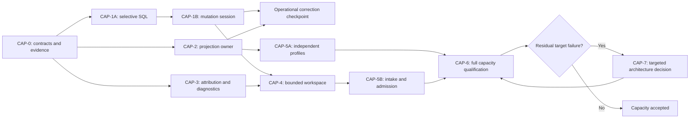

# Data processing capacity implementation plan

Status: CAP-0–CAP-1B implementation authorized; acceptance budgets adopted by
the owner on 2026-10-04. Prepared from the
[capacity review](data-processing-capacity-review.md). CAP-1A selective SQL and
its JDBC regressions and CAP-1B resource sessions are implemented. Stage G0/G1A/G1B
qualification is recorded in the [execution report](cap-0-1-execution.md);
whole-service resource acceptance remains open. The user supplied desired local-processing times, excluding external
network/cadence waits, and asked for an engineering recommendation. The absolute
budgets and technical stage gates below are frozen in
[the target manifest](qualification/capacity/cap-targets.json) before primary
measurements; they are neither achieved results nor performance promises.

Baseline: branch `module/platform/router`, reviewed HEAD
`ffccda9da84a86f40cfea5e1054fff2933a0ec6d`. The installed-release identity and
36m55s ingest-to-publication observation belong to the review's
[evidence bundle](qualification/capacity/README.md). This plan extends the
earlier [O0–O7 optimization plan](processing-optimization-plan.md); its local
qualification remains valid within its documented scope.

## Outcome and execution policy

Make mostly unique large documents and imports practical without changing IOC
meaning, configurable routing, canonical authority or supported recovery.
Eliminate the demonstrated alias-range lookup first. Correct competing mutable
projection ownership next. Then bound preparation state and separate admitted
execution from detection. Change transaction visibility or replace technology
only if corrected measurements require it.

Two completion levels are deliberately separate:

- **Operational correction:** selective canonical matching and safe projection
  ownership, qualified on the physical 100k stand workload. Memory architecture
  and million-occurrence acceptance can still be open.
- **Capacity acceptance:** the bounded preparation/execution model passes the
  required workload matrix and the adopted acceptance targets, including the
  million-occurrence reference. Passing a SQL probe or `make verify` alone does
  not reach this level.

Scope is implementation planning. No schema migration, deployment, service
restart or production data change is performed by writing this document.

## Priority, order and dependencies

Finding IDs C1–C8 refer to the review. Effort is relative change/risk scope,
not a calendar estimate or delivery promise.

| Stage | Priority / effort | Work and reason | Depends on | Exit |
|---|---|---|---|---|
| CAP-0 | Required / small | Freeze contracts, executable/state identity, a usable capacity harness and phase anchors | Review evidence already available | G0 |
| CAP-1A | P1 / small | Fix query selectivity for single- and multi-key requests; remove the demonstrated storage multiplier (C1) | Minimal CAP-0 | G1A; first corrected 100k cycle |
| CAP-1B | P1 / medium | Reuse matcher/mutation resources within their connection/transaction; avoid repeated TEMP/statement setup | CAP-1A | G1B; independently measured benefit |
| CAP-2 | P1 / medium | One mutable projection install/ack owner; reproduce and eliminate the stale-install race (C8) | CAP-0; can be developed independently of CAP-1 | G2 |
| CAP-3 | P2 / small–medium | Efficient section attribution and diagnostic construction bounded inside processing (C6/C7) | CAP-0 semantic oracle | G3 |
| CAP-4 | P2 architectural / large | Sealed private preparation workspace, cursors and global spillable selection/provenance (C4) | CAP-1, CAP-3 and workspace/recovery contract review | G4 |
| CAP-5A | P2 / medium | Independent bounded export-profile progress (C5) | CAP-2 and corrected CAP-1 measurements | G5A; may precede CAP-4 |
| CAP-5B | P1 operational / large | Durable intake/execution separation, byte/count admission and observable writer scheduling (C2/C5) | CAP-4; stable intake/recovery contract | G5B and atomic-unit decision |
| CAP-6 | Required / medium–large evidence | Whole-service capacity, live SMB cycle, upgrade and failure qualification | Adopted CAP-1–CAP-5 changes | G6 and release gate |
| CAP-7 | Conditional / separate decisions | Streaming source extraction, Camel execution changes or canonical transaction/store redesign | Residual bottleneck after corrected baseline | Decision-specific gates; then repeat affected G6 cells |

Recommended merge order is CAP-0 → CAP-1A → CAP-1B → CAP-2 → CAP-3 →
CAP-4 → CAP-5B → CAP-6. CAP-5A may be merged immediately after CAP-2; it
need not wait for the workspace. CAP-2 is independently urgent for correctness;
it is not gated on proving a performance percentage. Parallel development is
optional, but changes to shared promotion/projection contracts need one owner.

The review's S0 maps to CAP-0's completed investigation, not its entire new
benchmark harness. S1 maps to CAP-1; S2 to CAP-2; S3 to CAP-3/CAP-4;
S4 to CAP-5; S5 to CAP-7. CAP-6 explicitly owns final acceptance so that
implementation and measurement cannot be reported as the same milestone.

## Contracts held across every stage

Use the current [processing](../../../dev/processing.md),
[storage](../../../dev/storage.md),
[ingestion](../../../dev/ingestion.md),
[managed-import](../../../dev/dataframe-import.md),
[lifecycle](../../../dev/canonical-record-lifecycle.md) and
[export](../../../dev/artifact-export.md) contracts. Record actual schema
versions from each executable/state manifest; historical prose is not a schema
version source.

| Concern | Required invariant |
|---|---|
| Router | Required configuration remains authoritative; no hidden legacy preparer, optional bypass or second IOC evaluator |
| Document addresses | Stand IP/mask/blacklist carrier cleanup and detailed aggregate `url_match` remain exactly as configured; hashes retain their supported case/field rules |
| Import | All five configured contracts remain supported; AS_IS preserves permitted input values while validating them, including canonical decimal numeric cells |
| Identity | Compare complete configured canonical material, not hash alone; retain all match keys and NONE/EXACT/MULTIPLE behavior |
| Winner/order | Whole-row KEEP_FIRST, LAST_NONEMPTY and registered field rank retain their distinct meanings; worker completion is not encounter rank |
| IP import duplicate | Equal configured `(ip, score, time_last_seen, time_first_seen, threat_type)` selects the first input despite source/description differences; survivors retain requested sparse slots and removed duplicate slots stay holes |
| Cells/diagnostics | ABSENT, explicit NULL, VALUE and technical provider null remain distinct; every relevant occurrence contributes validation, provenance and supported diagnostics |
| Canonical commit | Ordinary document writes remain artifact-atomic; managed import remains one delivery-wide cross-artifact transaction until an explicitly reviewed new protocol |
| Lifecycle and IDs | Strict active deadline, expiry/reappearance, monotonic burned canonical IDs, stable sparse export slots, revisions and ordered field origins remain intact |
| Recovery | Dataframe receipts own canonical idempotency; service ledgers own coordination. A committed import finalizes without its stage or reprocessing CSV |
| Projection/publication | Generation coverage, mutable projection diagnostics, immutable manifests, `_SUCCESS`, cadence and endpoint serialization remain meaningful |
| Boundaries | Core ports are framework-free. JDBC, Camel, files and concrete executors remain adapter/bootstrap responsibilities |

There is no global document transaction today. Do not claim that changing private
preparation storage makes per-artifact promotion all-or-nothing across a file.
Likewise, the document workspace is not a revival of the removed partition
aggregation subsystem: it is private precommit state for one observation.

## CAP-0 — Minimal reproducible baseline and acceptance contract

The investigation is complete enough to start CAP-1A. Do not repeat a known
quadratic million-row baseline or build a universal benchmark platform before
fixing the query.

| Task | Deliverable |
|---|---|
| CAP-0.1 | Freeze input seeds/manifests, stand routing/import configuration without credentials, executable SHA/HEAD, JDK/driver versions, JVM/cgroup limits and actual schema versions |
| CAP-0.2 | Prepare isolated canonical/service starting states: empty plus populated 10k/100k states; generate business records through public application paths, not an ad-hoc writer |
| CAP-0.3 | Extend the existing comparison/harness through the Make facade with phase times, final-row/occurrence counts, writer wait/hold, publication anchors and memory scopes; preserve the existing sampler cleanup/error contract |
| CAP-0.4 | Add an independent small oracle for all five artifacts and both document/import flows; add streaming full-output checks for large fixtures rather than only comparing two potentially wrong implementations |
| CAP-0.5 | Review and freeze the proposed target manifest below before primary runs; keep instrumentation/JFR/NMT runs separate from primary timing samples |

G0 passes when one small physical-document and one physical-import run produce
valid independent semantic results and a complete, validated evidence manifest.
The harness must fail on sampler error, missing expected output, timeout or
missing required capability, terminate every owned worker and preserve failure
evidence. Pin initial state for every repeat; growing the same DB between
samples invalidates comparisons.

Use the current retained SQL probe and incident as mechanism/baseline evidence.
At the flawed revision, use bounded 1k/10k comparisons and fixed small incoming
sets against larger private DBs. Repeat the original 100k slow cycle only if a
controlled full-cycle regression ratio is needed; otherwise report candidate
absolute times and label the old live observation non-paired. No historical
36m55s-to-new-time ratio is accepted as a controlled speedup.

## CAP-1 — Selective canonical mutation

Primary ownership: `adapter-store-jdbc`, beginning with
`JdbcCanonicalMatchPlanner`, `JdbcCanonicalMutationEngine` and
`JdbcCanonicalLifecycleWriter`. Managed import must exercise the same corrected
matching semantics, including its existing staged plans and promotion behavior.

### CAP-1A: remove the artifact-size multiplier

| Task | Implementation boundary |
|---|---|
| CAP-1A.1 | Extend real JDBC matcher regressions for empty requests, multiple requests/keys, repeated keys, stable request/result order, zero/one/multiple active candidates and same hash with unequal material |
| CAP-1A.2 | Change query shape so requests drive full `(artifact, definition_id, key_hash, key_canonical)` index probes; cover the general query first, not only the probe's singleton shortcut |
| CAP-1A.3 | Preserve exact expiry boundary, lifecycle equality, definition/artifact isolation and candidate union/dedup; inspect actual plans with the packaged driver on empty/populated private databases |
| CAP-1A.4 | Test rows that insert/change aliases seen by later rows in the same transaction. Bulk prematching from an initial snapshot must not alter read-your-writes or mutation rank |
| CAP-1A.5 | Run the corrected production Spring document/import path and a complete physical 100k mostly unique daemon/SMB cycle; retain phase and semantic evidence |

**G1A functional:** current matcher/lifecycle/import TCKs and new independent
cases pass. Fault before commit leaves no partial artifact mutation; import
rollback remains cross-artifact. Receipts, revisions, sparse slots and field
origins remain consistent.

**G1A complexity:** with fixed request count/key count and fixed real matches,
compare 1k/10k/100k unrelated aliases using the exact driver. Full-key index
terms must appear; there must be no artifact-wide outer loop. In the retained
single-key synthetic shape, counted VM work per lookup including staging must
be at most **10,000 instructions**, and `W100k <= 2 * W1k + 5,000` with the
documented 1,000-instruction counter granularity. These are proposed engineering
screens against the demonstrated 1.8m-step query, not customer latency targets.
Legitimate many-match result work is measured separately. Do not assert exact
EXPLAIN text in functional tests; keep plan/work checks in version-pinned
capacity evidence.

**G1A service:** all five expected publications become terminal-successful,
their coverage matches required revisions, and the full-output oracle passes.
For 10k → 100k mostly unique inputs from equivalent empty stores, the canonical
promotion median must grow by at most **15x** for approximately 10x final rows.
Measure actual final-row growth; if it differs, use
`timeGrowth <= 1.5 * finalRowGrowth`. This proposed scaling screen rejects
quadratic behavior; adopted absolute targets still apply independently.

### CAP-1B: reusable resources after correct access paths

| Task | Implementation boundary |
|---|---|
| CAP-1B.1 | Introduce a connection/transaction-scoped matching/mutation session; bind schema/asOf and own statements/TEMP state with deterministic close |
| CAP-1B.2 | Reuse staged-request infrastructure between bounded calls; use an admitted singleton fast path where complete semantics allow it |
| CAP-1B.3 | Reuse mutation statements and admitted immutable key material within the session; fingerprint material whose correctness depends on schema/policy |
| CAP-1B.4 | Remove unconditional alias delete/reinsert only when profiling proves value and key/lifecycle equivalence is established; keep this as a separate change if adopted |
| CAP-1B.5 | Exercise two independent connections, rollback/exception/close, retry/recovery and interruption; no global mutable statement cache |

G1B repeats G1A semantics and work screens. Compare against frozen CAP-1A,
retaining a resource-reuse change only with measured reduction in setup/work
or allocation and no attributable end-to-end regression. Do not combine alias
mutation changes with query correction in one untraceable result.

## CAP-2 — One generation-aware mutable projection owner

Primary ownership: application convergence/run recovery, CSV projection,
JDBC projection-work state and bootstrap wiring. This is a correctness fix with
a plausible interleaving; its occurrence in the incident has not been proven.

| Task | Deliverable |
|---|---|
| CAP-2.1 | Reproduce older A snapshot → newer B install/ack → older A install using timed latches and real temporary CSV/SQLite; fail the current path deterministically |
| CAP-2.2 | Specify a shared per-artifact owner for ingest, oneshot, recovery and lifecycle. Couple snapshot generation, install eligibility and acknowledgement; CAS only after an unfenced rename is insufficient |
| CAP-2.3 | Route competing callers through that owner; keep expensive building outside canonical writer admission and fence/serialize the final install |
| CAP-2.4 | Coalesce superseded requests; leave newer generations pending; handle expiry-only generations and valid empty output |
| CAP-2.5 | Preserve completion/diagnostic meaning: runs await their required generation when appropriate; satisfy older requests with a newer covered generation without losing warning accounting |
| CAP-2.6 | Test failure before rename, after rename before ack, during ack, restart/reconcile, cancellation and simultaneous ingest/import/expiry |

G2 passes when the stale A installation is prevented, the installed file and
acknowledged coverage agree, failed work remains recoverable and no future
mutation is needed to repair an interrupted install/ack. All raw production
install paths have an explicit shared owner. Immutable slices remain independent
and their slot/manifest/recovery tests pass. Each worker and pending waiter has
a bounded shutdown path.

The CAP-1/CAP-2 checkpoint is eligible for an independently qualified operational
correction. It does not close C4 or assert bounded million-occurrence memory.

## CAP-3 — Attribution and diagnostics inside bounded processing

These are separate small changes with separate regression and measurement
evidence; they prepare the semantic contracts needed by CAP-4.

| Task | Deliverable |
|---|---|
| CAP-3.1 | Define ordered/unordered attribution behavior; use one monotonic section cursor for ordered occurrences or binary search where order is unrestricted |
| CAP-3.2 | Preserve nearest preceding marker, equal positions, marker precedence/overlap, absent source and encounter order; remove avoidable indicator materialization for counting |
| CAP-3.3 | Introduce construction-time diagnostic bounds, exact counters/severity/failure state and deterministic retained samples; apply them within extraction and preparation loops |
| CAP-3.4 | Stream complete diagnostic detail to quota-controlled private state only where the supported contract requires it; propagate disk/collector failure explicitly |
| CAP-3.5 | Verify diagnostics beyond the retained limit still affect the failure-policy checkpoint and exactly-once observer emission; preserve import participant warnings/receipts |

G3 attribution covers independent fixtures and randomized boundary cases; work
must match `O(N+S)` ordered or `O(N log S)` unordered behavior. Use deterministic
comparison counts in a diagnostic test/probe rather than a tight wall-clock
unit-test threshold. G3 diagnostics verifies high-error inputs far beyond the
sample limit, with exact totals, bounded retained state and no durable writes
on a rejecting failure policy. Assert semantics through public outcomes, not
through private collection layouts.

## CAP-4 — Bounded preparation and a sealed private workspace

This is the largest mandatory architecture slice. Keep its parts reviewable.
An iterator over a pre-existing full list does not satisfy this stage.

### CAP-4A: contract and recovery design

| Task | Deliverable |
|---|---|
| CAP-4A.1 | New ADR for private document preparation ownership, JDK-only handles/cursors, sealing/fingerprints, byte/disk quotas and recovery. Allocate the next available ADR number at implementation time |
| CAP-4A.2 | Define pinning of source snapshot, observation/rank, Router/schema/identity versions, ordered-field positions, artifact winner/provenance counts and checksums |
| CAP-4A.3 | Define unsealed/sealed/promoting/terminal transitions, cancellation and retention ownership. Reject incompatible uncommitted state; committed receipts remain sufficient after workspace removal |
| CAP-4A.4 | Specify recovery at per-artifact document boundaries separately from delivery-atomic import. Map existing incomplete-run seams, especially ING-11, to an explicit safe resume or fail-closed disposition |

The design gate is a reviewed state/ownership table and failure matrix, not
merely interface compilation. Do not reuse import delivery IDs or route
documents through the CSV-import API. Share storage mechanisms only where
contracts agree. Do not promote a newly resumable partial document by assuming
an incomplete whole-observation receipt proves which artifact committed.

### CAP-4B: storage and global selection

| Task | Deliverable |
|---|---|
| CAP-4B.1 | Private JDBC workspace adapter with bounded native cache, field/row/batch limits, spill/disk accounting, integrity checks and explicit cursor/resource lifecycle |
| CAP-4B.2 | Global final-key reducer preserving complete KEEP_FIRST winners, LAST_NONEMPTY order, redirected carriers and configured composite keys across batch boundaries |
| CAP-4B.3 | Store every required losing occurrence, provenance/diagnostic reference and import COALESCE participant/conflict; do not use dedup to skip validation/routing of later occurrences |
| CAP-4B.4 | Seal only after every artifact is prepared and counts/fingerprints validate; failure-policy rejection prevents all new canonical promotion |

### CAP-4C: production port migration and promotion

| Task | Deliverable |
|---|---|
| CAP-4C.1 | Migrate preparer/writer contracts from document-wide winner lists to owned handles and bounded cursors; preserve public CLI/extraction and diagnostics behavior |
| CAP-4C.2 | Stream confirmations and receipt accumulation without rematerializing all winners, source summaries or participants in the writer |
| CAP-4C.3 | Use CAP-1 transaction sessions while preserving existing artifact/import atomicity and canonical ID reservation semantics, including burned ranges on failure |
| CAP-4C.4 | Wire oneshot/daemon/processed import to the admitted paths; remove obsolete temporary adapters and fallbacks when migration is complete |
| CAP-4C.5 | Test seal corruption, quota exhaustion, cursor error/close, interruption, restart, retained pin cleanup and policy/schema mismatch; exercise actual Spring binding |

G4 passes only when the whole pipeline segment from routed occurrence to
canonical confirmation has bounded buffering, including provenance/receipt
accumulators. Force a small budget and test collisions/winners across spill
boundaries. Functional cases must pass both without spill and with forced spill.

For fixed preparation budgets, grow mostly unique input 10k → 100k → 1m.
The workspace/reducer-owned live-memory diagnostic must plateau within the
declared budget plus measured fixed overhead; prepared row/participant buffers
never exceed admitted count/byte bounds. Output/state disk use may grow with
real winners and participants and must remain within the declared quota.

Account for the **sum** of live workspace/native caches, not a separate full
budget per artifact. Input whole-text/occurrence memory is measured separately:
CAP-4 alone does not promise total-process memory independent of source size.
If that remaining reader/extractor graph prevents G6, CAP-7A becomes required.

## CAP-5 — Progress, isolation and operation admission

### CAP-5A: independent export profiles

| Task | Deliverable |
|---|---|
| CAP-5A.1 | Per-profile single-flight/coalesced readiness with one shared bounded reader/execution budget; retain startup recovery barrier and quiet/max-cap cadence |
| CAP-5A.2 | One blocked/failed profile cannot occupy all scheduling capacity; another ready profile gets execution while preserving export plan/slot serialization |
| CAP-5A.3 | Keep short clock/slot writer ownership explicit; CSV streaming stays outside the writer lock and SMB remains endpoint-keyed |
| CAP-5A.4 | Test profile failure/blocking, lost hints, periodic reconcile, changing plans, retention pins and shutdown; measure WAL growth under long readers |

G5A uses controlled blocking of one profile: another ready profile must complete
without releasing that first profile, whenever its own data/control prerequisites
are available. Running/queued readers stay within fixed limits; profiles do not
race their own slot namespace. This does not promise that a second profile can
bypass a genuinely held canonical writer transaction.

### CAP-5B: durable execution separated from intake

| Task | Deliverable |
|---|---|
| CAP-5B.1 | Design a durable job-reference path and source snapshot/claim lifecycle; register owned work promptly instead of executing extraction inline on the poller |
| CAP-5B.2 | Preserve quiet-period/full-listing behavior, ownership before processing, source-key guard, observation identity/rank, terminal CAS and recovery-before-intake |
| CAP-5B.3 | Keep expensive hashing/parsing out of the short detection path only with a reviewed claimed-snapshot protocol; path/mtime cannot become canonical content identity |
| CAP-5B.4 | Queue job/workspace references, with task-count and global byte/cache/disk budgets. Admission saturation leaves durable discoverable work; never drop a claimed delivery |
| CAP-5B.5 | Preserve supported promotion order. Start with serial canonical promotion; parallel preparation cannot change whole-row KEEP_FIRST or source/field rank |
| CAP-5B.6 | Add operation-class selection with aging/finite progress for control, expiry, slots, promotion and maintenance at legal transaction boundaries; avoid unconditional strict priority |
| CAP-5B.7 | Expose phase progress, queue age, writer wait/hold, rows/bytes processed, active readers, WAL/spill pressure and publication lag without per-IOC logging/control writes |
| CAP-5B.8 | Qualify saturation, lost events, crash before/after durable enqueue, interrupted promotion, retries and graceful shutdown; define fate of pre-claim failures rather than silently widening ING-13 |

G5B requires no lost/duplicated ownership, bounded queued payload bytes and finite
progress for each supported operation class under declared sustainable intake.
Test a newer preparation completing first and preserve the supported canonical
winner/rank outcome. Flood hints/jobs beyond the queue limit; after load stops,
ledger reconciliation drains the accepted backlog, pinned files stay available
and terminal cleanup leaves no orphan workers/resources.

### Atomic-unit decision after CAP-1 and CAP-5

Measure maximum writer occupancy for the largest supported artifact/import
delivery and the resulting control/export delay. The non-preemptive occupancy
is a lower bound on another writer's worst wait. More executor threads or
smaller Java batches inside the same transaction cannot remove that bound.

If it exceeds the frozen latency targets, CAP-5 is **not accepted** merely
because weighted scheduling was added. Activate CAP-7C: choose an explicit
versioned visibility protocol or a different transactional adapter. Do not
commit ordinary/import chunks into today's visible tables as an implicit fix.

## CAP-6 — Whole-service acceptance and deployment evidence

The workload matrix is deliberately staged to control cost. Every claimed
supported cell needs executed evidence; a skipped external test remains a skip.

| Tier | Required workload | Stage use |
|---|---|---|
| Deterministic CI | Small adversarial semantic, recovery, race and saturation fixtures; real temporary JDBC/CSV/Spring integrations | Every relevant stage and final `make verify` |
| Focused capacity | 1k/10k/100k alias sizes with fixed requests; 10k/100k unique and collapsed documents; all five import contracts; 400/thousands of sections | CAP-1/3/4, with exact driver and private states |
| Operational stand | Original physical 100k mixed fixture, all five artifacts and actual enabled export profiles, populated state, live SMB and original limits | CAP-1A and CAP-1/CAP-2 checkpoint |
| Final reference | 100k and 1m mostly unique, all-unique and collapsed cases; HTML and representative actual DOCX; empty and populated 100k/1m storage; bounded import deliveries for all five artifacts | G6 capacity acceptance |
| Mixed workload/faults | Document intake plus import, expiry, projection/export, SMB delay; quota full, restart and policy mismatch | CAP-5 and G6 correctness/latency |

The final reference is a covering matrix, not an uncontrolled Cartesian product.
At minimum run both formats at 100k/1m mostly unique, the repeated-collapse
reference, fixed incoming sets against each starting DB size, a large import
case for every artifact, and the mixed/failure cells. Record the exact selected
cells before running. Neither collapsing a million occurrences to 20 winners
nor rejecting the million-occurrence input proves unique-million capacity.

For each adopted stage, compare against its immediate frozen predecessor on
the affected smaller/100k workloads. Use at least five independent pairs where
ratios are claimed; alternate executable order and publish raw samples, median,
spread and failures. Cold startup and warmed service runs are separate. The
expensive final million reference needs at least three independent successful
runs per mandatory primary cell; report range/median, not a p95/p99 service SLO.
For mixed-workload queue/operation percentile diagnostics, collect at least 200
completed operations per reported class and show sample size plus worst wait.

### Absolute targets and resource gates

The user suggested **15 seconds for 100k** and **30–40 seconds for 1m**,
excluding external timeouts/network waits, and requested an objective proposal
rather than choosing the gates personally. Retain these as desired outcomes.
They are not accepted full-SMB-cycle limits or measured achievable throughput.

There is no evidence-backed universal normal time for this service: source
format, occurrence/final-row ratio, provenance, initial storage size, disk and
CPU quota change the work. The retained SQL experiment demonstrates a removable
multiplier, not the corrected service's total time. The earlier host-collapse
profile also has much less final canonical/output work than the incident.

As an initial engineering proposal, use **30 seconds / 180 seconds** for the
complete local 100k/1m reference. This allows substantial per-record work under
the current two-CPU quota while demanding seconds-to-minutes capacity instead
of the observed 36m55s cycle. These numbers are planning budgets, not a forecast
or an industry benchmark. A tenfold input/output increase cannot be assumed to
take only 2–2.67 times longer: 15s → 30–40s would require approximately
3.75–5 times higher throughput at 1m. Fixed-cost amortization may help, but must
be measured in a warmed service with the actual final-row counts.

#### Timing boundaries

`Tlocal` measures a warmed, ready service from a pinned local source becoming
eligible for execution through preparation, canonical commit, required mutable
projection and all expected **local immutable slices becoming ready**. Record
read-start separately; admission waiting cannot disappear before that anchor.
The interval includes local disk I/O, SQL/writer contention, internal queueing,
CPU throttling and GC. For imports it includes validation/staging/promotion and
the corresponding outputs.
Input occurrences/CSV rows, final rows per artifact, section count and enabled
profiles must be in the manifest. Large imports use their own fixed reference
cells; document throughput cannot be presented as import throughput.

Report separately any configured quiet/stability/export-cadence wait and SMB
transfer/retry time. Attribute excluded waits using observed state transitions;
do not remove unexplained gaps or ordinary internal execution waits. The raw
end-to-end `Tsmb` remains mandatory: producer upload completion/atomic rename
to verified remote `_SUCCESS` for every expected profile. If eligibility waits
overlap local computation, retain a timeline rather than subtracting their
durations twice. JVM startup/cold-first-run time is a separate measurement.

| Target | Proposed initial gate | Basis / interpretation |
|---|---|---|
| Local complete 100k reference | Median `Tlocal <= 30s`; every mandatory primary sample `<= 45s` | Desired outcome remains 15s; the maximum is a stall/noise guard, not a percentile SLO |
| Local complete 1m reference | Median `Tlocal <= 180s`; every mandatory primary sample `<= 270s` | Desired outcome remains 30–40s; this is a provisional capacity budget with tenfold real work accounted for |
| Writer occupancy | Maximum `Hwriter <= 5s` per admitted canonical/control transaction | A proposed responsiveness budget; test the largest import and artifact, not just a small batch inside one transaction |
| Short control operation | Queue wait `Lcontrol <= 10s` after it becomes eligible, under declared sustainable mixed intake | Record scheduled/due lateness as well; configured cadence is separate, writer-induced delay is included |
| Ready profile / publication dispatch | Start within 2s of eligibility when its own data/control prerequisites and an execution slot/free endpoint are available | Independently eligible work must not wait behind an unrelated profile; bounded executor saturation is also measured by G5 |
| Process resident memory | Peak sampled RSS `<= 512 MiB`, with process HWM also reported, for the warmed ready/admitted workload including overlapping allowed jobs | Whole-process target, not `-Xmx`; initial proposal gives meaningful headroom below the current approximately 625 MiB RSS |
| Retained Java state | Post-GC live heap `<= 256 MiB` in a separate private diagnostic run | A proposed half-heap live-state budget; primary runs use natural GC and still meet the RSS/time gates |
| Preparation-owned working state | Global 64 MiB budget for live reducer buffers and configured workspace native caches, plus an explicitly measured fixed ownership overhead | A starting CAP-4 design budget shared by all artifacts/jobs; forced-small-budget semantics and a plateau must pass G4 |
| Cgroup non-file state | Peak `anon + kernel <= 576 MiB`; report file and other memory.stat fields separately | Proposed service-state budget reserves 192 MiB below memory.high for file cache; it does not guarantee cache remains below that amount |
| Memory pressure | Cgroup memory PSI `full` total delta `<= 1%` of each measured local window; record `some`, memory.events deltas, peaks and swap | A proposed stall budget with microsecond counter accounting; OOM/kill or exceeded resident/time budgets always fail |
| Full SMB cycle | Report every `Tsmb`; freeze its acceptance ceiling after CAP-1A from the adopted local budget plus measured configured/transport waits | No single guessed network timeout is a local-performance gate; sample endpoint throughput/failures with the real files |
| Existing hard envelope | Keep `-Xms128m -Xmx512m`, two CPU equivalents, memory.high 768 MiB / memory.max 1 GiB | Known stand baseline; raising it cannot make qualification pass |
| Overload safety | Zero OOM/kill/data loss; declared count/byte/disk limits hold; overflow/deferral is observable and recoverable | Mandatory independently of faster median results |

Memory figures have different scopes. Linux charges filesystem cache to
`memory.stat:file`; `anon` and total `kernel` are separate categories. Do not add
kernel subcounters again. `memory.high` invokes reclaim/throttling and is not an
OOM hard cap. Cache usage or a high-event count alone cannot prove inefficient
Java retention; assess residency, pressure stalls and phase time together.
[Kernel memory accounting](https://docs.kernel.org/admin-guide/cgroup-v2.html),
[PSI counters](https://docs.kernel.org/accounting/psi.html).

The 64 MiB budget does not bound source-reader/occurrence retention or total
JVM memory by itself. Those objects, non-heap/native state and projection/export
workers remain inside the RSS/cgroup gate. If the 1m reader/extractor alone
prevents that gate, CAP-7A is required. If an artifact/import cannot meet the
5s writer limit while preserving current atomicity, CAP-7C is required; priority
queues do not excuse the miss. These are explicit architecture decision points,
not permission to expose partially committed deliveries.

After CAP-1A, review a phase/resource breakdown of the corrected physical 100k
path and bounded larger-cardinality probes. Estimate 1m work using actual final
rows, writer occupancy and retained-state growth; then review whether these
proposals should be tightened or whether a documented design change is needed.
Freeze revisions before the next primary qualification series and preserve
earlier failures. Algorithm/correctness implementation can proceed while target
adoption is discussed; no missing or unadopted target is a PASS.

Do not infer accepted capacity or a regression allowance from the historical
1m/~400 MB anecdote. The current memory report already separates roughly
238 MiB used heap, 625 MiB RSS and 767 MiB cgroup usage; the latter is not 767 MiB
of Java objects. The proposals deliberately gate the complete service rather
than requiring zero allocations or treating all filesystem cache as a defect.

### G6 exit checklist

- Full independent output oracle passes fields, complete keys, winner/rank,
  provenance/diagnostics, IDs/slots, lifecycle, import receipts and terminal
  recovery. Large-output comparison is streaming and validates manifest/revision
  coverage, not just byte equality against another implementation.
- Primary runs meet every frozen absolute target and G1/G4/G5 technical screen.
  Total-cycle anchors include upload completion; effective `changed_at`, fetch
  time and ingest start are not substituted for it.
- CPU/wall, whole-JVM versus caller allocations, used/committed heap, non-heap,
  RSS/HWM, cgroup anon/file/kernel, throttle/pressure, WAL, native caches and
  spill/output disk use are recorded with collection errors treated as errors.
  JFR/NMT and post-GC retained-object diagnostics run privately, not by forcing
  a production restart or GC.
  Mark allocation counters versus sampled estimates and their units/scopes;
  sampled JFR events do not become an exact whole-JVM byte count.
- Lost events, interruption, partial ordinary artifact progress, atomic import,
  postcommit receipt-only finalization, projection rename/ack, and publish
  recovery have deterministic fault tests. Live transport capability/cleanup
  evidence is recorded separately.
- New state/schema is upgrade-qualified; rollback feasibility is established
  before activation. Older binaries are not run against a newer incompatible
  schema as a rollback experiment. Drain or safely recover pinned work under
  its admitted policy; retain backups and immutable release identity.
- A qualified stand deployment verifies effective config, health, all expected
  remote files/markers/revisions and complete cycle times. This is separate
  from offline reactor success.

## CAP-7 — Conditional follow-on architecture decisions

Conditional does not mean optional when a required target is still failing.
Choose the cell that addresses the measured remaining mechanism.

| Track | Trigger | Design and promotion gate |
|---|---|---|
| CAP-7A: source/extraction streaming | Full-text/occurrence retention prevents G6 after workspace migration | Specify refang/match/marker carry-over, ordered absolute offsets, overlap resolution and Tika-format support; adversarial boundary oracle plus actual DOCX; retest total-process memory |
| CAP-7B: Camel batch or compiled direct evaluator | Corrected profiles show material dispatch/collection cost | Compare equal demanded views, selections, short-circuit/failure/trace and branch isolation; use real cursors/batches, require net complete-service benefit and simpler ownership; no new fallback runtime |
| CAP-7C: transaction visibility or canonical adapter | Largest atomic unit exceeds required control/export latency after SQL correction | ADR and complete crash/visibility/conflict/TTL/receipt/slot/revision protocol; compare staged/versioned SQLite and a qualified concurrent adapter under equal guarantees/resources |
| CAP-7D: alternate private reducer backend | Private spool dominates measured disk/CPU/native budget | Compare private SQLite, external sort/reduce or another admitted backend with serialization, cleanup/recovery and total resources included |

For CAP-7C, acceptance must prove pending data is never exported/matched as
committed data, final receipt/visibility is atomic, concurrent observations keep
their conflict/rank contract and restart/cancellation cannot expose half a
delivery. A storage replacement needs an adapter/TCK, migration and operational
qualification, not merely a faster bulk insert demo.

Redis is outside the current mandatory track: no demonstrated shared reusable
work justifies a remote cache, and it cannot correct an alias-range query or
legally collapse distinct aggregate URLs. Reopen it only as its own measured
decision with consistency/policy invalidation and total resource costs.

## Repository quality gates and documentation

All stages use the existing [test lifecycle](../../../TESTING.md) and
[build-quality policy](../../../dev/build-quality.md). Proposed capacity screens
add evidence; they do not weaken production coverage/analyzer ratchets.

| Gate | Required execution and interpretation |
|---|---|
| Focused functional | `make test-one MODULE=... TEST=...`, or applicable module tests while developing. Matcher/projection/import integrations use real private stores/files |
| Complete deterministic | `make verify` on the final candidate worktree: Surefire/Failsafe, port TCKs, ArchUnit/Enforcer, report integrity, coverage ratchets, SpotBugs and CPD |
| PMD policy | `make pmd-analysis` after production/analyzer-scope changes; inspect changed findings and count/identity drift, not only the exit code |
| Resource ownership watchlist | `make pmd-watchlist` for session/cursor/workspace/executor/projection ownership and significant size changes; explicitly review deferred findings |
| Tools/packaging | `make lint-shell` when Make/harness/launcher/templates change; add meaningful harness contracts for failure, cleanup, metrics/evidence and sample accounting |
| Documentation | `make docs`, affected module READMEs/capability docs and root maps updated in the same implementation change; ADRs append-only |
| Capacity | Stage-specific private work/scaling evidence, followed by G6 frozen workload/target checks; no tight CI wall-clock threshold masquerading as a benchmark |
| Provisioned stand | Live effective-config, SMB, whole-cycle and restart/upgrade evidence; an offline external skip cannot satisfy it |
| Identity/freshness | `make context` before work and after each requested commit. Final verify/PMD evidence must identify the promoted HEAD; rerun after a history rewrite or substantive change |

Async tests use timed coordination plus a containing `@Timeout`, release/cancel
owned workers in `finally`/owned fixtures and assert termination. There are no
automatic retries to hide flakes. Existing floors/baselines are not lowered;
legitimate suite-universe changes require same-change verifier/evidence review.

Starter regression seams, verified present at this baseline:

- `JdbcCanonicalMatchAndMutationIT`, `JdbcCanonicalLifecycleWriterIT`,
  `JdbcCanonicalImportWriterContractIT` and lifecycle/slot TCKs for CAP-1.
- `CsvArtifactProjectionIT`, `IngestRunRecoveryServiceTest`, lifecycle runtime
  integrations and new deterministic generation-order tests for CAP-2.
- `MarkerSourceAttributorInvariantTest`, `PrepareRoutedArtifactsStageTest` and
  pipeline diagnostic/failure-policy tests for CAP-3/CAP-4.
- `JdbcImportWorkspaceIT`, `RouterSelectedImportDeliveryIT` and
  `DocumentObservationSelectionTest` for workspace/receipt/winner equivalence.
- `DaemonExportSchedulerTest`, `DaemonIngestE2EIT`, source/ledger contracts and
  new admission/saturation/shutdown integrations for CAP-5.

These suites are extension points, not a claim that current tests cover the new
requirements. New suite names/tags follow discovery rules; million-size live
qualification belongs to an explicit expensive/provisioned command.

## Change packaging, evidence and completion tracking

Keep at least these concerns in independently reviewable changes: selective
query; session/resource reuse; projection reproduction/owner; attribution;
diagnostic bounds; workspace ADR/ports; workspace adapter/reducer; production
integration/recovery; profile isolation; intake/admission; final qualification.
Commit only when requested; never bundle runtime fixes with unrelated local
changes or generated reports.

For every stage, retain a compact record under a versioned qualification bundle:

| Field | Required content |
|---|---|
| Identity | Stage/task IDs, HEAD/JAR/source dirty digest, config/fixture/initial-state digests, schemas, versions, quotas and commands |
| Semantics | Independent oracle counts/digests, receipts/revisions, warnings, fault outcomes and all failures/skips |
| Work/resources | Raw samples and summary, phase anchors, actual final rows, memory accounting scopes, writer/queue/read/spill metrics |
| Gates | PASS/FAIL/BLOCKED/NOT_RUN per applicable gate, actual counts, reviewed findings, target manifest and honest limitations |
| Ownership | Cleanup/shutdown verification, retained evidence locations, migration/rollback boundary and next unresolved task |

Start each stage with its entry conditions and freeze its candidate/reference
manifests. Record evidence before proceeding to the next semantic boundary.
Document completion promotes durable decisions into an ADR, capability docs,
operator guide/root map or known-issue disposition; this worknote remains an
execution plan, not runtime truth.

Current status (2026-10-04): CAP-0, CAP-1A and CAP-1B implementation and scoped
qualification are recorded in the [execution report](cap-0-1-execution.md).
CAP-2–CAP-7 remain unimplemented. The 100k document RSS and maximum writer-hold
budgets remain open; scoped stage qualification is not whole-service acceptance.

Historical planning validation: `make docs`, an explicit offline link check of this plan,
the review and their index/evidence README files, and `git diff --check` passed.
Only documentation changed in this planning step. Current repository verify/PMD
evidence belongs to an earlier HEAD and is not fresh candidate-runtime evidence.
