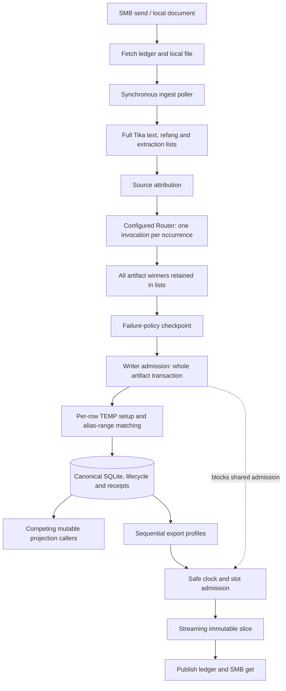
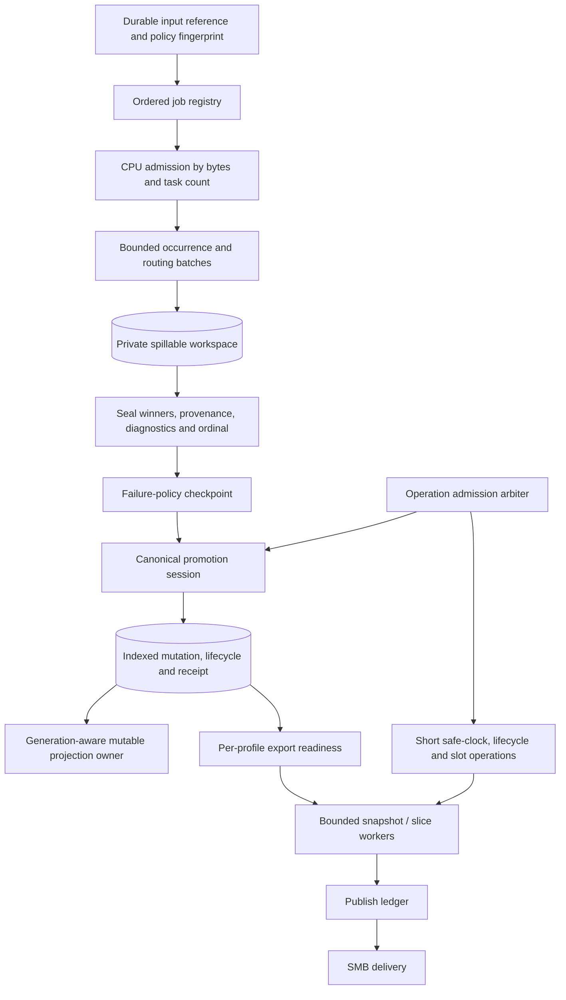

# Data processing capacity and scheduling review

Status: initial root-cause and architecture review recorded on 2026-10-04.
Runtime correction, complete memory attribution and capacity qualification remain
open. This report was updated during the investigation; confirmed observations
and proposals are kept separate. It is not performance acceptance or
authorization to change deployed state.

**2026-10-10 release-scope decision:** the owner requires SQLite for 0.3.0.
PostgreSQL will not be added or adopted in this release. The concurrent-store
alternatives below are historical research and possible future work, not
current implementation or qualification requirements. CAP-7C now compares the
corrected SQLite implementation with staged/versioned SQLite; see its
[transaction design](cap-7c-transaction-design.md).

The incident is a **storage/execution capacity defect**, rather than an
established inherent cost of configuration-driven routing. Exact-driver evidence
shows artifact-wide matching repeated once per row; a long canonical transaction
then blocks short control/export operations. The completed 100k-occurrence run
took 36 min 55 s from ingest start to GDI publication.

The proposed remedy has two scales: remove the selective-lookup failure first,
then replace document-wide prepared lists with bounded batches and a spillable
workspace, with explicit operation admission and one projection owner. A
Redis cache, larger heap or more Camel threads does not address these mechanisms.
The current 767 MiB cgroup sample includes memory outside Java live heap;
attribution remains incomplete and must not be presented as 767 MiB of Router
objects.

## Scope and evidence identity

Review the complete document/import → Router → canonical mutation → projection
→ immutable export → SMB publication path, including operation scheduling and
memory ownership. Challenge existing architectural choices as well as code.

- Repository: `module/platform/router`, HEAD
  `ffccda9da84a86f40cfea5e1054fff2933a0ec6d`, initially clean.
- Installed release: `860a3b2bdf3c-20261004T082925Z`, JAR SHA-256
  `8a1ddccb7ff669a56271719824e474ea1d44b30ab914cb027eb3ee28a1c12e43`.
- Relevant canonical matcher/mutation/writer sources are identical between
  installed release and reviewed HEAD. HEAD verification freshness must not be
  inferred from the installed release's earlier gates.
- Input: `ioc-100000-seed-43.html`, 6,277,616 bytes, SHA-256
  `8e27297b0aed5bc6e4a9dad1e1c81e55caa09aeb8696328fdbaa42d6e4a2ec9b`.
  Manifest: 100,000 input occurrences, 89,917 unique input values, six IOC types.
- Ingest run: `0d649de6-1c3f-412f-aee2-7cd65435d236`, started
  `2026-10-04T08:59:56.153432238Z` (16:59:56 Asia/Irkutsk).

Production diagnosis is observational: ledger queries use read-only connections
as the service owner; thread dumps do not restart the service. No production
data/schema, configuration, input or routing policy is changed. Local JMX management was
started for memory/thread observations; no forced GC or heap dump was requested.

## Confirmed incident timeline

| Event | UTC | Interpretation |
|---|---|---|
| Ingest started | 08:59:56 | Not the original SMB upload timestamp |
| Masks revision 11 | 09:00:02.841 | Stored effective-time timestamp; not commit completion |
| IP revision 15 | 09:00:41.667 | Stored effective-time timestamp; not commit completion |
| Blacklist revision 11 | 09:01:22.159 | Stored effective-time timestamp; not commit completion |
| Hashes revision 11 | 09:03:59.076 | Stored effective-time timestamp; not commit completion |
| New blacklist published | 09:10:15.744 | Delayed after its canonical commit |
| Observation at 09:27:26 | More than 27 minutes after start | Run still `STARTED`; aggregate revision still from 08:36:47 |
| GDI publication succeeded | 09:36:51.473 | Publish ledger success; physical CSV and `_SUCCESS` verified on SMB |
| Ingest completed | 09:36:52.064 | Final ingest ledger transition |

**Timestamp correction, recorded during investigation:** `changed_at` is derived
from `asOf`, sampled before the row loop, although the revision is written near
the end of the transaction. It is not a commit wall-clock measurement. The
aggregate revision later became 10 with `changed_at=09:10:15.396`, despite being
invisible at 09:27:26. Only the committed visibility observation, operation logs
and publication ledger establish the timeline above. Earlier working notes
interpreting these revision timestamps as commit completion are superseded.

Ingest start → GDI publication took **2,215.319 seconds (36 min 55.319 s)**;
ingest completion took **2,215.911 seconds**. SMB listing confirms the new
6,757,652-byte `GDI_IOC.csv`, manifest and `_SUCCESS`. This is one live run, not
a median, and the start is not the original SMB upload timestamp. The full
upload → publication duration needs a separately verified upload anchor.

The fetch ledger records completion at 08:59:53.137: fetched → publication took
**2,218.335 seconds**. Remote last-write time is 08:58:58.446, giving a
37 min 53.027 s last-write → publication interval; this timestamp is not verified
upload completion. Physical CSV has 90,203 data rows, its SHA-256 equals the
manifest, `_SUCCESS` equals the manifest hash, and coverage includes aggregate
revision 10. See [final evidence](qualification/capacity/stand-final-state-20261004.json).

## Confirmed findings so far

### C1. Canonical matching combines per-row invocation with an alias-wide plan

`JdbcCanonicalMutationEngine.confirm` invokes `JdbcCanonicalMatchPlanner.plan`
with a singleton request for every ordinary-ingest record. The planner drops,
creates and fills its TEMP request table each time. Its query joins the alias
table with active canonical records and sorts/deduplicates results.

Read-only EXPLAIN with the **installed JDBC driver 3.53.2.0 / SQLite 3.53.2**
on the live database showed:

```text
SEARCH a USING INDEX ix_canonical_match_alias_lifecycle (artifact=?)
SEARCH c USING INTEGER PRIMARY KEY (rowid=?)
SCAN r
USE TEMP B-TREE FOR DISTINCT
USE TEMP B-TREE FOR ORDER BY
```

Only `artifact` restricts the alias index range. This is not a selective lookup
by `(artifact, definition_id, key_hash, key_canonical)`, despite that index
existing. Repeating this search as the artifact grows implies quadratic work in
the affected execution plan. An isolated JDBC reproduction confirms scaling:

| Existing aliases | Current query, median ms / 32 requests | Request-first join, ms / 32 | Direct lookup, ms / 32 | Current VM steps, lower bound / one hit |
|---:|---:|---:|---:|---:|
| 1,000 | 18.926 | 7.862 | 1.524 | 18,000 |
| 10,000 | 110.623 | 6.424 | 2.010 | 180,000 |
| 100,000 | 753.919 | 4.378 | 0.855 | 1,800,000 |

The two candidate forms use all four alias lookup terms and fewer than 1,000
counted VM steps for the measured hit. The request-first experiment constrains
join order with `CROSS JOIN`; direct lookup bypasses the TEMP request table for
one key. Current and request-first timings include request-table recreation;
direct timings include statement construction, but no TEMP table. These are
single-fork diagnostic timings on synthetic in-memory data during live stand
work. They establish the bad complexity and a viable selective access path;
they do **not** establish an end-to-end speedup or validate complete mutation
semantics. See [probe protocol and raw evidence](qualification/capacity/README.md).

For `M` new mostly distinct rows and `A0` existing aliases, this plan's lookup
work is proportional to `M*A0 + M*(M-1)/2`, rather than `M` indexed lookups.
The completed stand aggregate contains 90,203 rows/aliases. That is a very
different storage workload from routing 100,000 occurrences into 20 winners.

Two live thread dumps sampled the worker in `NativeDB.step` through this matcher,
inside `JdbcCanonicalLifecycleWriter.confirm`. This supports the matching
bottleneck; it is not proof that every elapsed millisecond belongs to that SQL.

### C2. An entire artifact monopolizes writer admission

`JdbcCanonicalLifecycleWriter` holds `JdbcWriterAdmission` around a transaction
that iterates all prepared records. FIFO fairness only selects the next waiter;
it does not bound execution time or prioritize urgent operations.

The export thread waits for the same lock through `JdbcLifecycleClock.now`.
Safe-time sampling is a small **write** even when invoked by a read/export path.
Export also reconciles reusable slots under writer admission. A new committed
blacklist can therefore wait behind an unrelated artifact transaction.

### C3. Process, cgroup, heap and allocations were conflated

At 09:26:59 UTC, process `VmRSS` was 639,832 KiB (~625 MiB). A nearby cgroup
reading was 804,519,936 bytes (~767 MiB). These are different accounting scopes.
JVM limits are `-Xms128m -Xmx512m`; cgroup `MemoryHigh=768 MiB`,
`MemoryMax=1 GiB`, CPU quota is two CPU equivalents.

The diagnostic JMX sample reported:

| Metric | Bytes |
|---|---:|
| Heap used | 249,425,272 |
| Heap committed | 430,485,504 |
| Non-heap used | 123,119,720 |
| Non-heap committed | 137,101,312 |

Accumulated GC time was 1,957 ms young + 812 ms old over the entire process
lifetime. Those counters and sampled stacks contradict a GC-dominated explanation
for the observed many-minute delay. Native Memory Tracking is disabled, so native
memory attribution is incomplete. The cgroup has recorded `memory.high` events;
memory pressure is a separate amplification candidate, not yet a measured cause.

### C4. Preparation retains all artifact winners through sequential writes

`PrepareRoutedArtifactsStage` materializes each artifact's FINAL_KEY winners;
`PreparedArtifacts` retains all plans. `WriteArtifactsStage` writes them
sequentially and creates current-artifact confirmation structures. In daemon
mode `IngestionService` deliberately injects `NoopArtifactProjection` into that
stage; direct mutable projections run after all canonical writes. Oneshot uses
the stage's per-artifact projection. Independent lifecycle convergence can
project committed artifacts while the daemon run is still active.

Cache limits do not bound distinct winners or all prepared plans. Full input and
extraction structures contribute to preparation peak, but `PipelineRunner`
replaces the payload after prepare, making those earlier structures eligible
for GC. They must not be claimed to remain live through the entire writer loop.
Quantitative retained-object attribution remains pending.

### C5. Poller execution and profile ordering cause independent service stalls

`IngestFlowConfiguration:110–116` connects the poller to a synchronous handler.
`FileSourceMessageHandler.ingestAsync:346` calls the ingest use case inline;
only failed-attempt retries go through its retry scheduler. Thus a long business
operation occupies the detection/poller thread. Detection must register durable
work quickly, with bounded execution admitted separately. An unbounded executor
would exchange delayed detection for growing retained documents.

`DaemonExportScheduler:204–205` visits profiles on one executor in order. One
profile waiting for canonical writer admission prevents the following profiles
from making progress, even when their data is committed. This compounds C2.
Per-profile readiness, errors and bounded independent scheduling are needed;
the current per-endpoint SMB executor remains useful after a slice exists.

### C6. Source attribution has an independent quadratic dimension

`MarkerSourceAttributor:33–35,76–85` scans section markers from the beginning
for every occurrence. Work is `O(N*S)` for `N` occurrences and `S` sections.
For the roughly uniform current fixture (100k occurrences, 400 sections), this
is approximately 20 million marker visits. At 1m occurrences and 4,000 sections
it approaches two billion. This is a code-derived estimate, not measured CPU
attribution for the current incident.

For position-ordered extraction, advance a marker cursor once: `O(N+S)`.
If the attribution port supports unordered inputs, use binary search:
`O(N log S)`. Preserve nearest-preceding semantics, equality at marker position,
missing source, marker precedence and overlapping-marker selection.

### C7. Diagnostic limits apply after a stage has allocated its whole delta

`PrepareRoutedArtifactsStage:96,108–115` and `ExtractIndicatorsStage:76–108`
construct full stage diagnostic lists. `PipelineRunner:136–139` bounds retention
only after the stage returns. A 10,000-message run limit therefore does not
bound construction/peak memory for a large invalid or overlapping input.

Use a bounded diagnostic collector during processing, retaining exact aggregate
counts, severity/failure state and the supported diagnostic sample/order.
If complete detail must remain available, stream it to a quota-controlled spool.
Never discard an error in a way that changes the failure-policy checkpoint.
This is a capacity defect; high diagnostic volume was not established as the
dominant memory source in this successful live run.

### C8. Mutable projection has competing owners and a stale-install race

`IngestionService:469` directly writes projections after canonical processing.
Lifecycle convergence also invokes the same raw adapter (`AppConfig:940`), with
only its own scheduler guarded by `LifecycleProjectionScheduler:78`.
`CsvArtifactProjection:99–110` streams a snapshot to a private temporary file
and atomically replaces the target; there is no generation fence or shared
per-artifact owner around installation.

Code permits this sequence:

1. Direct ingest projection A opens an older snapshot, generation g1.
2. Another canonical operation creates g2.
3. Convergence B installs g2 and acknowledges it in durable projection state.
4. A finishes later and replaces the file with g1.

`JdbcArtifactProjectionWorkStore:70–76` protects acknowledgement with expected
generation, but A performs no acknowledgement and does not consult that fence.
The durable state can therefore report g2 projected while the mutable file is
stale. A periodic pending-generation check then has no work until another
change occurs. Atomic rename prevents a partial file, not an older complete
file overwriting a newer complete file.

This is a **P1 correctness finding from reachable code interleaving**, not a
live reproduction or the cause of this GDI delay. Immutable export slices use
another path. Introduce one generation-aware projection owner shared by ingest,
recovery and lifecycle; qualify stale-install ordering with a deterministic
latch-based regression before changing production.

**CAP-2 follow-up (2026-10-05): resolved and qualified.** The original
interleaving was reproduced with real temporary SQLite/CSV and timed latches.
The shared per-artifact owner now serializes snapshot/build/install/ack across
all production callers. Snapshot coverage advances monotonically; newer
canonical mutations stay pending and fault recovery needs no later mutation.
G2, including concurrent ingest/import/expiry and immutable-output regressions,
passed. See the [execution report](cap-2-execution.md) and
[ADR 0035](../../../ADR/0035-generation-owned-mutable-projections.md).
This correction does not establish that the historical stand incident exercised
the race or close the independent scheduling and memory findings.

## Finding priority and confidence

| Finding | Priority | Evidence | Required outcome |
|---|---|---|---|
| C1 alias-range search per row | P1 | Live exact-driver EXPLAIN, two hot-stack samples, private scaling/semantic probe | Selective indexed matching with work independent of unrelated artifact rows |
| C2 long writer occupancy | P1 | Lock owner/waiter samples and transaction code | Bounded admitted work or an explicit transaction architecture that meets control/export latency |
| C8 competing projection installs | P1, resolved in CAP-2 | Deterministic original-path reproduction; corrected G2 regression/fault qualification passed | Shared generation-aware install/ack owner implemented |
| C4 all winners retained | P2 | List contracts and preparation/writer ownership | Working-set budget independent of total distinct winners |
| C5 poller/profile coupling | P2 | Synchronous call path and sequential profile loop | Durable job execution separated from detection; independent profile progress |
| C6 marker rescanning | P2 | Nested-loop algorithm | Cursor/binary-search attribution preserving semantics |
| C7 late diagnostic bounding | P2 | Stage construction before bounded collector | Bound diagnostic allocation inside loops |
| C3 incomplete resource attribution | P2 qualification gap | RSS/cgroup/JMX evidence; no NMT/retained-object profile | Total-process accounting and comparable cold/warm baselines |

P1 denotes a high-impact functional/operational defect, not a measured percentage
of total cost. Several findings interact; their elapsed-time shares must not be
added without a controlled profile.

## Working technical direction

Separate bounded preparation, sealed global selection and admitted canonical
promotion. Route batches/references; spill high-cardinality final-key state to a
private workspace; make canonical matching selective and reuse statement setup
within a meaningful unit. Schedule operation classes explicitly and perform
CSV/SMB work outside canonical writer ownership.

Preserve failure-policy checkpoint, source ordering, KEEP_FIRST/LAST_NONEMPTY,
provenance/diagnostics, active-lifecycle matching, sparse slots, and canonical
receipt recovery. Import's delivery-wide canonical transaction must not be
silently weakened into ordinary chunk commits.

## Current execution model and cost ownership



The import side already pins a private snapshot and streams into a sealed SQLite
workspace. Its preparer uses the selected Router plan, then canonical promotion
uses one cross-artifact transaction and a commit receipt. This is a stronger
bounded-preparation model than the document's all-winners-in-heap contract.
Reuse its workspace/ownership concepts without coupling document semantics to
CSV delivery contracts or forcing them through an import API.

### Router is a policy mechanism, not the whole execution scheduler

The inspected Camel runtime has sound existing optimizations:
`CamelRouteRuntime:53–67` creates the isolated context once, binds endpoints and
reuses the producer; `:115–121` bypasses multi-recipient dispatch for one branch.
The compiler uses sequential recipients with linear reply aggregation. There is
no evidence of a Camel context being rebuilt for every IOC.

Each occurrence still creates invocation views, selection/recipient collections,
branch inputs/replies and Camel exchanges. Immutable row/cell/map wrappers add
allocation during mapping. This is a potential CPU/allocation cost proportional
to occurrence count and configured fan-out. The current SQLite search adds a
second multiplier: canonical table size. Replacing the Router cannot remove
that storage multiplier.

Configuration defines selection, demanded transformations, branches and field
mapping. It does not currently define global heap budgets, operation admission,
durable job execution or publication priority. Those are separate execution
contracts. Keeping the configuration-driven feature does not require keeping
one exchange per IOC or lists spanning an entire document.

### Secondary avoidable work

`AttributeSourceStage:65` creates an indicator list to count missing sources.
`PrepareRoutedArtifactsStage:101,103` materializes the same attributed indicator
twice per occurrence; `AttributionDecision.indicator` creates wrappers.
Final key material is computed during selection and again before confirmation.
`JdbcCanonicalMutationEngine:116,451–476` deletes/recreates aliases even for
unchanged-key TTL confirmation and computes match keys again.

These are suitable measured optimizations after C1: reuse one occurrence view,
carry admitted immutable identity with a schema/policy fingerprint, and update
aliases only when their key material/lifecycle actually changes. Statement reuse
must be connection/transaction scoped, with deterministic closure. A global
mutable statement cache is not a safe replacement.

Removing defensive copies indiscriminately would introduce branch/row aliasing.
Prefer compact immutable representations and explicit buffer ownership; do not
trade allocations for accidental cross-branch mutation. Unconditional alias
replacement is redundant in some cases, but the aliases remain authoritative
for mutable matching and identity migrations.

### Memory growth and algorithmic growth are separate

Let `N` be occurrences, `U_a` distinct final winners for artifact `a`, `S`
section markers, `M_a` canonical confirmations, `A0_a` prior aliases, and `K`
configured routing fan-out. The inspected model has these dimensions:

| Operation | Current dominant growth | Better target |
|---|---|---|
| Source/extraction preparation | Whole text and occurrence metadata in heap | Bounded parsing/occurrence windows or a quota-controlled spool |
| Attribution lookup | `N*S` marker visits | `N+S` for ordered occurrences, or `N log S` |
| Routing/mapping | Approximately `N*K` work and transient allocations | Same necessary semantics with batch dispatch/compact row representation |
| Final-key selection memory | `sum(U_a * retainedRowSize_a)` | Byte-bounded memory with indexed/external state |
| Canonical lookup in observed plan | `sum(M_a*A0_a + M_a^2)` | Selective probes or request-driven batch joins |
| Canonical mutation | Multiple statement setups/writes per row | Reused statements and batched/set-oriented eligible operations |
| Full projection/export | Active output rows/bytes per generation | Streaming snapshots with bounded/coalesced scheduling |

This analysis does not establish an exact retained byte count per prepared row.
Tika's `BodyContentHandler(-1)` and document-wide extraction lists remain an
input-size capacity concern; a private winner workspace alone does not make
the reader/extractor fully streaming. Likewise, reducing total allocation does
not necessarily reduce peak live heap or process RSS.

The processing session closes and clears its caches before writing; its current
two cache partitions share an accounted 1 MiB budget. Accounted cache bytes are
not measured deep heap, but enlarging or externalizing that cache does not
address hundreds of thousands of distinct retained rows. Cgroup file-cache
accounting also remains after Java objects are collected.

## Comparison with specialized data systems

The following are transferable mechanisms from official documentation, not
claims that those products would run this IOC workload faster. The applicability
column is our inference from the inspected implementation and contracts.

| System and official reference | Mechanism | Applicability and limitation here |
|---|---|---|
| [NiFi architecture](https://nifi.apache.org/nifi-docs/overview.html) | Content repository separated from coordination metadata and provenance | Queue delivery/workspace references instead of document/row graphs. Existing ledgers already provide part of this model; canonical receipt authority must stay in the dataframe DB. |
| [NiFi queues/priorities](https://nifi.apache.org/nifi-docs/user-guide.html) | Backpressure by queued count and bytes; configurable pending-work priority | Apply count **and** byte admission, plus age/fairness. A priority queue cannot preempt an already running transaction. Precommit spool must not require publication to drain it. |
| [Spring Batch chunks](https://docs.spring.io/spring-batch/reference/step/chunk-oriented-processing.html), [restart state](https://docs.spring.io/spring-batch/reference/readers-and-writers/item-stream.html) | Bounded read/process/write units, explicit resource lifecycle and persisted cursors | Adopt bounded preparation, connection/statement ownership and restart progress. Generic per-chunk canonical commits do not preserve delivery-wide atomic import. |
| [Flink backpressure](https://nightlies.apache.org/flink/flink-docs-stable/docs/ops/monitoring/back_pressure/) | Slow-consumer pressure and separate busy/idle/backpressured metrics | Stop admitting CPU work when prepared-data capacity or canonical throughput is exhausted. Measure waiting versus execution; more producers cannot increase a single SQLite writer's capacity. |
| [Flink state backends](https://nightlies.apache.org/flink/flink-docs-stable/docs/ops/state/state_backends/) | Explicit heap/disk state placement and shared state budgets | Spill global final-key/provenance state and budget native caches as well as heap. A disk backend adds I/O and serialization, which must be measured. |
| [DuckDB memory management](https://duckdb.org/2024/07/09/memory-management) | Streaming operators and disk spilling for large intermediate state | Use streaming batches **plus** spill for high-cardinality winner selection. An iterator alone does not bound a global dedup map. This is an execution pattern, not automatic adoption of an analytical database as canonical storage. |
| [Camel streaming Split](https://camel.apache.org/components/4.22.x/eips/split-eip.html) | Incremental split processing | Useful after the upstream API supplies a real cursor/batch. Splitting an existing full list does not recover its upstream memory. Parallel processing needs explicit deterministic encounter order. |
| [Camel SEDA](https://camel.apache.org/components/4.22.x/seda-component.html) | Bounded in-process asynchronous queue | Can carry durable work IDs between workers. It has no crash-persistent queue authority; ledger reconcile remains necessary. Count limits alone do not bound payload bytes. |
| [SQLite WAL](https://sqlite.org/wal.html) | Reader snapshots can coexist with the single writer | Keep safe-clock/slot control ownership short; stream CSV outside write admission. Long-lived readers can delay checkpoints. More writer threads do not add write capacity. |
| [PostgreSQL bulk loading](https://www.postgresql.org/docs/current/populate.html), [MVCC](https://www.postgresql.org/docs/current/mvcc-intro.html) | Bulk staging and transactional set operations with greater concurrency | A credible alternative if corrected SQLite cannot meet writer/control latency. COPY/MVCC do not implement our matching, authority, lifecycle, sparse IDs or recovery. Compare complete operations and total resources. |

The useful common pattern is **small coordination objects, bounded working
sets, explicit global state placement, selective/set-oriented storage and legal
yield boundaries**. Introducing NiFi, Flink or Spring Batch wholesale would add
a runtime and migration cost; their patterns can be applied within the existing
ports/adapters architecture.

## Proposed technical solution

This is a proposal, not an accepted ADR or an implemented change. It separates
policy semantics, memory working set, canonical atomicity and publication
visibility instead of treating one whole-document Java list as their shared
boundary.



### 1. Remove the storage multiplier first

Introduce a connection-scoped canonical matching/mutation session. Use a fully
constrained prepared query for singleton keys and request-driven indexed joins
for bounded multi-request batches. Create/stage TEMP request state once per
session/batch, not once per record. Reuse prepared statements, key material and
schema binding within that ownership scope.

The required match remains:

```text
artifact + definition_id + key_hash + key_canonical
    → alias canonical_row_id + lifecycle_id
    → matching canonical lifecycle with valid_until > asOf
```

Retain all keys for a request, union/deduplicate candidates and classify
NONE/EXACT/MULTIPLE exactly as today. Do not replace full canonical comparison
with hash-only matching, drop lifecycle equality or silently select the first
of multiple active matches. The probe's direct query only covers a single key;
it is not a drop-in implementation of the general matcher.

For a mutation batch, pre-matching against the initial database snapshot alone
is insufficient: earlier rows may insert or update aliases that later rows
must observe. The session must preserve transaction-local read-your-writes,
ordered field ranking and alias/key changes, or reproduce them in an explicit
staged reducer. A blind bulk prefetch can change collision behavior.

The existing full-key index is available, so a new index is not the primary
remedy. Query shape, join order and actual plans must be qualified with the
installed engine and representative cardinalities/statistics. `CROSS JOIN`
can constrain order in SQLite; `INDEXED BY` is a mandatory requirement, not a
tuning hint, and should not be the first intervention.
[SQLite optimizer](https://sqlite.org/optoverview.html),
[INDEXED BY contract](https://sqlite.org/lang_indexedby.html).

This correction is a necessary first slice, but it does not close bounded-memory,
projection ownership or operation-scheduling findings. Keep it independently
reviewable and measure the complete daemon path after it.

### 2. Replace document-wide prepared lists with sealed workspace handles

Application ports should expose a JDK-only `PreparedObservationHandle` and an
owned row/participant cursor, rather than requiring `List<PreparedArtifactRow>`
for every artifact. Concrete names remain an implementation choice. The JDBC
adapter owns the private workspace and SQL; core must not gain JDBC or Camel
dependencies.

The workspace records admitted schema/Router/identity fingerprints, source
observation identity, encounter ordinal, per-artifact final keys, final row
fields, ordered-field positions and provenance/diagnostic references. Global
selection stays global even though processing is windowed:

- KEEP_FIRST chooses minimum encounter ordinal, preserving the complete winner
  row and its requested export slot.
- LAST_NONEMPTY and ordered field updates preserve their existing explicit
  ordering/empty/null rules; completion order of parallel tasks is not rank.
- COALESCE stores participants, conflict disposition and diagnostics, not only
  a winner row. Losing occurrence provenance remains available.
- Explicit CSV NULL, ABSENT, technical provider null and redirected carriers
  retain their current distinct contracts.

Use indexed spool state or external sort/reduce when the byte budget is reached.
Logical spill indexes are private workspace detail, not a second canonical
authority. Seal the workspace only after preparation/validation completes;
apply failure policy before any canonical promotion. A failed prepare must leave
no public canonical mutation.

Provide disk quotas, bounded native/SQLite caches, manifest/count/checksum
validation, cancellation and cleanup ownership. A sealed workspace survives
recoverable interruption; unsealed state cannot be promoted. Check the canonical
receipt before replaying promotion. Reusing the managed-import workspace pattern
does not justify sharing its delivery IDs or mixing import/document namespaces.

A first workspace slice can preserve full-text reading while removing the largest
prepared-winner graph. Full streaming extraction is a separate change: regex
matches, refang literals, section markers, position offsets and overlap priority
can cross arbitrary byte/window boundaries. Specify carry-over or parser events
and independent equivalence fixtures before replacing whole-text extraction.

### 3. Separate detection, CPU workers and canonical operation admission

Detection stabilizes/claims/registers a file and queues its durable job ID.
Bounded CPU workers prepare workspaces. The single canonical writer consumes
sealed work through a separate admitted execution class. Reader/export and SMB
workers have independent bounded capacity. Queue saturation defers work to
ledger reconciliation; it must not lose a claimed delivery.

One global byte budget must account for all live document/import preparation
windows, queued data, reducer memory and workspace cache. Limit task count too.
With a two-CPU service quota, many concurrent CPU workers are an unlikely gain;
start with a small explicit pool and qualify throughput versus tail latency.
Virtual threads reduce waiting-thread cost, not canonical CPU/SQL work.

Preserve durable observation order and first-winner semantics when jobs execute
concurrently. Existing registered rank for selected fields is not proof that all
KEEP_FIRST behavior is independent of commit order. Start with serial promotion
in the supported order; parallel preparation may finish out of order without
changing that promotion order.

### 4. Define priority at legal ownership boundaries

Use explicit operation classes with wait-age metrics and starvation protection:

| Class | Resource/ownership | Proposed scheduling treatment |
|---|---|---|
| Safe-time, readiness/control state | Short canonical write | Small reserved opportunity between legal writer units |
| Lifecycle reconcile and export-slot work | Bounded canonical write | Due/age aware; preserve finite progress under intake |
| Document/import promotion | Canonical write | Throughput-oriented but measured occupancy; honor delivery/order contract |
| Snapshot and CSV generation | Bounded readers, disk/CPU | Independent per-profile readiness, coalesced superseded mutable work |
| SMB publication | Endpoint-keyed transport | Keep existing ledger/single-flight discipline; no canonical writer lock |
| Retention/compaction/checkpoint | Disk and bounded DB maintenance | Low ordinary priority with aging and backlog/space escalation |

This table is an execution-policy proposal, not an unconditional order where
all exports always precede every import. Strict priorities can starve bulk work;
FIFO fairness can allow one huge job to stall everything. Use weighted/aged
selection with measured work units. A scheduler cannot preempt a running SQL
statement or yield a transaction while preserving a single-writer lock.

Three boundaries must be kept distinct:

1. **Preparation window:** bounded rows/bytes; can checkpoint to private state.
2. **Physical canonical transaction:** the supported atomic mutation unit.
3. **Logical publication visibility:** which completed observations/revisions
   a consumer can see.

The first implementation should preserve current artifact-atomic ordinary writes
and delivery-atomic imports while eliminating bad SQL and heap materialization.
Measure writer occupancy after that correction. If the largest supported atomic
delivery still violates control/export latency, choose a new transaction model
explicitly; batching Java work inside one transaction cannot release SQLite's
writer to another operation.

Possible follow-on models are staged/versioned canonical promotion with a final
visibility barrier, or a more concurrent transactional store. A versioned model
needs pending-row exclusion, atomic receipt/visibility publication, conflict
handling against concurrent observations, TTL effective-time semantics, export
revision coverage, sparse slot behavior and restart/cancellation cleanup. It is
a substantial protocol change requiring an ADR and fault-injection qualification.
Committing chunks to current visible tables without that protocol is unsafe.

### 5. Unify mutable projection and decouple profile progress

Give each mutable artifact one generation-aware owner. Ingest/recovery/lifecycle
request convergence instead of independently installing CSV files. Capture the
covered generation with the snapshot; serialize or fence installation and
acknowledgement for that artifact, and leave newer requested work pending.
Building outside the install lock can improve throughput only if stale output
cannot install after a newer generation. Generation CAS solely after raw rename
does not provide that guarantee.

Coalesce superseded mutable generations and avoid rewriting the same current
file through two callers. Preserve run-ledger completion meaning: an ingest may
await acknowledgement of its required projection generation if that is the
existing completion contract. Generation ownership is not permission to mark
projection completed before installation.

Immutable export remains a separate snapshot/manifest/slot contract. Admit the
short safe-clock and slot reconciliation steps, then stream the snapshot outside
writer ownership as the current reader already does. Per-profile scheduling
should allow another ready profile to proceed while one is blocked, with reader
and disk limits; do not open one unlimited executor per artifact.

WAL permits concurrent reads and a writer, but long snapshot readers can pin WAL
and hinder checkpoint progress. Measure snapshot duration and WAL size. Safe
time and slot allocation currently write durable facts; bypassing their admission
without a replacement consistency contract is not a read-path optimization.

### 6. Make progress and cost observable

Record durable/current job phase and counts, without a database write per IOC:
prepared, sealed, awaiting canonical admission, promoting, committed, exporting,
awaiting transport, terminal. Rate-limit progress persistence and keep exact
final counters in receipts. A stale `STARTED` status for half an hour leaves the
operator unable to distinguish progress, a lock wait and a stalled worker.

Expose operation-class queue age, writer wait/hold time, records processed,
statement/lookup work, active readers, export profile lag, output bytes and
backlog. Distinguish event timestamps, effective lifecycle time, SQL commit
completion and publication completion. Cgroup pressure/CPU throttling, process
RSS/HWM, heap live/committed, non-heap, native cache and file-cache metrics belong
to separate series. Health UP should not be interpreted as capacity acceptance.

## Technology choices and rejected shortcuts

| Option | Assessment for this incident | Decision criterion |
|---|---|---|
| Correct SQLite matching + bounded workspace + explicit scheduling | Directly addresses observed complexity and ownership gaps with current contracts | Recommended first implementation track; full-cycle remeasurement required |
| Camel batch/cursor execution | Can reduce per-occurrence exchange/collection cost once batches are real | Compare against current runtime with exact routing/diagnostic/provenance equivalence and full ETL metrics |
| Compiled direct policy evaluator | Legitimate alternative if Camel dispatch remains material after storage correction | Preserve configuration, selection/demand/failure/trace contracts; adopt only from measured benefit and lower ownership complexity |
| Redis semantic/result cache | Does not fix alias scans, writer monopoly or retained unique winners | Revisit only for demonstrated reusable cross-run work with a safe policy/source/version key and net latency/resource benefit |
| Redis as canonical coordination/match authority | Introduces a second consistency/recovery authority and extra service | Requires a separate justified distributed contract; not an optimization of the current SQLite truth |
| More threads / virtual threads / SEDA around existing lists | Can increase concurrent retained state and writer wait | Useful for bounded I/O execution after ownership/admission is specified, not as the primary fix |
| Larger heap or weaker durability | May hide a pressure symptom or change guarantees while leaving quadratic SQL | Not accepted as a solution; compare equivalent durability and semantics |
| DuckDB for private analytical reduction | Potential useful spool/reducer backend | Compare with private SQLite/external sort; include serialization, disk and native memory |
| PostgreSQL canonical adapter | Real alternative for sustained concurrent transactional demand | Prototype against corrected SQLite with identical identity, lifecycle, receipt, slot and ordering contracts; count DB-service resources and operational cost |
| Whole NiFi/Flink/Spring Batch replacement | Offers useful primitives but brings a new runtime/control model | Justify by broader workload requirements; the incident does not establish that wholesale replacement is necessary |

Redis would add network/serialization work to currently local deterministic
processing. The aggregate intentionally keeps detailed URL identity, so many
distinct URL keys remain distinct even when they share a host. Caching cannot
legally collapse those rows. The immediate dominant lookup already has a local
selective index; use it correctly before adding a remote cache layer.

## Implementation sequence and decision gates

The detailed task breakdown, dependencies and proposed stage gates are in the
[capacity implementation plan](data-processing-capacity-plan.md). It separates
the first operational correction from complete capacity acceptance.

Do not merge these concerns into one unverifiable rewrite.

| Slice | Concrete work | Exit evidence |
|---|---|---|
| S0: root cause and baseline | Preserve input/runtime/DB identity, live outcome, SQL plans and work counts | This report and capacity evidence; completed without changing runtime |
| S1: selective mutation session | Direct/multi-key indexed lookup, batch request staging and statement ownership; preserve mutation order | Matcher/cardinality/identity/TTL/receipt regressions, work-count scaling and full 100k daemon cycle |
| S2: projection ownership | Shared generation-aware install/ack, remove competing raw callers, keep run completion semantics | Deterministic stale-install interleaving, failure/restart/backstop and mutable/immutable separation tests |
| S3: bounded preparation | Workspace handles/cursors, global reducer/provenance spill, bounded diagnostics; efficient attribution | Same complete semantic oracle, distinct-heavy resource scaling, spill/quota/cancellation/recovery tests |
| S4: execution admission | Durable detection/execution separation, byte/count budgets, profile independence and operation metrics | Mixed intake/import/expiry/export fairness, finite queue ages and shutdown/recovery under saturation |
| S5: optional runtime/storage alternative | Camel batch versus direct evaluator, or more concurrent canonical adapter | Net full-cycle gain against corrected baseline with equal guarantees; ADR for changed transaction/visibility contracts |

S1 has a demonstrated viable SQL mechanism, but has **not** been implemented in
the service. S3/S4 are architectural work, not cosmetic refactoring. Some work
can proceed independently, but shared contracts, schema migration and recovery
need reviewed boundaries. No accepted ADR is edited to imply this proposal has
already been adopted.

Promotion to a deployed release requires focused behavioral tests followed by
the repository's production gates (`make verify`, `make pmd-analysis`, applicable
watchlist review and `make docs`), then provisioned capacity/SMB evidence. Gates
from the installed release or an earlier commit do not qualify a changed runtime.

## Capacity qualification required after correction

Freeze both executable snapshots and the initial canonical/service state. Use
equivalent fresh/copy-on-write private stores, rather than benchmarking each
candidate against an increasingly populated database. Do not downgrade newer
schema files into an older binary. Keep all runtime flags, active lifecycle,
routing policy, quotas, filesystem and output/durability guarantees explicit.

| Dimension | Required cases | Purpose |
|---|---|---|
| Physical document volume | 1k, 10k, 100k, then supported 1m reference; HTML and actual DOCX | Separate parsing, routing, promotion and output costs |
| Final-key cardinality | Repeated/collapsed, mostly unique, all unique, and collisions after transform | Expose global winner/state and storage lookup scaling |
| Canonical starting size | Empty and populated 10k/100k/1m; fixed incoming set too | Distinguish incoming-size cost from unrelated existing rows |
| Section count | Few, 400 and thousands with fixed IOC count | Verify source-attribution complexity independently |
| Address shape | IPv4, port/path/query URLs, refanged values, domains, six IOC types | Preserve clean host/IP fields and detailed aggregate URL identity |
| Import mode | All five artifacts, AS_IS and supported processed contracts | Validate field preservation, canonical numeric rejection, IDs and dedup semantics |
| Concurrency | Intake plus import, expiry, mutable convergence, three export profiles and SMB | Measure writer/profile latency and overload behavior |
| Failure and restart | Before seal/checkpoint, during promotion, after commit before service finalization, during projection install/publish | Verify atomicity, receipt-only recovery and non-duplicated delivery |
| Resource pressure | Long/invalid values, high diagnostic volume, spill quota full, queue saturation | Verify count/byte admission and finite cleanup behavior |

The independent semantic oracle must cover fields, full canonical key material,
IDs, KEEP_FIRST/LAST_NONEMPTY, source ordering, provenance of losing occurrences,
diagnostics/failure policy, active/expired lifecycle boundaries, alias cardinality,
CSV NULL versus ABSENT, requested sparse slots and canonical/service receipts.
For the stand's IP import, equal `(ip, score, time_last_seen, time_first_seen,
threat_type)` selects the first row despite source/description differences;
removed duplicate slots remain holes and surviving requested slots are not
compacted. Aggregate detailed URLs must not be collapsed to host keys as a
performance shortcut.

For every primary sample report upload-complete → fetch → detect → prepare →
writer wait → canonical commit completion → projection/export → remote `_SUCCESS`.
Stamp upload completion in the runner with monotonic elapsed time and record
UTC correlation; do not reconstruct commit time from effective-time metadata.
Keep total cycle, each artifact publication and tail lag of already committed
data separate. Use multiple alternating fresh-JVM pairs and retain all samples,
including slow or failed runs; diagnostic JFR/instruction-count runs are separate
from primary timings.

Report total and per-phase CPU/wall time, final-row throughput, caller and
whole-JVM allocations, sampled/post-GC live heap in a private diagnostic run,
heap committed/max, non-heap, RSS/HWM, native ownership when NMT is enabled at
startup, cgroup anon/file/kernel memory, high-pressure/CPU-throttle events,
WAL/checkpoint/spill/output bytes and writer wait/hold distributions. Do not force
GC or restart the production process just to obtain a memory label.

A successful correction should demonstrate lookup work bounded by request keys
and actual matches rather than unrelated artifact cardinality; reducer heap
should plateau at its admitted budget while disk state grows with winners;
control/export jobs should make finite progress under sustained intake. Absolute
latency and resource acceptance require the operator's workload/SLO, but the
observed quadratic algorithm and stale-projection race are defects regardless
of a permissive local benchmark threshold.

## Qualification gaps and historical causality

O7/O8's repeated/collapse profiles establish valuable local semantic and
allocation evidence. The 100k host-collapse case has only 20 final hosts; O8's
unique document case is 8k/8k. Neither measures the current mostly unique mixed
100k document with roughly 90k aggregate rows, populated storage and concurrent
daemon lifecycle/export/SMB work. Passing those screens was not production
capacity acceptance. The O8 report already leaves that acceptance open.

The matching defect is present in storage changes `79be64ea` / `fbb5cc36`
(2026-08-23); Router runtime/preparation arrived with `468ff8e9` / `085cd9a5`
(2026-09-27/28). Git ancestry confirms the shared mutation kernel predates the
Router path. Thus "after deploying Router" does not by itself prove "caused by
Camel routing". The branch's routing semantics, occurrence preservation and
high-cardinality stand configuration can expose/amplify pre-existing storage
cost. Their exact contributions require a corrected-storage comparison.

The reported historical 1m-record/~400 MB run remains an operator observation,
not a verified comparable baseline. Equalize lifecycle/matching/receipt,
provenance, input/final-key cardinality, database starting state and accounting
scope before assigning a Router regression ratio. Do not reintroduce a removed
legacy runtime just to produce an easier but semantically weaker comparison.

Open evidence boundaries are explicit:

- Retained heap/native bytes per component are not measured; RSS and a sampled
  live heap cannot identify an individual collection's retained size.
- Two hot-stack samples plus work-count scaling establish a major matcher
  mechanism, not its exact percentage of the 36m55s cycle.
- Probe variants have one key/request and a synthetic schema; general batching
  and mutation/receipt equivalence remain to be qualified.
- The projection race was subsequently reproduced and corrected in CAP-2;
  no claim of its occurrence in the historical live run is made.
- Physical publication integrity is verified; this capacity investigation did
  not perform a complete independent row-by-row IOC oracle for the 90,203-row
  accumulated stand output.
- Original upload completion is uninstrumented; its true full-cycle duration is
  not substituted with file mtime, fetch or ingest time.
- No optimization was deployed, no production data was modified, and no new
  release/performance acceptance is claimed.

## Source audit anchors

Paths and line numbers refer to reviewed HEAD, not a stable public API.

| Evidence | Source |
|---|---|
| Singleton matcher invocation and alias replacement | [JdbcCanonicalMutationEngine](../../../../adapters/adapter-store-jdbc/src/main/java/com/iocextractor/adapter/out/store/jdbc/JdbcCanonicalMutationEngine.java), lines 84–87, 115–116, 451–476 |
| Query and request-table setup | [JdbcCanonicalMatchPlanner](../../../../adapters/adapter-store-jdbc/src/main/java/com/iocextractor/adapter/out/store/jdbc/JdbcCanonicalMatchPlanner.java), lines 65–87, 104–137 |
| Artifact transaction, effective time and commit | [JdbcCanonicalLifecycleWriter](../../../../adapters/adapter-store-jdbc/src/main/java/com/iocextractor/adapter/out/store/jdbc/JdbcCanonicalLifecycleWriter.java), lines 164, 185–256 |
| FIFO writer admission | [JdbcWriterAdmission](../../../../adapters/adapter-store-jdbc/src/main/java/com/iocextractor/adapter/out/store/jdbc/JdbcWriterAdmission.java), lines 17–31 |
| Export control writes versus outside-lock stream | [JdbcSnapshotSliceReader](../../../../adapters/adapter-store-jdbc/src/main/java/com/iocextractor/adapter/out/store/jdbc/JdbcSnapshotSliceReader.java), lines 123, 144–156, 177–205 |
| All plans, occurrence conversion and diagnostics | [PrepareRoutedArtifactsStage](../../../../core/ioc-application/src/main/java/com/iocextractor/application/pipeline/stage/PrepareRoutedArtifactsStage.java), lines 95–130, 139–174 |
| Sequential writes and confirmation list | [WriteArtifactsStage](../../../../core/ioc-application/src/main/java/com/iocextractor/application/pipeline/stage/WriteArtifactsStage.java), lines 94–100, 144–150 |
| Payload replacement and late bounding | [PipelineRunner](../../../../platform/platform-etl/src/main/java/com/iocextractor/platform/etl/PipelineRunner.java), lines 136–139 |
| Marker rescanning | [MarkerSourceAttributor](../../../../core/ioc-domain/src/main/java/com/iocextractor/domain/attribute/MarkerSourceAttributor.java), lines 33–35, 76–85 |
| Per-occurrence dispatch and shared runtime | [CamelRouteRuntime](../../../../adapters/adapter-processing-camel/src/main/java/com/iocextractor/adapter/processing/camel/runtime/CamelRouteRuntime.java), lines 53–67, 94–126 |
| Bounded session | [IndicatorProcessingSession](../../../../core/ioc-processing/src/main/java/com/iocextractor/processing/session/IndicatorProcessingSession.java), lines 20–21, 39–41, 105–109 |
| Inline ingestion | `FileSourceMessageHandler` at the reviewed baseline, lines 341–367 (replaced by `DurableDocumentDispatcher` in CAP-5) |
| Daemon projection ownership | [IngestionService](../../../../core/ioc-application/src/main/java/com/iocextractor/application/ingest/IngestionService.java), lines 456–469 |
| Mutable snapshot and unfenced installation | [CsvArtifactProjection](../../../../adapters/adapter-csv/src/main/java/com/iocextractor/adapter/out/sink/csv/CsvArtifactProjection.java), lines 85–110 |
| Generation convergence/acknowledgement | [ArtifactProjectionConvergenceService](../../../../core/ioc-application/src/main/java/com/iocextractor/application/artifact/lifecycle/ArtifactProjectionConvergenceService.java), lines 42–44; [JdbcArtifactProjectionWorkStore](../../../../adapters/adapter-store-jdbc/src/main/java/com/iocextractor/adapter/out/store/jdbc/JdbcArtifactProjectionWorkStore.java), lines 70–76 |
| Profile serialization | [DaemonExportScheduler](../../../../bootstrap/ioc-app/src/main/java/com/iocextractor/bootstrap/DaemonExportScheduler.java), lines 204–205 |

Earlier evidence: [O7 host-collapse](o7-host-collapse-qualification.md),
[O8 local optimization](o8-local-optimization.md),
[optimization plan](processing-optimization-plan.md).

## Review deliverable validation

### 2026-10-08 whole-service follow-up

[CAP-6 execution](cap-6-execution.md) and its compact evidence now test the
CAP-5 executable in the original resource envelope. The corrected matcher
removed the incident's SQL multiplier; it did not remove the following
whole-service costs:

- Serial preparation and canonical write already exceed 50s on the mostly
  unique 100k HTML/DOCX references, before final output convergence. Largest
  100k imports occupy the writer for 14–25s. This demonstrates CAP-7C's
  transaction-visibility decision point; priority admission alone cannot
  preempt an already admitted atomic transaction.
- Both mostly unique and heavily repeated million HTML inputs OOM while
  reading. CAP-7A must bound source retention and define fatal worker/admission
  ownership; winner reduction cannot repair an OOM before routing.
- Million DOCX reaches preparation but exceeds the private SQLite page cap
  within the configured disk/journal budget. Separate 100k JFR samples show
  substantial row decoding/UTF-8/map allocation churn. CAP-7D should compare
  serialization and index density as well as backend choices; moving the same
  encoding to another backend is not a demonstrated solution.

The drained schema upgrade and stopped-backup restore pass. Full SMB readiness,
exact eligibility/allocation counters, complete independent diagnostics/ranks
and sustainable mixed-load acceptance remain open. These results require
separate CAP-7 changes and renewed G6 qualification; they do not establish a
need to replace Camel or add Redis. Earlier review findings and validation
below describe their historical baseline, not today's acceptance.

The final diagnostic source was rerun against a private 1,000-alias database:
all three query variants returned the expected hit/miss counts and passed the
independent matching boundary fixture. This rerun checks reproducibility; it
does not replace the retained timing samples or qualify a production correction.
All three retained JSON evidence files parse successfully.

`make docs` passed with zero link errors; `git diff --check` passed. No production
Java or analyzer scope was changed in this review. Runtime `make verify` and
`make pmd-analysis` were not rerun: `make context` reports their previous passing
evidence at `860a3b2bdf3c`, with both freshness flags false for reviewed HEAD
`ffccda9da84a`. Those gates are required again when a runtime correction is made.
