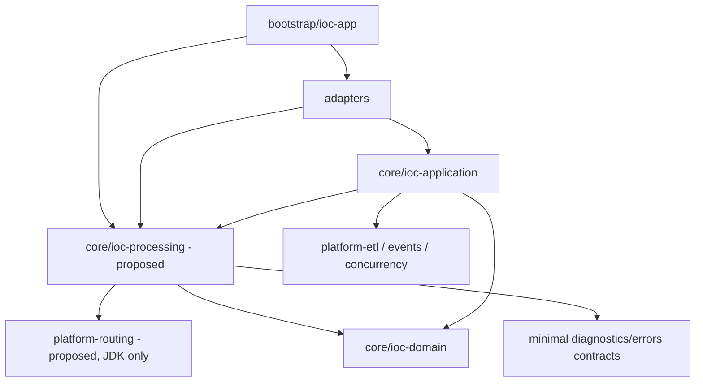

# Maven module boundaries

> Runtime selection reopened on 2026-09-27: see [Camel migration assessment](camel-migration-assessment.md).
> The JDK-only design below is option A, not a frozen implementation decision.
> Qualify option B (Camel preparation execution) before adding a routing module.

Status: revised proposal, 2026-09-27. New modules are a first-class design option, not
excluded by the preference for reuse. This document changes no POMs. Module
admission is separate from standalone library publication.

Basis: [module map](../../../MODULARIZATION.md),
[boundary enforcement](../../../BOUNDARIES.md),
[architecture](../../../ARCHITECTURE.md),
[ETL module](../../../../platform/platform-etl/README.md),
and the current application/CSV POMs. Domain and application capabilities remain
framework-free. A module should own a cohesive contract and implementation,
with an acyclic dependency closure; one class or pattern name does not require
one Maven module.

## Candidate disposition

| Candidate | Responsibility and dependencies | Proposed disposition |
|---|---|---|
| `core/ioc-processing` | Pure IOC preparation: derived views, binding, branch/field preparation; domain + minimal platform contracts | Preferred extraction candidate for shared semantics currently embedded in CSV/application |
| `platform/platform-routing` | JDK-only typed destination selection, match modes and explicit outcomes | Recommended internal module; no IOC logic, executor or durable state; see router-boundary.md |
| `platform/platform-etl` expansion | Outer ordered-stage runner and its existing diagnostics | Keep existing owner; avoid absorbing artifact routing or a second durable scheduler |
| `core/ioc-artifact-policy` | Pure record/match identity and candidate/update decisions | Possible later boundary if cohesive closure justifies it; do not create merely to repair a cycle caused by poor splitting |
| New engine adapter | Wraps one selected external execution family | Only if library adoption is independently justified; no Camel/NiFi adapter is currently planned |
| Existing modules with cohesive packages | Same capability API, no new reactor entries | Valid lower-migration-cost alternative if extraction would create tiny modules or broad shared contracts |

Recommendation: separate generic routing from IOC in an internal
`platform-routing` module, with the bounded contract in the
[Router analysis](router-boundary.md). Independently qualify `ioc-processing`
for relocation of shared IOC preparation. These modules have different owners:
routing chooses destinations; processing implements data semantics. Keep the
existing ETL runner and canonical coordination. No external publication or
second production domain is required for this internal boundary.

## Proposed dependency graph for the extraction option

Arrows mean compile-time dependency, not data flow.

The application retains use cases, ordered registration, import authorities,
workspaces, canonical writer ports, lifecycle, receipts and export coordination.
The processing module must not depend back on `ioc-application`. It returns pure
preparation values; the application attaches persistence commands and durable
observation metadata. CSV retains delimited parsing, wire/schema translation
and projection serialization.

## Dependency closure and relocation plan

| Current seam | Target under the extraction option | Constraint |
|---|---|---|
| ConfigurableRowMapper/ColumnSpec and provider/transform semantics in CSV | Processing-owned wire-neutral mapping model and evaluator | Move pure behavior; keep CSV storage/encoding rules in adapter; no duplicate mapper |
| IndicatorClassifier in application | Move the pure classifier with preparation, or reuse domain MatchPolicy through a single relocated facade | Both consumers use one implementation |
| ClassifiedIndicator in application pipeline payload | Processing result type, adapted by outer stages | Do not make processing import pipeline payloads |
| ArtifactRow and prepared row structures | Audit field-only value contract for relocation; retain ID reservation/write-plan orchestration in application | No dependency on ArtifactWritePlan/ID sequence merely to return mapped cells |
| Existing canonical key resolvers and write policies | Remain application-owned initially; processing returns final fields/candidates | Application applies identity/grouping through existing evaluators; no copied hashing/reducer |
| CsvProcessedImportRowPreparer | Thin boundary translating contract cells into preparation inputs and results back to import rows | Source authority and ABSENT/NULL/VALUE semantics remain explicit |
| Configuration catalogs | Bootstrap compiles existing configuration into immutable processing contracts | No IocProperties or Spring imports in processing |

The existing CSV preparer interleaves mapping and key-based selection. Extraction
must separate these responsibilities at that seam: pure mapping produces
candidates; application policy selects/groups them. If this requires moving a
small stable row-value type inward, move the type once and update consumers.
Do not create `ioc-shared`, generic maps or bidirectional Maven dependencies as
shortcuts. Do not lift lifecycle/storage types into a shared module merely to
make compilation succeed.

## Separate Router module

The [detailed analysis](router-boundary.md) recommends a distinct JDK-only module
for FIRST/ALL/EXCLUSIVE selection and explicit default/unmatched/ambiguous
outcomes. It accepts bound typed predicates and returns destination IDs. IOC
rules stay in processing/domain. The consumer dispatches selected operations
through existing preparation orchestration; no Stage, Envelope or executor is
reimplemented. Neither platform-routing nor platform-etl depends on the other.

This has a distinct reason to change and can be tested without IOC classes.
The added Maven/build scope is justified by enforceable boundaries, not code
volume. The larger heterogeneous DAG/scheduler remains a separate extension.
Standalone library publication still requires its own admission evidence.

## Admission evidence and build costs

Before selecting a module split, record exact moved classes, imports, public API,
consumers and rejected dependencies. Compare against the package-only variant
for cohesion, dependency reduction, visibility and migration cost. Compile a
minimal dependency closure; new architectural tests must reject inward-to-outward
dependencies and cycles. No performance advantage is claimed from modularization.

An admitted module requires parent reactor/dependencyManagement entries,
shared version alignment, module README, package visibility and boundary tests,
Enforcer rules and affected consumer POM changes. Update coverage/SpotBugs/CPD/PMD
report scope, lifecycle integrity expectations and evidence in the same change;
do not lower gates or silently relabel denominators. Update root module maps
and capability docs. Run focused tests, full verify and PMD on the final tree.
No new module or published artifact is created by this design revision.

Relevant build admission files include `build-support/coverage-report/coverage-scope.tsv`,
`coverage-floors.tsv` and `coverage-ratchets.tsv`, analyzer-specific `*-scope.tsv`
files, and `build-support/test-quality/test-lifecycle.properties`. Relocated core
behavior must retain appropriate core coverage requirements; moving it into a
new JAR must not become a way to weaken its previous quality gate.

## Draft decision M1

**Status:** proposed. **Context:** preparation semantics have two use-case
consumers and currently depend on CSV implementation details. **Decision:**
separate the generic Router as specified by draft R1 and evaluate extracting
the IOC preparation capability with the dependency closure above. **Alternatives:** enforce
the same capability within application packages; extend platform-etl; introduce
separate routing and artifact-policy modules immediately. **Consequences:**
stronger compile-time separation is possible, at the cost of moving existing
types and updating build scope. Identity, mutation and recovery retain one owner.
