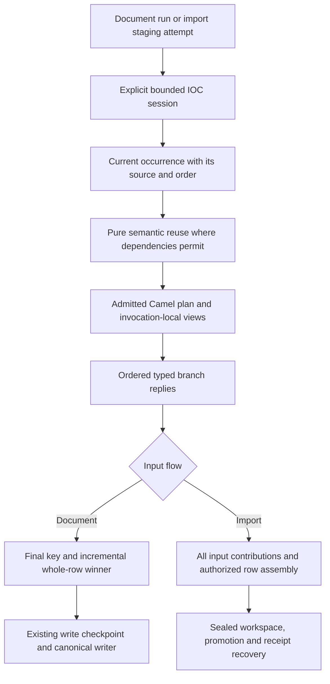

# IOC processing and Camel optimization plan

Status: accepted execution plan, originally prepared 2026-10-01. Production baseline:
`08d30621876f546ba7f19061fd3fcbd9548b7e29`, branch `module/platform/router`.
This plan refines the completed Router/IOC implementation; it does not reopen
the customer data contract or claim performance acceptance.

Progress, 2026-10-03: O0 comparison/diagnostic tooling and O1–O2 implementation
are recorded in [O0–O2 evidence](o0-o2-implementation.md). That evidence includes
independent first/warmed workload pairs, invocation counters, preparation timing
and a proposed resource budget. Customer budget agreement, broader workload
qualification and final performance acceptance remain open. O3 incremental winner
retention and O4 explicit semantic sessions are implemented; qualification is
recorded in [O3–O4 evidence](o3-o4-implementation.md). O4 delivery-wide import
reuse is deferred in favor of row-local scope. O3 retains the explicit
`prepareLegacy` exclusion and the pre-existing lifecycle duplicate-key rejection.
O5–O7 implementation has not started.

Inputs: [cost analysis](router-cost-and-architecture-analysis.md),
[Camel applicability](camel-optimization-applicability.md),
[P6 qualification](p6-qualification.md),
[configuration/execution design](configuration-execution-design.md),
[IOC implementation plan](ioc-processing-implementation-plan.md) and
[ADR 0031](../../../ADR/0031-bounded-camel-preparation-runtime.md).
The order below is the common execution sequence for the two investigations;
their earlier priority lists remain research recommendations.

## Objective and scope

Reduce selected document and processed-import time, allocation churn and
retained preparation state while preserving configurable data routing and
observable results. Keep Camel as the admitted execution adapter initially.
Use its existing mechanisms efficiently before considering a runtime replacement.

The measured duplicate-heavy baseline is 1.67x compatible document time and
2.43x calling-thread allocations; import is 1.86x time and 1.55x allocations.
These are workload-specific measurements, not Camel-only costs. The document
fixture produces 60 final rows from 24,000 selected-path mapped candidates and
performs 8,000 original plus 8,000 host classifications. Compatible preparation
also processes every aggregate occurrence: its 8,040 candidates are not merely
20 unique values. See P6 and the cost analysis for measurement boundaries.

Mandatory work: measurement discipline, invariant binding, linear reply
collection, redundant-copy removal, incremental document winner retention,
safe semantic reuse and final qualification. Conditional work: coarser Camel
execution, delivery-wide import reuse and secondary allocation optimizations,
subject to their semantic and resource gates. New Maven modules, runtime
dependencies, database migrations and operator routing syntax are not assumed.

## Invariants and responsibility boundaries

| Concern | Owner and invariant |
|---|---|
| Address grammar, features and host derivation | Existing domain implementations remain the single source. Preserve type, port/path/query/fragment distinctions; no DNS or alternate parser. |
| Declarative classification and field mapping | `ioc-processing` remains pure and uses registered rules/providers/transforms. Operator codes and conditions remain authoritative. |
| Selection, view demand and execution | Camel adapter owns generic contracts; no IOC types or artifact-key logic enters it. Preserve MATCH/NO_MATCH/BLOCKED and declared short-circuit order. |
| Final document identity and winner | Application owns configured final-row keys and whole-row selection. No global domain/IP uniqueness; composite identities remain valid. |
| Import row assembly and authority | Application contracts and bootstrap binding retain ABSENT/NULL/VALUE, source authority and explicit input/output bindings. Technical provider null is no contribution. |
| Durable state | Existing service coordination and dataframe commit/receipt owners remain unchanged. Document commit is per artifact; import promotion is cross-artifact. |
| Runtime wiring and lifecycle | Bootstrap selects preparers through real YAML/preflight. Adapter runtime owns endpoints/producers and bounded shutdown; invocation/session state has explicit owners. |

All observations still pass through applicable validation, routing, mapping and
diagnostic production. KEEP_FIRST is not permission to skip later occurrences.
Winning a document candidate does not change canonical conflict/mutation rules.
Import COALESCE is not document winner selection: never use an in-memory
document reducer to bypass stage participants or their warnings.

Only new observations use configured cleanup. No rekey/backfill of accumulated
records, fingerprint bypass, hidden fallback, framework redelivery, early
durable writes or change to the failure-policy checkpoint is introduced.

## Intended structure

This shows responsibility boundaries, not a new generic ETL engine. O1/O2 keep
current exchange boundaries; O6 alone experiments with a coarser Camel graph.
IOC session caches and per-invocation view memoization have different lifetimes.

Use the existing Adapter, compiled registry/factory and winner Strategy seams.
Add invocation-local accumulation and explicit session ownership where needed;
do not build a universal cache/router abstraction or a second field evaluator.
Composition is preferred over a new processing inheritance hierarchy.

## Ordered slices

| Slice | Deliverable | Prerequisites and exit |
|---|---|---|
| O0 — comparison and acceptance contract | Reproducible baseline, observable-equivalence corpus, measurement manifest and proposed resource budget | Before performance claims; no production rewrite. |
| O1 — bind invariants | Runtime-bound endpoints and startup-bound predicate parameters | O0; equivalent admission, failures and shutdown; isolated cost comparison. |
| O2 — linear replies and row ownership | Typed Camel list strategy, safe single-recipient path, one defensive row copy | O1; ordered immutable results, isolation and exception equivalence. |
| O3 — incremental document winners | Shared application winner mechanism used only by `PrepareRoutedArtifactsStage` and `CsvArtifactPreparer.prepareOccurrences`; preserve `prepareLegacy` multiplicity | O0/O2; winner/order/diagnostic, ID-reservation and provenance equivalence; lower retention only in existing reduction paths. |
| O4 — session and semantic reuse | Explicit document scope, bounded pure-result reuse; gated import staging scope | O3; proven dependency key, isolation, bounded capacity and retry cleanup. |
| O5 — measured secondary work | Immutable import binding metadata; justified mapper/trace/MDC allocation improvements | Profiles after O1–O4; retain only useful independent changes. |
| O6 — coarse Camel experiment | One plan entry with fewer tiny operation exchanges | O1–O5 evidence; promote only if conformance, cost and complexity all improve. |
| O7 — final qualification | Paired production-composition evidence, risk dispositions and documentation | All adopted changes; complete build-quality gates and acceptance review. |

Implement in order with separately reviewable changes. Record O1/O2 substeps
individually rather than combining endpoint binding, caching and graph changes
into an unattributable benchmark improvement. An experiment rejected at O6 does
not invalidate the earlier safe improvements.

### O0 — measurement and acceptance contract

Extend the existing `ProcessingRouteComparison` and
`tools/dev/processing-route-comparison.py`; expose reproducible profiles through
the Make facade. Reuse R5 for neutral dispatch diagnostics. Retain the current
sampler-failure/interruption regression and publish metrics only after every
owned measurement worker has terminated successfully.

Maintain three comparison references:

- **Original selected path** at `08d30621`: optimization regression reference;
  optimized selected results must preserve its full supported behavior.
- **Compatible path at the same revision**: current incremental routing cost.
  Re-measure after shared mapper/winner improvements; do not freeze an
  artificially slower compatible implementation to make a ratio look better.
- **Matched-semantic dispatch experiment**, only for execution decisions:
  identical operations, view demand and branch outcomes across mechanisms.
  It complements, not replaces, the production comparison.

Keep existing exact CSV/key checks and add source/order metadata, diagnostic
code/severity/count, prepared/materialized row multiplicity, reserved canonical
ID counts/ranges and recorded provenance occurrence counts, failure status,
import participant/warning counts, canonical
receipt and receipt-only finalization checks where appropriate. Selected and
compatible flows already differ in duplicate-skip diagnostics. Record that
difference explicitly; do not erase it or claim whole-workload equivalence from
equal CSV bytes. Within a selected-path optimization the diagnostic contract
must remain unchanged. Measure routing/preparation separately to help explain
end-to-end results without turning off production diagnostics in acceptance runs.

Record revision/worktree identity, fixture and effective-config digests,
JDK/Camel/Boot versions, CPU/cgroup limits, JVM flags, logging/trace state,
warm-up and measurement counts, pair order, output signatures and raw samples.
Use isolated worktrees for cross-revision execution. Keep generated JFR/logs/DBs
under ignored workspaces; retain compact reviewed reports and fixture/harness
sources needed to reproduce decisions. Local `.dev/` experiments are leads,
not a portable qualification bundle.

Start with the retained 8k-document/2k-import workload and one-factor changes:
0%, 50%, approximately 99.75% repeats; 1k/8k/100k occurrences;
1/4/16/64 admitted branches. Define duplicate fraction and unique count
explicitly for each import size instead of assuming its 2k/20-key baseline has
the document's duplicate fraction. Add mixed hashes/domains/IPs/URLs, long
paths, multi-input rows, filtered, blocked and recovered cases. Use at least
five independent pairs initially; alternate order and report median, spread
and paired ratios. Extend sampling when noise prevents a conclusion; do not
retry selectively or discard failed runs. A small fork count does not support
a tail-latency SLO.

Report separately:

- First-workload time after Spring startup, and JVM/context startup itself.
- Warmed service processing with a defined warm-up sequence; bounded semantic
  sessions are still fresh for each document/staging attempt. Use new identities
  and delivery occurrences with equivalent preconditioned DBs in both paths;
  repeated receipt replay or canonical no-op work is not an insertion benchmark.
- Preparation time, complete workload time, input throughput, calling-thread
  allocations, GC activity, sampled heap and process RSS. Distinguish current
  RSS samples from historical VmHWM and startup from workload peaks. Validate
  metric availability and units; unsupported/missing metrics invalidate the
  applicable comparison rather than silently becoming zero.
- Longer diagnostic JFR profiles separately from primary timing. Use allocation
  weights as estimates; sparse execution samples cannot establish CPU shares.
  Calling-thread allocation is not process-wide allocation.

Diagnostic counters cover original/derived classifications, parser/PSL calls,
predicate evaluations, view demands/computations, template/recipient sends,
mapped/discarded candidates, maximum retained winners/cache entries and emitted
diagnostics. Put counters in the probe or opt-in diagnostic instrumentation;
check their effect and keep primary timing runs free of expensive per-item
logging. Cache hit rates alone do not establish an end-to-end improvement.

Before qualification, agree and record the allowed time/allocation overhead
against the **contemporaneous compatible path**, absolute resource limits and
relevant workloads. The existing 2x/3x guards and 1 GiB envelope remain historical
regression limits, not approval of that cost. Customer acceptance values are
not yet agreed; do not invent or relax them after seeing optimized results.
Implementation can proceed with per-change improvement evidence, but O7 cannot
declare performance acceptance while the budget remains unresolved.

### O1 — compile and bind invariant work

Owners: `CamelPlanCompiler`, `CompiledRoutes`, `CamelRouteRuntime`,
`InvocationViews`, `OperationCatalog`, `CompiledSelector` and
`IocProcessingOperations`.

Keep descriptors framework-neutral. Build runtime endpoint references only
after the corresponding context/routes are installed; keep them inside the
Camel adapter and release them with that runtime. Replace fixed string template
requests and selected recipient URI resolution with references supported by the
pinned Camel version. Keep producer reuse and startup failure cleanup; do not
disable its cache or enlarge it without evidence of endpoint churn.

Extend the existing predicate registration binding seam so each condition leaf
binds validated arguments once into a value predicate. Bind `type-in` to an
immutable supported-type set; no per-occurrence splitting and no shared mutable
argument cache. Preserve existing syntax, eager collect-all semantic validation,
short-circuit order and accepts-absence metadata. Unknown/invalid arguments must
fail through existing configuration diagnostics, not delayed runtime parsing.

Tests: startup binding failure cleanup, repeated calls, two independent runtimes,
concurrent invocations, close races, all routing modes and invalid YAML arguments.
Evidence: reduced URI-resolution/argument-parsing work and allocations in the
production probe; structural counts must not change semantic operation counts.

### O2 — reply aggregation and defensive copies

Owners: `BranchReplyAggregationStrategy`, dispatch routes/contracts and
application `ArtifactRow`.

Replace copying every accumulated reply prefix with a thin typed
`AbstractListAggregationStrategy<BranchReply>` adapter. The mutable collection
belongs to one exchange/invocation, never to the strategy instance. Require a
valid typed reply; Camel's null-value omission must not hide an invalid result.
Verify completion behavior for the actual Recipient List and freeze exactly at
the public result boundary. Preserve prepared/filtered/unavailable replies and
declared order. Collection growth becomes linear in recipients rather than
repeated prefix copying.

Retain zero-recipient finalization. Introduce one-recipient dispatch only after
complete selection and required-view resolution; wrap its reply in the same
result contract. EXCLUSIVE must still establish uniqueness, and FIRST must not
reselect after a selected preparation failure.

Remove the extra map copy in `ArtifactRow.ordered` while retaining ordered,
unmodifiable, defensively copied public rows and support for null cell values.
Do not substitute `Map.copyOf` where null values are legal. Changes to ownership
must not expose mutable caller maps or mutate a previously returned row.

Tests: zero/one/many recipients, expected/unexpected errors, exact order,
immutability, concurrent isolation, branch input contamination, mutation of a
source row map after construction and null cells. Measure aggregation and row
copy changes separately; the six-variant local probe's 44% allocation reduction
is not a promised application gain.

### O3 — incremental document winner retention

Owners: application `ArtifactOccurrenceSelector`,
`PrepareRoutedArtifactsStage`, `CsvArtifactPreparer.prepareOccurrences` and
existing final identity resolver. Keep winner policy in application; the CSV
adapter uses that owner instead of implementing a second reducer.

Apply the accumulator only where final-key grouping and winner selection already
exist: `PrepareRoutedArtifactsStage` and `CsvArtifactPreparer.prepareOccurrences`.
Do not apply it to `CsvArtifactPreparer.prepareLegacy`, or change dispatch from
`prepare(List)` / the KEEP_FIRST batch path to occurrence-aware preparation.
`prepareLegacy` passes every accepted mapped row onwards without final-key
grouping. This remains true when upstream `ioc.pipeline.deduplicate=false`, and
when distinct retained indicators map to the same final key. Preserve prepared
row multiplicity/order and downstream ID reservation and provenance accounting;
equal projected CSV bytes do not prove these effects are equivalent.

Extend the selector with an invocation-owned accumulator that retains a winner
per `(artifact, configured final row key)` in first-key-encounter order:

- KEEP_FIRST retains the first whole candidate.
- LAST_NONEMPTY replaces it only when the configured selection field is
  nonblank; if every value is blank, retain the first candidate.
- A replacement carries the complete row and its source/order/ordinal/field
  metadata. It is not independent per-field merging.

Resolve identity after mapping/cleanup as today. Process all subsequent
occurrences and collect their diagnostics even when their candidates lose.
Preserve current candidate encounter order, including multiple branches for
the same artifact. Do not sort or recompute winner positions as an optimization.
Reuse the same selection transition only in those two existing reduction paths;
retain a list-based selector entry point where needed and delegate it to the same
policy implementation. Do not introduce winner selection into the legacy path.

Tests: all-blank groups, later nonblank then blank, ties, distinct sources,
multiple branch candidates, cleanup collisions, synthetic composite keys,
losing-row diagnostics and failure checkpoint. Compare exact golden outputs.
Do not apply this accumulator to import staging/COALESCE.

Add regressions for the unselected KEEP_FIRST path with upstream deduplication
disabled: two identical accepted IOC occurrences still produce two prepared rows
in input order. Add a separate fixture with distinct admitted/retained indicators
whose mapped rows collide on the configured final key, including distinct source
contexts; cover deduplication enabled and disabled. Check preparation multiplicity
and materialization/ID-sequence reservation, then drive the canonical writer and
assert the supported source/provenance occurrence counts against the unchanged
baseline. Canonical uniqueness may still produce one public row. Exercise the
applicable lifecycle and non-lifecycle write paths, and retain selected-route and
occurrence-aware winner tests to prove their existing reduction still takes place.
These checks must inspect storage/accounting effects, not just golden CSV bytes.

Expected bound in the two existing reduction paths: **candidate retention**
changes from O(mapped candidates) to O(distinct final keys). `prepareLegacy`
retains its existing row list and multiplicity. Mapping, input occurrences and
accumulated diagnostics can remain input-proportional; no claim of bounded total
process memory follows. Mostly unique input remains O(N) and must still fit the
resource envelope.

### O4 — explicit sessions and bounded semantic reuse

Owners: framework-free application ports/use-case scope, pure IOC processing
operations and bootstrap wiring. Router remains unaware of IOC cache keys.

The current `DocumentProcessingPlan.prepare(occurrence)` has no document scope.
Introduce a small explicit document-session factory/handle at that port rather
than putting a cache in a singleton or ThreadLocal. The preparation stage owns
one session for its run and closes it on success, rejection or exception. Retain
existing call-site behavior through a lightweight uncached adaptation where
needed; never create two document execution algorithms. Keep Camel/Spring types
out of the application API.

Separate current occurrence context from cacheable semantic results. Reuse the
existing classifier/parser/host deriver through a session-owned collaborator,
not a rewritten parser or duplicate rule evaluator. Cache only immutable results
whose dependency contract is demonstrated. Audit `MatchPolicy`, feature
predicates and registries: the API accepts a complete Indicator and does not
currently guarantee value-only purity. Until that contract is explicit, reuse
only safe feature/parsing work or use a complete conservative dependency key;
do not silently assume source-sensitive policies cannot exist.

Key classification by effective value, type and every declared semantic
dependency. Pin configuration/registry semantics to the session; any cache that
outlives that pin also needs policy identity. Keep current source, document span,
order, ordinal, preparer bindings, clock-derived fields and diagnostics outside
shared value-only entries. Reconstruct derived indicators with the current
source. Equal original/host strings justify reuse only when type and all
classification dependencies also agree.

Initially cache successful pure results. Expected failure descriptors may be
reused only after proving per-occurrence diagnostics/recovery equivalence;
never cache published diagnostics, consumers, branch replies or full candidates.
Unexpected exceptions propagate and are not retained as reusable successes.
No Idempotent Consumer: every occurrence still participates.

Set explicit entry and retained-key/value-size budgets, including oversized
input bypass. Use simple bounded admission with uncached computation after the
budget is reached initially; consider eviction only if measured workload locality
justifies it. Cache exhaustion affects speed only, never results or admission.
Choose limits from O0 unique/long-value/concurrent-session measurements before
enabling reuse. Avoid new cache libraries or operator knobs without need; any
new knob requires strict binding/preflight/documentation. A session bound does
not bound the number of simultaneous sessions: measure existing concurrency.

For import, begin with reuse within one logical-row invocation when useful.
Delivery-wide reuse is a separate gated substep: the existing preparer is called
row by row, so staging must own and pass one explicit handle through admission,
preparation and source-authority validation. Scope it to one pinned contract and
one staging attempt; close on seal/failure, use a new handle on restaging, and
open no processing session for receipt-only recovery. If that seam cannot be
changed safely, document delivery-wide reuse as deferred rather than implementing
a hidden delivery-ID map. Still complete document/session correctness evidence.

Tests: same value/different source, equal host/different original type,
policy-dependent classification, capacity and oversized bypass, concurrent
sessions, failure cleanup, source/position winner metadata, import ABSENT/NULL,
compound carriers, warnings and replay from receipt. Counters must demonstrate
fewer pure computations on repeats without fewer observations/diagnostics.

### O5 — immutable metadata and secondary allocations

Precompile immutable contract/output authorization metadata currently rebuilt by
`RouterProcessedImportRowPreparer.requireBinding`. Reuse admitted contract/plan
owners and reject mismatches; do not remove dynamic row presence, required-primary,
source authority, carrier replacement or compound-conflict checks. Keep source
`when-type`/`when` and configured transforms consistent with their verifier.

Profile shared mapper/provider/transform metadata and capture stable operation
bindings during compilation where it removes demonstrated repeated work. Both
selected and compatible paths keep the single `ConfigurableRowMapper`.

Guard disabled trace work before formatting success events. Optimize MDC scopes
only if post-O4 profiles justify it, preserving correlation and nested restoration
with tracing both enabled and disabled. Preserve warning/error logging and
per-consumer recovery severity. Lazy success/failure containers may reduce churn;
do not remove error evidence or introduce mutable public results to save copies.

Each adopted change has a focused regression, isolated measurement and explicit
owner. Defer micro-optimizations whose cost is below measurement noise.

### O6 — one-entry Camel experiment

Prototype a single plan-entry exchange with invocation-local original/view state,
compiled processors, complete typed preselection and ordered dispatch. Use bound
single sends or selected endpoint Recipient List as appropriate. Do not execute
all static multicast recipients merely to filter most of them afterwards.
Retain lazy dependencies; requesting one view must not eagerly run the graph.

Compare the existing optimized plan with the prototype using the same IOC
operations and conformance fixtures. Preserve typed expected failures and explicit
recovery; framework exception handling must not convert an unexpected exception
into fallback, implicit retries or a filtered branch. Mutable exchange body,
headers and properties must not contaminate another branch's immutable input.
Keep sequential execution; shared session/exchange state is not permission to
introduce parallel dispatch, SEDA or asynchronous work.

The prototype replaces execution at the adapter seam when adopted; do not keep
two configurable production engines. Retain CompiledSelector and demanded-view
evidence initially. Standard boolean Choice is not a replacement for three-state
FIRST/EXCLUSIVE or complete ALL preselection before unexpected predicate failure.

Promote only when:

- Conformance and production document/import tests pass unchanged.
- Real workloads show a useful improvement beyond noise without unacceptable
  unique-input, startup, memory or concurrency regressions.
- There are fewer execution boundaries/custom mechanisms without a larger
  interpreter hidden in processors. Record state objects, route/request counts,
  removed implementations, lifecycle owners and exception paths before/after;
  LOC is supporting evidence, not the acceptance metric.

If the experiment adds complexity without useful improvement, remove it and
retain O1–O5. A direct evaluator comparison is a later controlled alternative
only if optimized Camel remains inadequate. A runtime replacement requires an
accepted superseding ADR and migration plan; never rewrite ADR 0031 or add a
permanent duplicate interpreter merely to offer both modes.

## Stop and rollback rules

Stop an individual slice on semantic divergence, analyzer drift without a
reviewed disposition, resource-limit violation or unreproducible measurement.
Preserve the failing fixture, pair order, revision and raw report. Fix the cause
or revert the isolated change; do not disable assertions, suppress diagnostics,
increase bounds or lower quality floors to manufacture a pass. Optional secondary
changes need an improvement distinguishable from noise; remove unsuccessful
experiments rather than keeping complexity without demonstrated value.

Retain the original selected baseline and an evidence checkpoint after every
adopted slice. Roll back execution/caching through the supported deployment and
drain procedure to the previous qualified implementation with the same semantic
configuration. Disabling the selected plan changes output policy and is not a
transparent optimization rollback. Run existing fingerprint/pending-delivery
checks before rollback; never bypass a pinned-contract mismatch. Preserve service
ledgers, dataframe rows and import receipts; do not restore a database snapshot
merely to undo a preparation optimization.

No schema migration is planned, which keeps code rollback local. Receipt recovery
must remain usable without CSV, staging or cache state. If implementation exposes
a need for a durable/schema/identity change, stop that substep and design its
migration separately; it is outside a semantics-preserving cost reduction.

## Risk mitigation and mandatory evidence

| Risk | Mitigation | Observable verification |
|---|---|---|
| Early dedup loses source/order/warnings | Reuse pure work; process every occurrence and every import participant | Changed-source duplicates, losing-row errors and COALESCED fallback warning in terminal report/receipt |
| Winner optimization changes identity or merges fields | Use configured final key and shared whole-row policy | URL path collisions; original-view retention; composite-key multiplicity; exact winner metadata |
| Winner accumulator introduces new legacy reduction | Limit it to `PrepareRoutedArtifactsStage` / `prepareOccurrences`; preserve `prepareLegacy` and existing call-site dispatch | Deduplication disabled and distinct-input final-key collisions: prepared row count/order, reserved canonical IDs and persisted source/provenance counts remain unchanged even if CSV is identical |
| Cross-run or cross-policy cache contamination | Explicit pinned session; complete dependency key; no global/ThreadLocal cache | Concurrent distinct policies/sources; restaging after failure; no session during receipt recovery |
| Unique or very long inputs inflate cache heap | Entry and size budgets; oversized bypass; uncached fallback | Unique/long-input profiles, cache capacity evidence, concurrent-session retained heap |
| Endpoint/list reuse leaks state or hides failures | Context-owned endpoints, invocation-owned lists, typed nonnull replies, immutable boundary | Startup/close failure tests, recipient order, filtered/unavailable replies and concurrent isolation |
| Coarse graph changes selection/recovery | Shared semantic corpus and complete preselection before dispatch | FIRST BLOCKED; EXCLUSIVE ambiguity; ALL unexpected predicate exception causes no dispatch; fallback demand/severity parity |
| Branches share mutable Exchange state | Explicit immutable branch input; isolate body/header mutations | A branch mutating its message cannot change a later branch's input/context |
| Import carriers or authority regress | Assemble all contributions before replacement; keep dynamic authority checks | URL-to-IP clears old carrier; another input survives; explicit NULL; conditional source normalization |
| Optimized shutdown ignores non-exchange work | Account for selection/session/aggregation around calls; bounded cleanup with finally | Closing rejects new work, active calls terminate within budget, MDC/session ownership restored after exceptions |
| Apparent gain comes from fewer side effects or stale baseline | Full signatures, counters, separate startup/warm modes and same-revision compatible reference | Raw manifest and paired results; valid receipt/delivery counts; diagnostics differences disclosed |
| Partial sampler/profile gives success | Propagate worker errors, bounded join and fail before metric publication | Status-read failure, interruption, timeout and missing-metric regressions |
| Tooling or module movement weakens gates | Preserve dependency directions and exact analyzer/coverage universe | ArchUnit/Enforcer, complete Surefire/Failsafe inventory and reviewed analyzer reports |

## Verification, documentation and delivery

Extend existing suites rather than creating a parallel synthetic acceptance stack:
`CamelPlanCompilerTest`, `CamelRuntimeLifecycleTest`,
`PrepareRoutedArtifactsStageTest`, compatible CSV preparation tests,
`RouterProcessedImportRowPreparerTest`, `CustomerRoutingPipelineIT`,
`RouterSelectedImportDeliveryIT` and `ProcessingRouteComparisonTest`.
Add new test classes only where session/ownership responsibility warrants them.
Concurrent tests use timed coordination, containing JUnit timeouts and owned
worker cleanup; no automatic retry. Follow [testing policy](../../../TESTING.md).

The import integration reference must retain real YAML, binding/preflight,
preparer selection, extractor/classifier, Camel, physical CSV, temporary SQLite
service/dataframe DBs and workspace. Preserve canonical COALESCE/receipt checks
and terminalization after stage removal without rereading/reprocessing CSV.
Correctness tests are deterministic offline evidence; performance/JFR and live
transport evidence are separate and do not replace that gate.

For each production slice: focused tests, then `make verify` and separately
`make pmd-analysis` on the final worktree, plus `make pmd-watchlist` for resource,
exception/lifecycle ownership or material method/class growth. Inspect raw
SpotBugs, CPD and PMD findings intersecting changes and full reports on count
drift. No exclusions, lowered floors, widened suppressions or relabelled reports.
Update test/coverage/analyzer inventories only for reviewed legitimate changes.

Work within existing modules. If evidence requires a new module/dependency,
document the boundary first and include parent dependency management, reactor
ordering, ArchUnit, test inventory, JaCoCo, PMD/CPD/SpotBugs membership and module
README in the same admission change. No Spring/Camel imports in pure core.

Update affected published processing/import capability docs and module READMEs
with adopted mechanisms; change root maps only when boundaries change. Published
docs must not link to this worknote. Keep configuration examples and policy
fingerprints consistent; a semantics-preserving optimization should not casually
invalidate pinned contracts, but verify existing restart/fingerprint tests.

Suggested commit boundaries follow O0–O7, with independent O1/O2/O4 substeps and
their tests/docs/evidence together. Commit only when authorized; stage explicit
paths, inspect staged diff/stat and run `make context` after commits. Generated
qualification artifacts stay ignored; retain reviewed compact evidence only.
Do not commit the supplied research documents together with unrelated code.

O7 records adopted/rejected optimizations, isolated and combined effects,
contemporaneous compatible ratios, raw manifests, cache limits and observed
capacity behavior, semantic regressions, remaining risks and acceptance budget.
If delivery-wide caching or O6 is deferred, state its disposition explicitly.
If the agreed budget is missed, report that performance acceptance remains open;
successful build gates or improvement against the old selected path cannot close it.

## Open decisions before the relevant slice

| Decision | Deadline | Safe default until resolved |
|---|---|---|
| Customer-acceptable overhead/absolute resource budget and primary workload | O0 defines proposal; before O7 acceptance | Historical guards are regression evidence only; make no performance-acceptance claim. |
| Value-only classification dependency contract for supported registries | Before O4 classification reuse | Cache only proven pure sub-results or use conservative complete keys; bypass unsafe reuse. |
| Cache capacities and retained-size bound under existing concurrency | Before enabling O4 | Bounded admission, oversized bypass and ordinary uncached computation. |
| Explicit session seam for delivery-wide import reuse | Before O4 import substep | Row-local scope; document delivery-wide reuse as deferred. |
| Adoption of coarser Camel execution | After O6 experiment | Keep optimized admitted Camel runtime; no second production engine. |

For this documentation-only change, run `make docs` and inspect local links.
Full Java/static-analysis runs belong to implementation slices. At plan creation,
`make context` reports successful verify/PMD at `08d30621` but both freshness
flags are false for the research-document worktree; no new full-gate claim is made.
