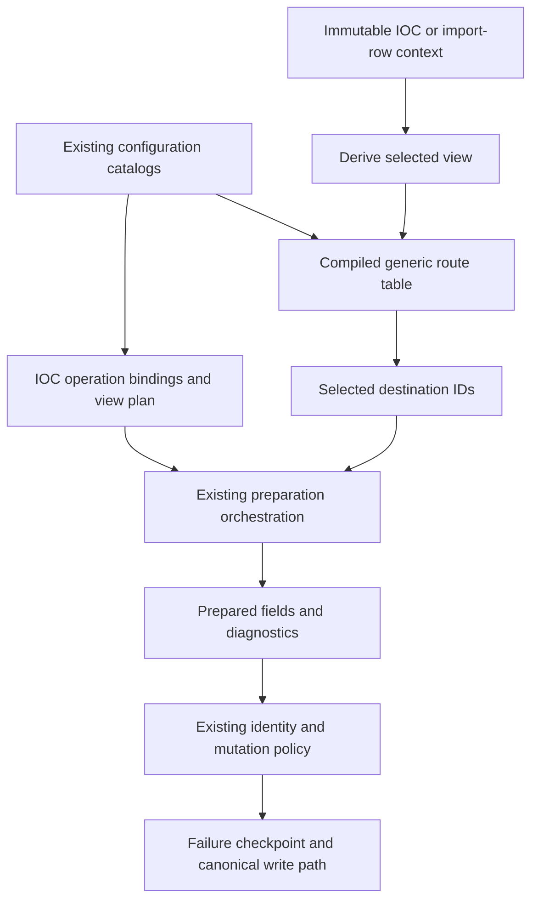
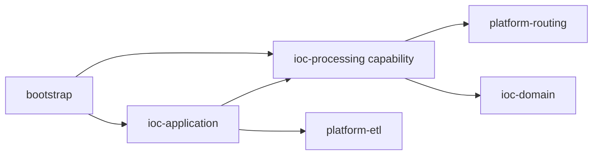

# Router independent of IOC

> Runtime selection reopened on 2026-09-27: see [Camel migration assessment](camel-migration-assessment.md).
> The JDK-only design below is option A, not a frozen implementation decision.
> Qualify option B (Camel preparation execution) before adding a routing module.

Status: proposed, 2026-09-27. Source baseline: `f43037ee87ef`, with only this
proposal bundle untracked. This analysis strengthens the earlier conditional
recommendation: a separate internal `platform/platform-routing` module is
justified for the bounded routing contract below. No runtime implementation,
external library publication or independent service deployment is authorized
by this document.

Detailed implementation design: [Router internals](router-internals.md).

## Conclusion and reason for separation

Routing mechanics and IOC policy have different reasons to change. Selection
modes, destination resolution and no-match behavior can be specified without
knowing an IP, URL, artifact, source authority or canonical record. Business
predicates and transformations remain supplied by the IOC capability.

Logical separation is necessary for the intended configurable flow model. A
Maven boundary is recommended to enforce it at compile time. This is a local
modularity decision, not a claim that an externally stable router library has
already been qualified. A second production business domain is not required
to justify the internal module; synthetic non-IOC tests demonstrate independence,
not external adoption.

The EIP [Message Router](https://www.enterpriseintegrationpatterns.com/patterns/messaging/MessageRouter.html)
separates destination choice from message transformation. The
[Recipient List](https://www.enterpriseintegrationpatterns.com/patterns/messaging/RecipientList.html)
pattern supports multiple destinations. These are suitable responsibilities
for our module. General graph execution, durable scheduling and aggregation
are separate responsibilities even if a product exposes them through one UI.

## Source evidence: what already exists

| Existing component | Observed behavior | Consequence |
|---|---|---|
| `platform-etl/Stage<I,O>` | Typed operation over Envelope | Reuse for outer processing; do not create an equivalent router-owned stage API |
| `Pipeline.then` / PipelineRunner | Ordered composition; synchronous execution; observer and diagnostic delivery | Retain as execution owner; routing selects destinations without another runner |
| `PrepareArtifactsStage` | Calls all configured preparers and collects results/diagnostics | Current fan-out orchestration seam; migrate selection ownership here/in shared preparation, not by wrapping another identical loop |
| `ArtifactFilter` and `CsvArtifactPreparer.accepted` | IOC type and include/exclude predicates | Bind these rules into route conditions; do not duplicate their business semantics |
| `ConfigurableRowMapper` | Field gates and ordered transforms | Field mapping remains a processing operation, not Router logic |
| `Envelope` | Immutable outer record, arbitrary generic payload | Does not guarantee deep payload immutability; branch isolation needs a payload contract |

The current runner accepts a public wildcard stage list and internally uses
unchecked dispatch; fluent construction alone does not validate arbitrary
configuration-created type edges. A router must not amplify that seam into an
unchecked heterogeneous graph. Validate operation composition at the existing
configuration boundary and retain a homogeneous input type per routing point.

## Responsibility boundary

| Responsibility | Owner |
|---|---|
| Ordered route table, FIRST/ALL/EXCLUSIVE selection, default/no-match outcome | platform-routing |
| Predicate implementation: bare IP, host with detail, source policy | IOC processing/domain through existing predicate registry |
| Deriving host, classifying a selected view, mapping fields | IOC processing and domain |
| Resolving configured operation names, artifact authorization and schema compatibility | Bootstrap catalogs plus application/processing contracts |
| Executing selected processing steps | Existing ETL runner / preparation orchestration |
| Input delivery, retry, scheduling, shutdown and backpressure | Existing application runtime and executor owners |
| Key formulas, duplicate reduction and mutable-field precedence | Existing artifact policy and canonical mutation owners |
| Durable receipt, TTL, export slot and transaction | Existing application ports and JDBC implementation |

The Router may evaluate a supplied predicate on a typed payload. That does not
make its implementation IOC-dependent: dependency is on a function contract,
not on the concrete predicate implementation or its business vocabulary.
Likewise a destination can be an opaque ID; its mapping to an artifact remains
outside the module. Hiding IOC checks inside reflection or generic maps would
not constitute meaningful separation.

## Minimal Java contract sketch

Names are illustrative, not an implemented API. Start with JDK-only types:

```java
record Route<T>(RouteId id, Predicate<? super T> condition,
                DestinationId destination) {}

interface Router<T> {
    RoutingDecision select(T input);
}
```

`RoutingDecision` has explicit selected/unmatched/ambiguous outcomes and ordered
route/destination identifiers. It is not another Envelope, Result<T>, event bus
or diagnostics sink. Route IDs and destination IDs are distinct. A validated
immutable route table supplies mode and default policy; null input is rejected; predicates return primitive boolean. Predicates are deterministic, non-mutating and
nonblocking. Programming exceptions propagate; they must not become no-match.

Selection contract:

- FIRST evaluates in declared order and stops at the first matching route.
- ALL evaluates every route and returns matches in declared order.
- EXCLUSIVE stops at the second matching route and reports those two conflicting
  routes before invoking any destination (not an exhaustive match list). This is not first-match with a warning.
- A default destination applies only after no match. It cannot hide a predicate
  failure or an exclusive-mode conflict.
- Route IDs are unique. In the initial contract, duplicate destination IDs in
  one table are rejected; combine conditions when one destination is intended.
  Intentional separate processing branches need distinct destination IDs.

The consumer resolves selected IDs to already validated operations and dispatches
them. This gives Router ownership of flow decisions without moving transformations
or resources into it. If reusable dispatch is later justified, add it as a
separate thin collaborator; do not grow Router.select into a workflow scheduler.

## Integration with the IOC preparation flow



Routing points may occur before or after a transform, but dependencies are
explicit: predicates on a derived host run after that view exists. Selecting
initial processing branches may use source/original facts; selecting a terminal
artifact can use transformed facts. Do not pre-filter all branches on original
IOC type and thereby make URL-to-IP routing impossible.

For the cleaning requirement, the IOC operation derives a new host view and
effective type. A generic routing point chooses matching destinations through
bound predicates. The destination mapping prepares artifact fields. Neither
host parsing nor the target's identity formula is embedded in the Router.

Each routing point consumes one typed context. Branches may internally transform
to different types, but a global Object payload and unchecked casts are not the
public API. A fully heterogeneous operator-authored DAG would require typed
ports, cardinality validation and join contracts; it remains a separate extension.

## Dependency graph and relation to platform-etl



The processing capability can initially be a package or the proposed Maven
module. `platform-routing` depends on the JDK; it does not need an ETL dependency
to select destinations. The consumer supplies Envelope.payload or a typed
processing context. Neither platform module depends on the other, so there is
no new platform cycle and no forced movement of existing Envelope/Stage types.

Why a separate module rather than platform-etl: consumers that need destination
selection do not need run scopes, accumulated diagnostics or execution policy.
Routing can evolve independently while the linear runner retains its contract.
The costs are another reactor artifact, public API discipline and report scope.
They are justified by the intended first/all/exclusive and explicit outcome
contract, not merely by the size of the predicate loop.

## Failure, concurrency and observability

Selection is synchronous and stateless per invocation; the compiled table is
immutable. Thread safety additionally requires thread-safe bound predicates.
No executor, queue, background task, retry counter or transaction is introduced.
Parallel branch execution, if later measured necessary, belongs to the existing
execution owner and must preserve deterministic result order, bounded work and
explicit cancellation. A timeout alone is not worker termination.

All selections are known before dispatch. A preparation failure retains the
current diagnostic/checkpoint semantics; successful preparation of a sibling
does not grant permission for a partial durable commit. Import retains its own
row authority and single promotion transaction. Pure routing outcomes are
translated by the caller into existing diagnostic/trace contracts.

Never merge branch Envelopes by concatenating inherited diagnostic lists: this
would duplicate ancestor diagnostics. Collect new branch deltas once at the
application boundary and let the existing runner own document-run delivery;
the import caller retains its established diagnostic owner. Do not nest full
PipelineRunner invocations merely to run each route and double-report errors.

Version route descriptors and operation bindings through the existing processing
fingerprint, not lambda class names or object hashes. Pin one compiled snapshot
for a run/delivery. No hot reload is presumed. Validate route count/fan-out limits
and authorized terminal destinations at startup; never use IOC text as an
executable endpoint or expression. Complexity is bounded by table size; no
throughput gain is claimed without measurements.

## SOLID and alternative assessment

| Principle / alternative | Assessment |
|---|---|
| SRP | Router changes for routing semantics; IOC operations change for data meaning; executors change for scheduling |
| OCP | New business predicates/destinations bind through existing catalogs without Router type switches |
| LSP | Implementations preserve ordering, match-mode and failure contracts; async substitution cannot silently change completion semantics |
| ISP | Consumers select destinations without depending on storage, parser, scheduler or transaction methods |
| DIP / hexagonal | Generic code depends on predicate contracts; bootstrap supplies implementations; domain never imports routing |
| Package inside IOC | Lower build cost but weaker enforceable genericity; acceptable interim boundary, not preferred target |
| Package inside platform-etl | Framework-free and feasible, but couples selection API to execution module |
| Separate platform-routing | Recommended internal module; clean dependency closure and independently testable semantics |
| Complete generic graph engine | Adds state, joins, cancellation and scheduling ownership; unnecessary for current requirements |

## Qualification and migration plan

1. Freeze match/outcome contracts and test with a non-IOC record fixture. Prove
   first/all/exclusive/default, exception propagation, deterministic ordering and
   no destination invocation on ambiguity. This proves isolation, not market reuse.
2. Admit the JDK-only module with the existing Maven/ArchUnit/quality conventions.
   Assert no dependency on domain/application, ETL execution, Spring or JDBC.
3. Bind current artifact predicates once through existing catalogs. Replace the
   old route decision path; compatibility configuration maps to the same table.
   Keep genuine field gates and canonical authorization checks in their owners.
4. Connect derived views and processed import through the shared preparation
   capability. Preserve occurrence positions, diagnostics and row cardinality.
5. Verify legacy outputs plus the new configured flow, replay and failure cases.
   Check changed report scopes and execute full verify/PMD only with implementation.

## Hypothetical multi-field identity example

`IP + country` is exclusively a synthetic extensibility scenario. No such
production artifact, data feed, geolocation feature or present defect is asserted.
Its lesson is that consumers choose whether an additional field participates in
identity. Router passes the typed record through selected branches without
deduplicating or projecting away fields. Existing key/match policies then retain
one or multiple records as configured. If a future lookup is under-specified,
its consumer rejects ambiguity; Router does not choose an arbitrary record.

## Draft decision R1

**Status:** proposed, 2026-09-27. **Context:** configurable flow requires routing
semantics independent of IOC and independently evolving from linear execution.
**Decision:** introduce an internal JDK-only platform-routing module for typed
destination selection; bind IOC predicates externally and reuse existing
execution/identity/diagnostic owners. **Alternatives:** IOC-local routing,
platform-etl expansion, generic workflow runtime. **Consequences:** one new
small module and explicit API/tests/build scope; no extra executor, persistent
state or duplicated IOC evaluator. This supersedes the proposal's earlier
conditional deferral of generic routing, not an accepted published ADR.
