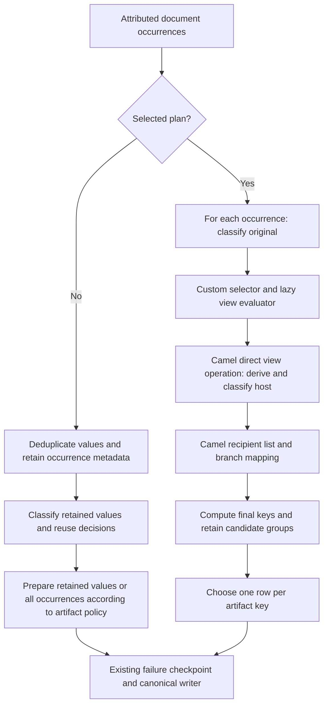

# Router implementation cost and architecture analysis

Date: 2026-10-01. Inspected revision: `08d30621876f546ba7f19061fd3fcbd9548b7e29`
on `module/platform/router`. This is an engineering investigation, not a new
accepted architecture decision or a production capacity qualification.

## Assessment

The selected-plan implementation contains avoidable repeated computation,
unnecessary candidate retention, repeated interpretation of static configuration,
and fine-grained framework dispatch. These are concrete optimization targets.
The overhead cannot be attributed to Camel alone: the two execution paths do
different amounts of classification, mapping, identity computation and diagnostic
publication even when their final CSV bytes are identical.

The principal architectural issue is granularity. One IOC occurrence becomes
an invocation of a custom selection/view evaluator, multiple small Camel routes,
several mapped candidates and a later reduction. On duplicate-heavy documents,
this repeats work that the compatible path shares across equal IOC values.
For import, row-local authority and receipt semantics justify processing every
row, but do not justify reparsing immutable configuration on every row.

No new canonical-data correctness defect was confirmed in this investigation.
The earlier memory-sampler defect is fixed at the inspected revision. Several
implementation inefficiencies are proven by source inspection and corroborated
by allocation stacks; their individual contribution to elapsed time has not
been isolated by controlled implementation variants.

Recommended direction: retain the current semantic contracts, first reduce
repeated work and transient state, then compare coarse-grained Camel execution
with direct execution of the same admitted plan. Replacing Camel immediately,
adding parallel branches, or deduplicating original values before all routing
would be premature and can change behavior.

The subsequent [Camel applicability investigation](camel-optimization-applicability.md)
refines that order: optimize Camel endpoint binding and aggregation first, then
prototype coarser execution **within Camel**. An eighteen-run synthetic mechanism
comparison supports this direction; it is not an end-to-end IOC speedup claim.
The direct evaluator remains a later control, not the preferred migration target.

## Terminology and evidence

“Without a selected plan” and “with a selected plan” refer to two configurations
of the same application revision, not two releases. The former uses compatible
document stages / CSV import preparation; the latter uses the configured IOC
plan through the Camel adapter. Both retain existing canonical persistence.

Evidence categories used below:

- **Measured:** the retained paired P6 report or an executed diagnostic profile.
- **Confirmed mechanism:** directly reachable work/allocation in the inspected code.
- **Hypothesis:** expected benefit requiring an isolated before/after experiment.

Source pointers below identify classes and methods at the inspected revision.
Line numbers are navigation aids and may drift after edits.

### Existing paired measurement

The [sampler-fixed P6 report](qualification/p6/processing-route-comparison-sampler-fixed-20261001.json)
supersedes the earlier timing table for this investigation. Its recorded source
is the preceding commit plus the sampler-fix worktree, as explained in
[P6 qualification](p6-qualification.md). It is not an exact-clean-HEAD benchmark.

| Median, three JVMs per configuration | Without selected plan | With selected plan | Ratio |
|---|---:|---:|---:|
| Document elapsed | 1,631 ms | 2,728 ms | 1.67 |
| Document caller allocations | 218.3 MB | 531.1 MB | 2.43 |
| Import elapsed | 870 ms | 1,615 ms | 1.86 |
| Import caller allocations | 78.2 MB | 121.6 MB | 1.55 |

The document contains 8,000 occurrences of 20 domains; import contains 2,000
rows of the same 20 domains. This is a duplicate-heavy workload, not a general
IOC distribution. Low peak-heap growth does not contradict high allocation:
most temporary objects can die young. RSS, retained heap and allocation rate
answer different questions.

### Additional diagnostic execution in this investigation

Built the reactor dependencies and probe with the script's package command,
then executed four fresh JVMs at the inspected revision: one configuration pair
for the document and one for import. Each used the existing comparison script's
fixture/configuration/result-signature functions, current probe classes, current
reactor production classes, and the retained comparison's dependency JARs.
No production source was modified. Both pairs passed the existing result
equivalence checks, including document CSV/key equality and import
fields/keys/COALESCE/receipt counts.

JVM options added to the existing `-Xms128m -Xmx512m`:

```text
-XX:StartFlightRecording=filename=profile.jfr,settings=profile,dumponexit=true
-XX:FlightRecorderOptions=stackdepth=128
```

Local evidence is under `.dev/router-cost-analysis/`: `profile.py`,
`ReadJfr.java`, `Stacks.java`, `compile.log`, `profile-metrics.json`, and four
`document|import-compatible|selected-0` directories containing logs, JFR files,
databases and `jfr-summary.txt`. These paths are local evidence, not portable
published assets. The source-launch Java reader uses `jdk.jfr.consumer` and
retains only stacks containing `ProcessingRouteComparison.document` or
`ProcessingRouteComparison.importCsv`, excluding startup-only stacks.

| Diagnostic single run | Elapsed ms | Caller allocation bytes | Allocation samples in workload stacks | Execution samples in workload stacks |
|---|---:|---:|---:|---:|
| Document without plan | 1,654.660 | 216,462,600 | 202 | 10 |
| Document with plan | 2,714.894 | 528,317,832 | 424 | 21 |
| Import without plan | 850.114 | 78,335,792 | 151 | 4 |
| Import with plan | 1,416.749 | 121,623,472 | 232 | 9 |

These are diagnostic runs, not additional release medians. CPU samples are too
sparse to assign meaningful CPU percentages. `jdk.ObjectAllocationSample.weight`
is a sampling estimate, not an exact byte ledger: a single sampled `URIScanner`
carried about 66 MB of weight. It would be incorrect to report that scanner as
an object consuming 66 MB or to derive an exact component cost from that sample.
Use stacks to identify mechanisms; use caller counters for total allocations.
Framework request frames can also contain downstream user work and are not
exclusive measurements of Camel overhead.

Observed allocation stacks include URI resolution under `requestBody`, Camel
exchange machinery, Guava PSL classification, `type-in` string splitting,
artifact map copies, canonical key material, and MDC scopes. The compatible
document also samples diagnostic formatting, redaction hashing and Logback
publication. This materially affects interpretation of the comparison.

## Execution model and work amplification



The diagram simplifies control flow: a view is resolved only when demanded by
conditions or selected branches; it is not always eagerly derived. Import enters
through admission/refang/exact-cell parsing and row-local assembly, then sealed
staging and canonical promotion. It does not use document-wide grouping.

For the document fixture, the following are **code-derived counts**, not profiler
invocation counters. They assume the configured deduplication and artifact policies:

| Work | Without selected plan | With selected plan |
|---|---:|---:|
| Network classification decisions | 20 | 8,000 original + 8,000 host |
| Explicit host derivations | 0 | 8,000 |
| Camel branch dispatches | 0 | 32,000: masks, IP, blacklist, aggregate per occurrence |
| Mapped candidate rows before reduction | 8,040: 20 masks + 20 blacklist + 8,000 aggregate | 24,000: masks + blacklist + aggregate per occurrence |
| Final public rows across those artifacts | 60 | 60 |

The IP branch is selected by its NETWORK eligibility but its artifact accepts
filter rejects domains; the hash branch is not selected. Original and derived
host classifications are equal on these bare domains, yet are computed twice.
The compatible aggregate already needs every occurrence for `last-nonempty`:
it is incorrect to say that all compatible work is proportional to 20 values.

Evidence: `ClassifyIndicatorsStage.process` (classification reuse),
`CsvArtifactPreparer.prepare(ArtifactPreparationBatch)` (policy-dependent path),
`DocumentProcessingAdapter.prepare:53–57`, `IocProcessingOperations:45–55`,
`PrepareRoutedArtifactsStage.group:73–99`, and
`application-customer-routes.yml` / `application-golden.yml`.

## Findings and optimization candidates

### A1 — Repeated classification and parsing across identical occurrences

**Confirmed mechanism; high optimization priority.**
`DocumentProcessingAdapter.prepare:53–57` classifies every occurrence.
`IocProcessingOperations` derives a host and classifies it again. The compatible
`ClassifyIndicatorsStage.process:60–85` shares classification by dedup key and
then reattaches the current occurrence's indicator. Within a selected invocation,
`InvocationViews` memoizes a demanded view, so two branches do not independently
derive that same view; the missing reuse is primarily across occurrences and
between semantically equal original/host classification inputs.

`DefaultIndicatorFeatureExtractor.extract` normalizes/parses the address and
calls PSL classification. `NetworkHostDeriver.derive` parses it again.
`ExactIndicatorParser.parse` additionally validates a network address during
import admission. Thus a successful selected network import can parse the
value during exact-cell validation, original classification, derivation, and
derived classification. Some passes see different values and cannot simply
be deleted. JFR reaches `PslHostClassifier.classify` and address validation.

Prefer bounded document-invocation caches of pure classification/parsed-address
results, not a process-global cache of complete routed candidates. Keep source,
position, ordinal, diagnostics and field-order metadata outside shared cached
values. The current configured classifier uses value/features, but `MatchPolicy`
accepts an entire `Indicator`; general source-independent caching needs an
explicit dependency/purity contract or a key including all semantic inputs.
Include policy identity in any cache that can outlive a single pinned invocation.

For import, use a bounded delivery-owned cache only after defining lifetime and
memory limits. Never deduplicate logical CSV rows before staging: `COALESCED`
status, authority, explicit `NULL`, warnings and receipts belong to each row.

### A2 — All losing document candidates remain live until the final pass

**Confirmed mechanism; high memory priority.**
`PrepareRoutedArtifactsStage.group:95–96` stores a list for every final key and
appends every candidate. `ArtifactOccurrenceSelector.select` ultimately needs
only the first row for KEEP_FIRST, or the last nonblank selection-field row
(falling back to first) for LAST_NONEMPTY. There is no requirement here to retain
all mapped losing rows. Auxiliary candidate storage is O(N × selected artifacts)
even when final cardinality is tiny.

Use an incremental accumulator per final artifact key: initialize with the
first row; for LAST_NONEMPTY replace the winner only when the current field is
nonblank. Maintain first-key encounter order and the winning row's complete
position metadata. This reduces candidate retention to O(distinct final keys).
It does not eliminate mapping, key computation, extracted-document storage or
diagnostic accumulation. The same list-retention pattern exists in compatible
`CsvArtifactPreparer.prepareOccurrences`; it is shared debt amplified by routing.

Do not skip evaluating later occurrences merely because a KEEP_FIRST winner
exists: later failures still contribute diagnostics before the checkpoint.
An accumulator is safe independently of such computation skipping.

### A3 — Static Camel endpoints are resolved through strings for each invocation

**Confirmed mechanism with JFR stack evidence; measure benefit next.**
`InvocationViews.evaluateOperation:79` and
`CamelRouteRuntime.executeAdmitted:107` call `ProducerTemplate.requestBody`
with URI strings already known to the compiled plan. A recorded stack is:

```text
InvocationViews.evaluateOperation
  DefaultProducerTemplate.requestBody
    DefaultProducerTemplate.resolveMandatoryEndpoint
      AbstractCamelContext.getEndpoint / doGetEndpoint
        EndpointHelper.normalizeEndpointUri
          URISupport.normalizeUri / parseQuery
            URIScanner
```

This is local dispatch, not a network round trip. Producer caching does not
eliminate every URI-resolution step: the string overload resolves the endpoint
before sending. Camel also exposes an endpoint overload. Resolve admitted
endpoints once after route installation and use endpoint references under the
same runtime lifecycle; investigate recipient-list endpoint objects as a
separate optimization. Verify startup failure, shutdown and admission safety.
The fixed-version [Camel producer-template source](https://raw.githubusercontent.com/apache/camel/camel-4.22.1/core/camel-base-engine/src/main/java/org/apache/camel/impl/engine/DefaultProducerTemplate.java)
supports this distinction. No speedup percentage is established yet.

### A4 — Parameterized predicates still parse static arguments per evaluation

**Confirmed avoidable work, sampled in the document profile.**
`IocProcessingOperations.predicates:75–77` executes
`Arrays.asList(args.get("types").split(","))` for every `type-in` test.
The document fixture reaches four such predicates per occurrence: 32,000 splits
of immutable configuration for 8,000 inputs. `CompiledSelector.compileCondition`
compiles the boolean structure but retains a binding receiving the argument map
on every call. This is incomplete compilation, not a requirement of declarative
configuration.

Bind parameters once to an immutable enum set or small bit mask. A generic
predicate registration can expose a startup binder producing a typed predicate.
Preserve collect-all validation and exact BLOCKED / short-circuit behavior.
Likewise `ConfigurableRowMapper.applyTransform` repeatedly separates transform
name and argument and looks up the registry. Prebinding column providers,
conditions and transforms is shared-path follow-up, not a Router-only defect.

### A5 — Sequential branch aggregation copies every accumulated prefix

**Confirmed algorithmic inefficiency; more significant at wider fan-out.**
`BranchReplyAggregationStrategy.aggregate:17–31` constructs a new list, copies
earlier replies, appends one, and `DispatchRequest.Replies` freezes the list
again. Across B recipients this produces O(B²) reference-copy work. The admitted
branch count is bounded (64), so this is bounded amplification rather than
unbounded growth. At the fixture's four recipients it is unlikely to explain
the whole regression; at 16 or 64 it deserves a dedicated measurement.

Keep one invocation-owned mutable accumulator and freeze once when returning
the public result. Never share it across invocations. Preserve ordered replies
and unexpected-exception propagation. Do not infer that every `List.copyOf`
elsewhere allocates: copying an already JDK-immutable list may reuse it.

### A6 — Repeated row-map copies and transient wrappers amplify mapping cost

**Confirmed shared inefficiency, amplified by the selected path.**
`CsvArtifactPreparer.preparedRow` builds a `LinkedHashMap`.
`ArtifactRow.ordered:26` copies it, then the `ArtifactRow` constructor copies it
again. The factory's extra copy adds no isolation beyond the constructor copy.
`prepareRouted` creates a `PreparedArtifactRow` and then another wrapper with
ordered-field positions. Import subsequently converts the prepared template
back into authorized `ImportCell` maps. JFR samples artifact constructors and
row preparation; exact savings require a variant measurement.

Remove redundant copies while retaining immutable public ownership and column
order. Consider a single preparation constructor carrying position metadata.
Do not create a second import mapper merely to avoid wrappers: shared mapping
semantics and source authority are more valuable than a small allocation saving.

### A7 — Per-row import binding validation repeats startup invariants

**Confirmed avoidable work; lower priority than A1–A4.**
`RouterProcessedImportRowPreparer.requireBinding:225–253` rebuilds artifact and
authorized-field sets and rescans contract definitions on each row. Branch and
artifact helpers repeatedly scan lists. Compiled contracts and route bindings
are immutable for the pinned delivery; static authority compatibility can be
validated once and retained in a contract-specific prepared binding. Keep
row-dependent checks (cells, admitted branches, source, conflicts) per row.
Do not remove authority validation merely because the happy-path fixture passes.

### A8 — Instrumentation and generic invocation state have nonzero disabled-path cost

**Confirmed mechanisms; mostly secondary optimization candidates.**
`CompiledSelector.traceDecision:114–118` lowercases a status name before
`RoutingTraceSink.emit` checks whether tracing is enabled. A typed event or
constant status rendering can avoid this work when tracing is disabled.

`CamelPlanCompiler` opens an MDC scope around every view and destination.
`RouterMdcScopes` changes three keys; `MdcScope` stores previous values in a map
and materializes a key list on close. JFR samples MDC operations. A fixed-key
scope could reduce allocations while preserving nesting/restoration. Disabling
MDC when decision tracing is off is unsafe: error and warning logs still need
correlation.

`InvocationViews` creates success-path maps plus failure/recovery containers;
some failure-only state can be lazy. Compiled route processors still look up
operations/destinations in catalog maps per call. Capture immutable processor
references at compilation. Prefer these bounded changes over object pooling,
which introduces ownership/reset hazards for concurrently used runtimes.

## Architectural assessment

### What Camel actually owns

| Responsibility | Current owner |
|---|---|
| Operator YAML, semantic admission, artifact/source bindings | Bootstrap catalogs |
| FIRST/ALL/EXCLUSIVE, three-state conditions, default decision | Custom `CompiledSelector` |
| Lazy view dependency traversal, memoization, expected recovery, demanded consumers | Custom `InvocationViews` |
| Endpoint routes, exchange lifecycle, sequential recipient dispatch/aggregation | Camel through compiler/runtime |
| IOC parsing, classification and column mapping | Domain / `ioc-processing`, bound by bootstrap |
| Final identity, winner policy, failure checkpoint, transaction, durable recovery | Existing application/storage owners |

This is a custom bounded evaluator using Camel as its execution substrate.
It is not a second independent selector plus Camel's selector: conditions are
not deliberately evaluated twice. Nevertheless, adopting Camel has not removed
the custom graph/selection/recovery semantics. ADR 0031's rationale about avoiding
project-owned operation composition is only partially realized by this split.

The application ports remain framework-free, which is sound. Concrete bootstrap
adapters know Camel and CSV implementation types, which is acceptable at the
composition boundary. `ProcessingView` also carries per-extraction preparer
bindings: operational context travels with the semantic value. Separating
execution context from immutable value features would make cache safety clearer,
but is a maintainability proposal, not evidence of a current data defect.

The configured `classifications` catalog primarily admits which views may be
consumed. Execution currently classifies original inputs eagerly and host views
inside the host operation; it is not a separately scheduled classification DAG.
An original used only by a type predicate still receives full classification.
Demand-driven classification would require typed feature dependencies rather
than treating every predicate/provider as needing a fully classified value.
That is a larger design change than adding a bounded classification cache.

### Why current boundaries should survive optimization

Retain lazy view evaluation, immutable public results, bounded plan sizes,
ordered three-state selection, explicit expected recovery and propagation of
unexpected exceptions. ALL preparation is not a canonical transaction; the
existing checkpoint and writer retain that responsibility. Recovery hints are
not durable truth. No framework retry should silently reapply an import commit.

Source, ordinal and observation position are not incidental metadata. A cache
by raw IOC string alone can select the wrong source or last-nonempty row.
Cleaning must precede final artifact identity, and a multi-field identity cannot
be replaced by global IOC deduplication. Preserve `ABSENT`, explicit `NULL` and
technical no-contribution as different import states.

## Comparison with established mechanisms

These comparisons use primary documentation and the fixed Camel source. They
compare semantic ownership and execution granularity, not measured performance
of different products. No external service was benchmarked.

| Mechanism | Relevant behavior | Lesson for this implementation |
|---|---|---|
| Camel Direct + Recipient List | Direct invokes consumers synchronously; Recipient List supplies ordered sequential dispatch by default, optional parallelism and aggregation. | The current substrate is a legitimate EIP use, but exchanges around tiny pure functions are a granularity choice. Bind known endpoints and compare coarser routes before rejecting Camel. |
| Spring Integration RecipientListRouter + DirectChannel | Configured recipients can have selectors; DirectChannel dispatch occurs in the sender's thread. | Existing Spring Integration could supply synchronous dispatch, but changing frameworks would not remove our BLOCKED, view recovery or final-key policies. A dependency already present is not proof of lower cost. |
| Apache NiFi RouteOnAttribute | Named relationships are selected from FlowFile attributes; strategy can route to matching property relationships or aggregate matched/unmatched outcomes. | Separate eligibility from content transformation and make unmatched outcomes explicit. A FlowFile routing platform is a different operational abstraction, not a drop-in per-IOC function executor. |
| Apache Beam keyed combination | Grouping followed by reduction can be expressed as Combine per key; distributed combining requires appropriate associative/commutative semantics. | Retain sufficient accumulator state instead of all losing candidates. Our sequential last-nonempty policy must retain explicit occurrence order; do not assume arbitrary parallel completion order is equivalent. |

Sources: [Camel Direct](https://camel.apache.org/components/4.22.x/direct-component.html),
[Camel Recipient List](https://camel.apache.org/components/4.22.x/eips/recipientList-eip.html),
[Spring router implementations](https://docs.spring.io/spring-integration/reference/6.4/router/implementations.html),
[Spring channel implementations](https://docs.spring.io/spring-integration/reference/channel/implementations.html),
[NiFi RouteOnAttribute](https://nifi.apache.org/components/org.apache.nifi.processors.standard.RouteOnAttribute/),
[Beam programming guide, Combine](https://beam.apache.org/documentation/programming-guide/#combine).

### Architecture alternatives to evaluate

1. **Optimize within the admitted Camel architecture.** Prebind configuration and
   endpoints, reduce candidate groups incrementally, avoid redundant copies,
   add bounded pure-result reuse. Lowest semantic migration risk.
2. **Use coarser Camel routes.** Keep Camel at an input or branch boundary while
   composing small pure view functions directly within that boundary. Compare
   trace granularity, exception behavior and operation ownership explicitly;
   do not merely hide a second engine inside one processor.
3. **One direct synchronous compiled evaluator.** Execute admitted operations
   without exchanges, preserving the same port and conformance corpus. This
   removes dispatch machinery but explicitly makes the project own all runtime
   semantics. It would require revisiting ADR 0031 and retiring the replaced
   executor, not permanently maintaining two production engines.

The present evidence favors option 1 as immediate work and an isolated comparison
of options 2/3 as an architecture decision input. It does not establish that
Camel must be removed, nor that its complexity is already justified by a
quantified benefit. Useful criteria include code actually retired, required
runtime capabilities, dependency/lifecycle cost and equivalent error behavior.

## Measurement limitations and implementation pitfalls

- **Different observable diagnostic work:** without a plan, deduplication emits
  7,980 duplicate-skip diagnostics on the document fixture. The selected stage
  counts retained originals but does not emit those same diagnostics. JFR samples
  baseline logging/redaction work. Equal CSVs do not imply equal diagnostic work.
  Keep the production-observability comparison, and add a controlled preparation
  measurement to isolate computation; do not silently turn logs off in only one
  path or advertise the result as production throughput.
- **Cold processing in fresh JVMs:** startup is outside the timer, but the first
  workload still pays lazy initialization and JIT effects. Measure both first-file
  latency and warmed repeated invocations in a long-lived daemon, separately.
- **Import baseline still declares the plan catalog:** the script removes
  `processed-route` but retains `ioc.processing.plans`. `IocRouterConfiguration`
  activates on the first plan name, so both import configurations start Camel.
  This is valid for incremental selected-plan execution cost; it cannot establish
  the total footprint of enabling Camel versus an application without Camel.
- **Memory metrics have different boundaries:** `VmHWM` includes process startup
  history; sampled Java heap is used heap observed during sampling, not a JVM-wide
  historical heap high-water counter. Caller allocation excludes background work.
  A 10 ms sample can miss short heap peaks. Neither proves a memory leak or its
  absence. P6's general statement about startup high-water applies directly to
  RSS, not to previously collected Java heap peaks.
- **Limited distribution:** one short, repeated bare-domain workload does not
  qualify long URLs, diverse keys, mixed hashes/IPs, blocked/recovered views,
  multi-input imports, wide fan-out or concurrent document calls.
- **Post-observation thresholds:** the 3× allocation bound is an initial local
  regression guard with headroom around observed behavior, not an independent
  customer acceptance argument. The updated import median is already 1.86×
  the baseline against a 2× guard.
- **Static bounds are not workload bounds:** limiting plans, views and branches
  does not bound document occurrence count or the product of occurrences and
  selected branches. Candidate retention remains input-proportional today.

## Prioritized implementation and validation plan

| Order | Work | Required evidence |
|---|---|---|
| 1 | Incremental candidate winners; bind `type-in`; remove redundant `ArtifactRow.ordered` copy; linear reply accumulation | Existing exact outputs plus winner/order/diagnostic and concurrent-invocation regressions; allocation comparison for each independent change |
| 2 | Resolve fixed Camel endpoints once; prebind operation/mapper metadata | URI stack disappearance or reduction; equivalent startup failure, runtime shutdown, exception and source semantics |
| 3 | Bounded classification/address reuse and same-value view reuse | Explicit dependency key and lifecycle; source/position changes, policy changes, unique-input memory bounds, failures and import NULL/ABSENT cases |
| 4 | Reduce MDC and success-path container allocation where profiles justify it | Nested scope restoration, warning/error correlation, concurrent calls, tracing both enabled and disabled |
| 5 | Compare current, coarser Camel and direct evaluator with identical semantic work | Same conformance corpus and workload; CPU/allocation/startup/retained-heap evidence; proposed ADR only after result review |

The first group consists of concrete removable work. Later groups contain design
choices whose benefits and trade-offs need measurement. No target improvement
percentage is promised from source inspection.

Use a matrix with 0%, 50% and approximately 99.75% duplicates; 1k/8k/100k
occurrences; 1/4/16/64 branches where admitted; network/hash mixtures; same-value
and changed-value host derivation; successful, blocked and recovered paths;
one and several callers. For import vary unique keys and semantic inputs per row.
Do not combine all dimensions into an expensive Cartesian product initially:
start with one-factor variations around the retained baseline.

Record stage time, original/derived classification counts, parser/PSL calls,
predicate calls, mapped/discarded candidates, endpoint requests and emitted
diagnostics. Distinguish structural counts from sampled profiles. Use longer
warmed CPU profiles before reporting component percentages; retain fresh-JVM
latency as a separate measure. After each change, compare full public results,
final keys, source ownership, ordering, diagnostics, stage outcomes and receipt
recovery. Keep canonical transactions and failure checkpoints outside all
performance experiments that might change behavior.

For production Java changes, run focused tests, `make verify` and
`make pmd-analysis`, plus watchlist review where ownership/size changes require
it. Do not weaken quality gates or relax the performance envelope to mask a
regression. This investigation changes documentation only; its package/profiling
runs are not full test or static-analysis evidence. At initial inspection,
`make context` reported both full gates stale for `08d30621` (last passed
`7d0c9844`). No fresh full-gate claim is made here.

## Source navigation

- [Document preparation stage](../../../../core/ioc-application/src/main/java/com/iocextractor/application/pipeline/stage/PrepareRoutedArtifactsStage.java)
- [Compatible classification stage](../../../../core/ioc-application/src/main/java/com/iocextractor/application/pipeline/stage/ClassifyIndicatorsStage.java)
- [Document adapter](../../../../bootstrap/ioc-app/src/main/java/com/iocextractor/bootstrap/DocumentProcessingAdapter.java)
- [Shared operation bindings](../../../../bootstrap/ioc-app/src/main/java/com/iocextractor/bootstrap/IocProcessingOperations.java)
- [Import adapter](../../../../bootstrap/ioc-app/src/main/java/com/iocextractor/bootstrap/RouterProcessedImportRowPreparer.java)
- [CSV preparation](../../../../adapters/adapter-csv/src/main/java/com/iocextractor/adapter/out/sink/csv/CsvArtifactPreparer.java)
- [Field mapper](../../../../core/ioc-processing/src/main/java/com/iocextractor/processing/mapping/ConfigurableRowMapper.java)
- [Router compiler](../../../../adapters/adapter-processing-camel/src/main/java/com/iocextractor/adapter/processing/camel/compile/CamelPlanCompiler.java)
- [Router runtime](../../../../adapters/adapter-processing-camel/src/main/java/com/iocextractor/adapter/processing/camel/runtime/CamelRouteRuntime.java)
- [View evaluator](../../../../adapters/adapter-processing-camel/src/main/java/com/iocextractor/adapter/processing/camel/runtime/InvocationViews.java)
- [Reply aggregation](../../../../adapters/adapter-processing-camel/src/main/java/com/iocextractor/adapter/processing/camel/compile/BranchReplyAggregationStrategy.java)
- [Artifact row ownership](../../../../core/ioc-application/src/main/java/com/iocextractor/application/artifact/ArtifactRow.java)
- [Paired comparison harness](../../../../tools/dev/processing-route-comparison.py)
- [Probe and sampler](../../../../bootstrap/ioc-app/src/test/java/com/iocextractor/bootstrap/ProcessingRouteComparison.java)
- [Accepted runtime decision](../../../ADR/0031-bounded-camel-preparation-runtime.md)
- [P3 integration evidence](p3-document-integration.md), [R5 synthetic qualification](r5-qualification.md), [P6 qualification](p6-qualification.md)
