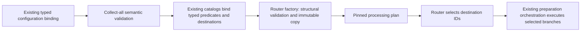

# Router internal architecture

> Runtime selection reopened on 2026-09-27: see [Camel migration assessment](camel-migration-assessment.md).
> The JDK-only design below is option A, not a frozen implementation decision.
> Qualify option B (Camel preparation execution) before adding a routing module.

Status: proposed, 2026-09-27. Refines [R1](router-boundary.md) against source
baseline `f43037ee87ef`. This is an implementation design, not implemented API
or an accepted ADR. See [module design](module-design.md) for reactor admission
and [reuse inventory](reuse-inventory.md) for existing semantic owners.

## Scope and internal structure

Router is a technical platform capability, not the IOC domain layer. Its
responsibility is to select destinations from a typed input and an immutable
ordered table. It does not need miniature domain/application/infrastructure
layers: there is no persistence, transport or resource lifecycle to isolate.

Proposed module: `platform/platform-routing`, internal reactor artifact using
the parent version. Start with one package `com.iocextractor.platform.routing`:

| Component | Visibility and responsibility |
|---|---|
| `Router<T>` | Public selection interface; no execution methods |
| `Route<T>` | Public immutable route ID, predicate, destination ID |
| `RouteId`, `DestinationId` | Public distinct nonblank value types |
| `SelectionMode` | Public FIRST, ALL, EXCLUSIVE semantics |
| `RoutingDecision` | Public sealed outcomes with immutable identifier lists |
| `Routers` | Public factory and structural validation entry point |
| `RouteTableProblem` | Public structural problem code and route/index location |
| `CompiledRouter<T>` | Package-private immutable table and selection loop |
| `RouteTableValidator` | Package-private single owner of table invariants |

Do not put package-private classes in a different `internal` subpackage: Java
subpackage membership does not grant package access. An extra builder, strategy
class per enum value, plugin loader or dependency-injection container is not
needed for these three small algorithms. Public types are justified by consumer
use; implementation helpers stay hidden. Names remain reviewable before coding.

## Configuration compilation versus record processing



There are two different validation scopes, with one owner each:

1. Bootstrap validates operator configuration: unknown keys, predicate names and
   parameter types, view availability, destination existence, schema compatibility,
   condition-tree depth and route/fan-out budgets. Extend `IocProperties`, the
   semantic configuration check and `ConfigRegistryCatalog`; do not introduce a
   second YAML loader or a Router-owned IOC registry. Existing artifact filters
   compile into the same predicates as the new configuration. Field gates remain
   field gates, rather than being evaluated again as an identical route filter.
2. The Router factory validates structural invariants for every Java consumer:
   nonnull inputs, unique route IDs/destinations, nonblank identifiers and explicit
   selection mode. Its validation function returns all structural problems;
   creation invokes that same function and refuses an invalid table. Bootstrap
   maps those problems to the existing configuration diagnostics. Binding
   constructors must not throw early and hide other operator errors.

A compiled plan contains the Router and its destination bindings together.
The caller resolves IDs only against that same snapshot. Looking up IDs in a
new mutable global catalog midway through a run would break reproducibility.
Descriptors, condition parameters, route order, mode, fallback and operation
versions enter the existing processing fingerprint. Lambda identity is never a
configuration fingerprint. A run/import delivery pins the plan through the
existing lifecycle; hot reload is outside the initial scope.

The operator confirmed registered predicates with parameters and AND/OR/NOT
on 2026-09-27. This is the agreed condition-language scope, not an assertion that
the current configuration already supports this tree. Arbitrary expressions and
scripts are outside this scope.
Bootstrap compiles it once to `Predicate<T>` using the existing catalog; Router
never parses expressions. Empty AND/OR groups should be rejected in operator
configuration to avoid surprising implicit constants. Explicit always/never
conditions can be registered if needed. Predicate composition uses declared
short-circuit order. [JDK Predicate](https://docs.oracle.com/en/java/javase/21/docs/api/java.base/java/util/function/Predicate.html)
already provides these boolean operations; no additional predicate library is
needed. Existing include-all/exclude-any rules retain their current semantics.

## Runtime API and exact selection semantics

Illustrative API (constructor validation and public modifiers omitted):

```java
record Route<T>(RouteId id, Predicate<? super T> condition,
                DestinationId destination) {}
interface Router<T> {
    RoutingDecision select(T input);
}
```

The proposed sealed decision has four variants:

- `Matched`: nonempty ordered list of `(RouteId, DestinationId)` selections.
- `Defaulted`: fallback destination; no fabricated matching route ID.
- `Unmatched`: no matching route and no configured fallback.
- `Ambiguous`: the first two conflicting route/destination pairs in EXCLUSIVE.

FIRST stops at the first true condition. ALL evaluates every condition before
returning the ordered selections. EXCLUSIVE stops at the second true condition;
its conflict evidence is deliberately not an exhaustive list of all matches.
If only one route matches, EXCLUSIVE must evaluate the remaining conditions to
prove uniqueness. Predicates not reached by short-circuiting are not evaluated,
even when diagnostic logging is enabled.

Null input is a programming error. `Predicate.test` returns primitive boolean;
there is no nullable predicate outcome. An exception from an evaluated predicate
propagates unchanged and aborts selection; accumulated matches are not returned.
The initial API introduces no exception hierarchy or platform-errors dependency.
The caller reports failures through its existing diagnostic boundary. Evaluation
failure is not no-match and cannot activate the fallback. Exception text must not
be assumed safe for logging payloads. Rich route-specific error wrapping can be
added only if a real diagnostic need justifies the extra contract.

An empty table is allowed: it returns Defaulted or Unmatched. This makes an
explicit pass-through/default-only configuration possible without fake rules.
A service scenario that requires coverage may reject such a table in bootstrap.

Route IDs and regular destination IDs are unique within a table. This retains
R1's initial restriction: multiple conditions for one processing branch should
be combined with OR. This deliberately avoids defining duplicate delivery as an
accidental property of ALL. Two distinct branches may eventually write to the
same artifact, but they need distinct destination IDs and explicit downstream
candidate reduction. A fallback may name a regular destination because it runs
only when no regular route matches. Relaxing uniqueness later requires an
explicit delivery multiplicity contract, not a silent Set conversion.

Unmatched is data, not automatic drop or success. The consuming processing
scenario must explicitly choose skip-with-accounting or diagnostic failure.
Defaulted selects a branch. Ambiguous is a preparation failure with no dispatch;
it is never silently converted to FIRST. The existing failure policy determines
whether that failure blocks the overall write. This preserves controlled partial
acceptance where already supported without introducing partial branch commits.

## Three independent kinds of order

| Order | Meaning and owner |
|---|---|
| Route declaration order | FIRST precedence and stable ALL result ordering; Router |
| Operation dependencies/order | Derive view before inspecting it, classify before field mapping; processing plan and ETL |
| Observation/candidate precedence | Which fields or row survive reduction; existing artifact policies and registered observation order |

Do not add a numeric route priority alongside list order in v1. It creates a
second ordering authority and tie rules without a demonstrated need. ALL result
order is not permission to derive business winner precedence from completion
order. Preserve original occurrence positions and registered observation order
through every branch. Likewise, selected destination order alone cannot express
a dependency where branch B consumes branch A's output: that belongs to the
operation plan, with a new routing point after the required transformation.

## Patterns and technology decisions

| Choice | Application and trade-off |
|---|---|
| Content-Based Router | Typed conditions choose destination IDs; data semantics remain injected |
| Recipient List | ALL produces multiple recipients; actual delivery belongs to the existing caller |
| Strategy | `Predicate<? super T>` injects policy without IOC type switches |
| Immutable compiled plan | Startup work and validation are separated from per-record evaluation; predicate state must also obey the contract |
| Factory + value objects | Prevent malformed tables and impossible outcomes; no mutable builder is required |
| Chain of Responsibility | FIRST has short-circuit resemblance, but this is not the model for ALL or EXCLUSIVE |
| Pipes-and-Filters | Already owned by platform-etl; Router supplies decisions at explicit routing points |

Recommended production dependencies: JDK 21 only. Test dependencies use existing
parent-managed JUnit/AssertJ and architecture checks. This is based on the small
required mechanism and dependency direction, not a rule that every non-domain
module must avoid frameworks.

[Spring Integration routers](https://docs.spring.io/spring-integration/reference/router/overview.html)
combine message-channel routing with options for destination resolution and
send failures. They are relevant when routing **transport messages**. Replacing
our preparation selection with channels would require reconciling channel
failure and execution semantics with the existing checkpoint and diagnostic
owners. Existing Spring Integration in adapter-ingest does not make it an inward
application dependency. Retain its current ingestion role; no second messaging
runtime is justified by destination selection alone.

[Camel Choice](https://camel.apache.org/components/4.18.x/eips/choice-eip.html)
provides content-based `when`/`otherwise` branching over exchanges. It becomes a
credible implementation candidate if the required product is a general endpoint
integration runtime. Our current contract requires neither Exchange nor endpoint
execution. A Camel-backed implementation would need an outward adapter with a
neutral inward API and qualification of ordering, failures and the repository's
exact dependency versions. No compatibility or performance claim is made here.

NiFi and Beam remain pattern references in the [technology assessment](technology-assessment.md).
They inform explicit branch relationships, immutable views and grouping by
configured keys; they are not candidate dependencies for this Router. A scripting
engine, rules engine, graph library or reactive runtime needs a separate concrete
requirement. Boolean composition and bounded ordered selection do not establish
one. Existing Spring Boot configuration creates and injects the immutable plan;
there is no need for a new starter, auto-configuration module or @Service classes
inside platform-routing.

## Concurrency, resource and observability contracts

The Router owns no executor, queue, connection, transaction, cache or shutdown
hook. Invocation is synchronous with local temporary state. Shared use is safe
only when bound predicates are thread-safe, deterministic, nonblocking and do
not mutate input. Structural immutability cannot enforce callback purity. Neither
can a declared timeout stop an arbitrary blocking Java predicate; the initial
catalog must contain controlled implementations, not untrusted code.

Cost is O(R) predicate calls in the worst case and O(M) result space for ALL,
where R is route count and M is match count. FIRST and EXCLUSIVE retain bounded
match evidence. Predicate costs are additional. Do not cache decisions by IOC
string: predicates can depend on source, view and other fields. Do not parallelize
predicate evaluation: that changes short-circuit and exception behavior without
a measured benefit. Precompute shared expensive view features in processing.

The caller maps outcomes to existing diagnostics/metrics. Route IDs may support
bounded configured labels; payload values do not become metric labels. No second
observer subsystem is introduced. Explanation must use actual decision evidence;
re-evaluating all predicates would produce different behavior for FIRST and
EXCLUSIVE. A richer per-condition trace is a future optional contract, not a
hidden diagnostic second pass.

ALL has decision atomicity: no destination runs until selection succeeds. It
does not promise transactional delivery. Existing side-effect-free preparation,
failure checkpoint and canonical transaction own that guarantee. Branch input
must be immutable or copied by the processing owner; Envelope immutability alone
is insufficient. Import preserves row boundaries, source authority, sealed
workspace and canonical receipt recovery. No routing-state table or DB migration
is needed for this module.

## Implementation slices and review gates

1. Review remaining contracts, especially unique destinations and explicit
   unmatched behavior; the catalog plus AND/OR/NOT scope is confirmed. Promote agreed durable decisions into a new
   ADR when implementing; leave accepted ADRs unchanged.
2. Add the small module and public-behavior tests with non-IOC records. Cover
   FIRST short-circuit, ordered ALL, EXCLUSIVE second-match conflict, fallbacks,
   empty tables, invalid tables, predicate exceptions and concurrent independent
   selections. Concurrency tests require bounded coordination and cleanup.
3. Integrate one existing preparation routing point. Compile legacy configuration
   into the same plan and remove replaced routing decisions. Keep field gates,
   source authorization and canonical checks in their current owners.
4. Add integration evidence for derived-view selection, explicit no-match policy,
   no dispatch on ambiguity/error, a single diagnostic owner and preserved
   observation precedence. Test document and import callers as they adopt the plan.
5. Update module maps/README, analyzer and coverage scope, architecture tests and
   test-lifecycle inventory in the same implementation. Run focused tests, then
   final `make verify` and `make pmd-analysis`; do not relax floors for a module.

The initial delivery is one shared routing decision mechanism in a real flow,
not a generic graph scheduler. Admission as an externally published library is
an independent future decision.

## Draft decision R2

**Context:** Router must be independent of IOC while fitting existing execution,
configuration and recovery owners. **Proposed decision:** a compact JDK-only
module, immutable factory-validated tables, typed predicates, sealed decisions
and synchronous selection; composition and dispatch stay with existing owners.
**Alternatives:** embed Spring Integration/Camel behind an adapter; expand the
ETL runner into a graph engine; retain IOC-local filtering. **Consequences:**
small independently testable API and explicit configuration compilation work;
no transport lifecycle supplied by Router, and no arbitrary operator scripting
in the recommended initial scope. This is a draft supporting R1, not an accepted
published ADR.
