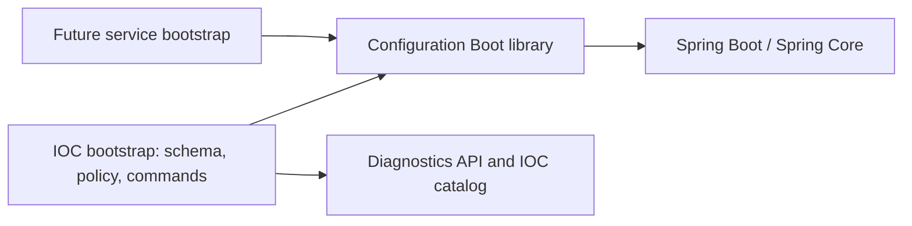

# Spring Boot configuration library proposal

Status: proposed, 2026-09-13. Analysis and extraction plan; not an accepted ADR,
implementation, publication admission or new numbered LIB commitment.

C0 update, 2026-09-13: [independent qualification](configuration-c0-analysis.md)
reproduced 54 scenarios. The proposed boundary remains useful, but copying the
current classes unchanged is not qualified. The C0 support matrix and required
corrections refine the initial API sketch below; C1 has not started.

## Recommendation and scope

Extract a small Spring Boot integration library for **configuration property-name
inspection and ordered source observations**. Keep schema, validation of values,
severity, startup refusal, operator messages and command composition in each
service. This is a narrower boundary than moving the existing bootstrap classes.

Suggested module: `adapters/adapter-config-spring-boot`; publication coordinates:
`io.github.xorex-lc:ioc-config-spring-boot`; package:
`com.iocextractor.config.boot`. These names are proposals. Keep product/library
lockstep versions. Do not create a generic configuration engine, API/implementation
module pair, starter, reload subsystem or mandatory diagnostics dependency.

The [interview](shared-library-exploration.md#configuration-interview-checkpoint)
confirms interest in source reporting, a separate configuration-check command,
service-selected severity and Spring integration. Named-handler checking is
potentially useful, not a confirmed shared framework. Future collectors are
intended consumers; none is an implemented second consumer yet. A small independent
consumer fixture must demonstrate that the proposed boundary works without IOC.

Disposition: **genericity-review**, with a concrete extraction sequence below.
The existing library goal is already satisfied by LIB-1. This proposal does not
reopen that goal or change the published concurrency artifact.

## Evidence and current behavior

Baseline: `release-0.3.0`, commit
`0df7183fcc02cfd010104733c3608e710b059be9`; Java 21, Boot parent 4.0.8.
Production code and build files are unchanged. Existing untracked discussion
notes were preserved. An independent read-only boundary review corroborated
the source traversal, schema and reporting limitations.

Project contracts consulted:
[configuration capability](../../../dev/configuration.md),
[ADR-0016](../../../ADR/0016-config-preflight-strict-binding.md),
[architecture](../../../ARCHITECTURE.md),
[module map](../../../MODULARIZATION.md),
[publication guide](../../../guides/library-publication.md),
[LIB-1 worknote](../lib-1-concurrency-worknote.md), and
[diagnostics proposal](lib-2-diagnostics-design.md).

The following paths are relative to
[`bootstrap/ioc-app/src/main/java/com/iocextractor/bootstrap/`](../../../../bootstrap/ioc-app/src/main/java/com/iocextractor/bootstrap/).

| Existing implementation | Observed responsibility | Proposed disposition |
|---|---|---|
| `IocConfigurationPropertyShape` | Reflects records; tokenizes names and indexes | Internal library helper after supported-shape qualification; not public reflection API |
| `IocEnvironmentPropertyMatcher` | Maps reserved IOC environment names against a record schema | Internal library matcher parameterized by prefix/schema; retain explicit naming contract |
| `IocUnknownConfigurationPreflight` | Enumerates names and rejects unknowns before binding | Extract inspection; retain IOC lifecycle adapter, strict rejection and exception translation |
| `IocConfigurationOverrideReporter` | Selects first declared external occurrences and logs migration notices | Extract observations; retain logging, defaults classification and migration handling |
| `IocProperties`, `ConfigPreflightConfiguration`, converters | Product schema, binding and validation wiring | Service-owned |
| `IocConfigPreflight` | Collects semantic problems about storage, lifecycle, import, sync and other IOC features | Service-owned; reuse Spring Validator/Errors |
| `ConfigRegistryCatalog`, `ConfigRegistryPreflight` | Resolve product provider/transform/predicate references, including name/argument syntax | Service-owned; reconsider a tiny membership helper only with demonstrated duplicate consumers |
| `IocConfigurationMigrationCatalog`, `IocConfigurationFailureAnalyzer` | Product migration knowledge, CONFIG codes and operator guidance | Service-owned |
| `IocYamlSyntaxCheck`, `IocYamlFailureDetails`, YAML failure analyzer | Boot YAML loading plus parser-error formatting and product instructions | Reuse framework loader; retain wrappers locally in v1 |
| `IocSemanticConfigurationCheck` | Restricted command context, argument guard, exit convention and output isolation | Service-owned command; document an integration recipe using the extracted inspectors |

### Findings that constrain extraction

1. **The shape checker is not a complete Boot Binder model.** It recognizes
   nested records, resolvable indexed `List<T>` elements and a single map tail.
   JavaBean nesting, indexed sets/arrays, nested map values, dotted/bracketed map
   keys, generic type variables, `@Name` aliases and scalar-converted records
   are not generally modeled. Non-environment container terminals are accepted
   more broadly than environment terminals. An unsupported shape must not become
   a confident claim that an operator supplied an unknown parameter.

2. **Environment naming has an IOC-specific subset.** The matcher recognizes
   `IOC_INGESTION_STABILITY_QUIET_PERIOD` by splitting record component words;
   compact `..._QUIETPERIOD` does not match that algorithm. Boot documents
   removing dashes when deriving environment variable names. Whole-container
   environment assignments are another gap. Freeze compatibility with the
   installed Boot version through actual binding fixtures before claiming
   relaxed-binding equivalence. Do not silently broaden IOC's accepted names.
   [Boot external configuration](https://docs.spring.io/spring-boot/reference/features/external-config.html).

3. **Name inspection has limited coverage and mixed error aggregation.** The
   preflight scans enumerable sources, skips the `configurationProperties`
   aggregate and examines lower-priority declarations even when shadowed.
   Nonenumerable sources are invisible; arbitrary composite traversal is not
   implemented. Unknown names accumulate, whereas environment ambiguity throws
   immediately. The shared result should distinguish unknown, ambiguous and
   uninspected input. Its IOC adapter must preserve current rejection behavior.

4. **The reporter does not establish final bound-value provenance.** It skips
   baseline sources before choosing the first external occurrence of each key.
   It does not resolve null entries, nonenumerable winners or collection binding.
   A reported lower-source list field need not survive binding. Preserve IOC
   behavior during migration, but name the shared contract accurately: ordered
   declarations/source observations. A future effective-provenance contract
   would require additional implementation and Binder-backed tests.

5. **Value-free scanning is narrower than safe arbitrary error output.** The
   scanner and reporter enumerate names without reading values. However, the
   reporter can return arbitrary `PropertySource.getName()` text. The semantic
   command's fallback prints an informative cause's message; YAML formatting
   normalizes/truncates the parser's problem text rather than redacting it.
   Custom validators, converters or parser messages may include sensitive input.
   This is a code-backed exposure risk, not a reproduced secret leak. Do not
   export those paths with a universal safe-to-log promise. Generic output reuse
   requires separate synthetic-secret tests and an explicit redaction contract.

6. **The command is not a general embedded validation service.** Its restricted
   configuration binds `IocProperties` and imports preflight configuration without
   normal application scanning. It also temporarily replaces process-wide
   `System.out`/`System.err`. Synchronization serializes checker calls, but cannot
   protect unrelated threads' output. Keep this behavior in the isolated command
   path; do not publish the existing class as an in-process utility.

7. **Existing publication tooling admits a different dependency shape.** The
   concurrency-only script rejects any consumer POM dependencies and mirrors
   Central to the selected target repository. A Boot library needs third-party
   dependencies. Its local/GitHub consumer cannot rely on that repository also
   hosting Spring. Removing isolation would allow a different repository to hide
   an incomplete publication. Tooling qualification is a prerequisite, not a
   post-publication cleanup task.

## Use the framework where it already provides the mechanism

Boot continues to load configuration, order sources, bind values and convert
types. The library supplements name inspection; it must not introduce a second
value parser or precedence engine. Collection behavior must be checked against
actual Binder results, not inferred from the reporter or historical worknote
wording. [Boot external configuration](https://docs.spring.io/spring-boot/reference/features/external-config.html).

Spring's `Validator` and `Errors` already provide validation and error collection.
Service-specific semantic rules should continue using them. They do not require
a new generic rule registry or mandatory startup failure policy.
[Spring validation](https://docs.spring.io/spring-framework/reference/core/validation/validator.html).

Use explicit service registration for the initial library. A schema and enforcement
policy must be supplied deliberately; scanning arbitrary application beans would
weaken startup-order guarantees. If later needed, Boot provides conditional
auto-configuration and `AutoConfiguration.imports`; that is a separate justified
integration step. [Boot auto-configuration](https://docs.spring.io/spring-boot/reference/features/developing-auto-configuration.html).

These are official reference sources, not proof of a tested compatibility range.
The moving Boot reference inspected during this review identified 4.1.1, while
this repository uses 4.0.8. Initial qualification targets the project's actual
version. No Boot 3.x, all-4.x or Framework-only support is promised.

## Proposed public contract

Illustrative API, to be finalized in the first extraction slice:

```java
PropertyNameInspector.inspect(PropertySchema schema,
        Iterable<PropertySource<?>> sources) -> NameInspection

PropertySourceInspector.inspect(PropertySchema schema,
        Iterable<PropertySource<?>> sources) -> OverrideInspection
```

These are separate entry points over shared internal traversal, not two parsing
engines. Callers supply sources from a prepared Spring Environment in precedence
order. The second method observes declarations; its result must not be named
`effectiveValues` or claim actual Binder provenance.

| Contract | Initial rule |
|---|---|
| `PropertySchema` | Explicit canonical prefix and record root type; begin with the single-segment prefix already exercised by IOC |
| Schema support | Document records, resolvable indexed lists and flat-map scope; reject unsupported schema preparation explicitly or mark inspection coverage incomplete |
| `NameInspection` | Immutable findings for unknown and ambiguous names, plus coverage information; expected operator mistakes are data |
| `OverrideInspection` | Ordered canonical-name/source observations, including shadowed declarations where recognized; service selects baseline/external presentation |
| Source reference | Safe kind and encounter ordinal; no raw arbitrary source name, source object or property value in public results |
| Ambiguity | Return candidate canonical names; never silently select one |
| Exclusions | Explicitly identify the known aggregate-source exclusion; distinguish unsupported sources from intentional exclusions |
| Ordering | Preserve source precedence; make per-source finding ordering deterministic independently of unordered sets |
| Immutability | Defensive copies of lists/sets; do not expose the matcher's existing mutable set |
| Errors | Programming/schema errors have explicit exceptions; unknown operator names do not trigger shared startup refusal |
| Lifecycle | Stateless inspectors; no retained Environment, background work, bean creation or cached mutable source values |

Unknown-name facts may contain the supplied parameter name. A malformed name or
dynamic map key can itself contain sensitive text; value-free is not a universal
redaction guarantee. Service rendering remains responsible for its output policy.
Inspection describes one traversal of a prepared environment, not an atomic
snapshot under concurrent configuration mutation. Reload is outside this contract.

Before finalizing the API, exercise an unrelated prefix and small independent
record schema. Expose only the result distinctions needed by both IOC and that
consumer. Do not add strategies, factories or SPI interfaces for hypothetical
extensions. In particular, no `ConfigManager`, global singleton or handler registry.

### Severity and diagnostics integration

The library reports configuration facts without choosing WARNING/ERROR, generating
service diagnostic codes or throwing an IOC exception. The service maps them to
its diagnostics and decides whether to reject startup, disable one connection or
continue. Existing IOC strict startup remains the default IOC adapter policy.
This extraction does not implement per-aggregator isolation in the current service.

No required dependency on the proposed diagnostics library is necessary for these
small configuration results. An IOC adapter maps findings to its CONFIG catalog.
That keeps diagnostics JDK-only and avoids making configuration publication wait
for an unpublished project-owned dependency. Do not duplicate a general-purpose
diagnostic/result framework inside this module.

## Dependency direction and SOLID review



Application/domain modules acquire no Spring dependency. The new adapter module
has no dependency on IOC bootstrap, domain, application, catalog, logging adapter
or the executable application. The parent retains `com.iocextractor`; the new
library overrides its module group with `io.github.xorex-lc`, as LIB-1 already
does. Reactor dependencies use that actual module coordinate.

| Principle | Concrete design consequence |
|---|---|
| Single responsibility | Inspect names/observations in the library; enforce and render in the service |
| Open/closed | Accept a service schema and prefix instead of embedding `IocProperties`; no speculative plugin framework |
| Liskov substitution | Claim only a tested subset of Boot naming/binding; unsupported input cannot masquerade as a valid complete inspection |
| Interface segregation | Name checking and source reporting can be used independently; consumers need no CLI, logger or registry SPI |
| Dependency inversion | Product policy consumes technical findings; shared mechanics never call IOC rules or construct IOC exceptions |

Production imports imply explicit Spring Boot and Spring Core dependencies;
generate and review the exact transitive closure from the implementation POM.
Do not shade Spring, declare its necessary runtime classes `provided`, or depend
on a starter to obtain unrelated web/logging behavior. Keep internal build version
management centralized. The published consumer POM must resolve without the IOC
parent and must contain concrete third-party dependency versions.

## Configuration-only command integration

Confirmed reuse need does not imply copying the whole command into the JAR.
Provide a small independent-consumer example of the existing composition pattern:
explicit configuration-properties registration, the service validator, the shared
name inspector and a restricted Boot context that closes after checking.

IOC retains `--ioc.validate-config`, candidate-file/override semantics, syntax
precheck, source/argument guards, exit 78, CONFIG messages and packaging integration.
Preserve the early name check before property binding and existing daemon bypass.
Retain override reporting on `ApplicationStartedEvent`; it is after context
refresh, not a generic guarantee that all application work has finished.

The command checks local configuration, not endpoint reachability or credentials.
No component scanning of the normal application is allowed in the example.
Tests must prove that runtime connector/scheduler beans never start, the context
closes on failure and forbidden source/argument routes stay rejected. Existing
process-output suppression is not part of the public library API. A reusable
embedded runner can be reconsidered only after its isolation contract is solved.

## Publication tooling work required

Review targets:
[`library-publication.py`](../../../../tools/ci/library-publication.py),
[`library-publication.md`](../../../guides/library-publication.md) and the existing
LIB-1 publication profile/consumer fixture and protected workflow.

1. Replace concurrency-specific coordinates, target path and class markers with
   reviewed per-library descriptors. Keep the default/explicit LIB-1 descriptor's
   zero-dependency rule. A new descriptor may allow only the reviewed configuration
   library dependencies; do not remove the dependency guard globally.
2. Produce a standalone POM with concrete versions and no unresolved properties,
   private parent, embedded repository credentials, reactor artifacts or executable
   Boot packaging. Retain sources/Javadoc, exact manifest, checksums, signatures
   and source identity validation. Reject unexpected dependencies and BOM imports.
3. Separate target-library resolution from public third-party resolution. For a
   local or GitHub test, own coordinates must resolve only from the chosen target;
   Spring and build plugins may use approved public repositories. Evaluate Maven
   Resolver's repository group filtering on the Resolver bundled with the current
   Maven 3.9.9 wrapper;
   configure all relevant repository IDs explicitly and verify negative cases.
   Do not assume filters without input fail closed or copy newer filter syntax
   into an older wrapper. [Resolver filtering](https://maven.apache.org/resolver-1.x/remote-repository-filtering.html).
4. Use an empty isolated Maven repository and a standalone consumer outside the
   reactor. Assert that missing own artifacts fail even when another repository
   could supply them; assert third-party dependencies still resolve. Include
   transitive own-artifact negatives if such dependencies are later admitted.
   Repository-order preference alone is insufficient evidence of isolation.
5. Re-run LIB-1 bundle/consumer regression fixtures after generalizing the tool.
   Exercise preparation and local consumption before any protected publication.
   Never replace `ioc-platform-concurrency:0.3.0-rc.1` or its component tag.

Repository-filter qualification is an implementation checkpoint, not a claim
that this review tested a multi-library publisher. If the pinned resolver cannot
enforce the required routing, resolve that limitation before publication admission.

## Implementation slices and acceptance criteria

Each slice below is future work; this document authorizes no publication action.

| Slice | Work | Exit evidence |
|---|---|---|
| C0: contract qualification | Independent schema fixtures; map documented names to actual Boot Binder behavior; choose the supported subset and truthful source-report wording | Compatibility/unsupported-case matrix; no unreviewed IOC behavior changes; named capability/release owner recorded |
| C1: module extraction | Add one adapter JAR, internal matcher/traversal and immutable results; parameterize prefix/schema; IOC delegates to inspectors | Non-IOC consumer compiles; unknown/ambiguity/coverage contracts pass; no product imports or core-to-Spring dependency |
| C2: preserve integration | Adapt IOC strict preflight and reporter, retain local validators/analyzers/commands; add restricted-context consumer example | Current startup codes, legacy hints, binding failures, output and command isolation retain their contracts |
| C3: build and documentation | Update module/root maps, capability doc, module README and publication guide; review an ADR for the accepted extraction boundary | Maven/analyzer/coverage scope reviewed together; focused tests, `make verify` and `make pmd-analysis` on final code/build tree |
| C4: publication qualification | Descriptor/POM changes, repository routing, independent consumer and LIB-1 regression evidence | Local bundle and cold-consumer positives/negatives; dependency closure, protected trigger and immutable artifact identity reviewed before publication |

Add tests for behavior and boundaries, not internal reflection method structure:

- Canonical, camel/dashless and both environment spellings against real Binder;
  nested records, flat maps, whole/indexed lists, malformed indexes and explicitly
  unsupported shapes. Preserve IOC's existing documented semantics or review any
  correction separately.
- Unknowns plus ambiguity in one inspection; lower shadowed unknown names;
  nonenumerable/custom sources and accurate coverage; deterministic immutable
  findings under a non-IOC prefix.
- Source-order observations with baseline, null entries and list overrides;
  explicitly show where declaration observation differs from a bound winner.
- An enumerable source whose value getter fails if called, proving name inspection
  reads no values; synthetic secret-bearing source labels and rendering inputs.
- Before-binding rejection, semantic collect-all, existing converters and migration
  hints; command success/failure exit behavior, forbidden configuration routes and
  no runtime connector/scheduler creation. Test process-wide output behavior in
  an isolated command fixture, not parallel in-process tests.
- Standalone consumer dependency resolution and publication negatives described
  above. A passing reactor build is not external-consumer evidence.

Rollback before publication is reverting module wiring and retaining the original
service implementation. Do not leave two active validators/reporters. After a
public release, API changes require normal compatibility review and a new immutable
version; unpublished internal types have no separate external compatibility promise.

## Verification performed for this proposal

Source, existing tests, documentation and publication script were reviewed.
Two focused existing suites were run sequentially through the repository facade:

| Command | Result on 2026-09-13 |
|---|---|
| `make test-one MODULE=bootstrap/ioc-app TEST=IocSemanticConfigurationCheckTest` | BUILD SUCCESS; 7 tests, no failures/errors/skips |
| `make test-one MODULE=bootstrap/ioc-app TEST=IocConfigurationOverrideReporterTest` | BUILD SUCCESS; 4 tests, no failures/errors/skips |

These 11 tests confirm their existing covered behaviors, not the proposed public
API, complete binding compatibility, absence of secret exposure, or publication
support. No new production implementation or test was added. Full verify/PMD
were not rerun for this documentation-only proposal; local freshness still points
to an older commit and is not represented as current release evidence.

The C0 analysis is now recorded in the linked qualification worknote. The next
proposed step is C1 with its explicit correction requirements; generic admission
is conditional on those fixes and actual API tests. No additional future-service
feature interview is needed to define that bounded work.
