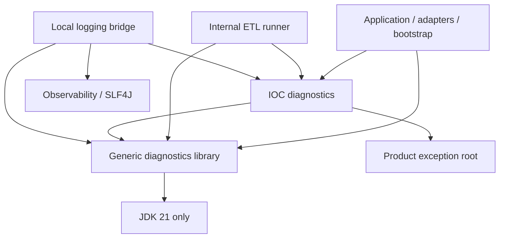

# LIB-2: Diagnostics library boundary proposal

Status: proposed, 2026-09-13. Existing-code extraction design, not an accepted
ADR, implementation or publication admission.

## Proposed boundary

One JDK 21 library owns structured in-process diagnostics, results, failure
decisions, optional bounded retention and observational delivery. These needs
are confirmed in the [interview](shared-library-exploration.md). IOC categories,
catalogs, text rendering, exceptions and logging composition stay in the service.
No reload, messaging protocol, Spring starter or API/implementation split.

Suggested coordinates (not admitted/published):
`io.github.xorex-lc:ioc-platform-diagnostics-api`, new reactor module
`platform/platform-diagnostics-api`. The JAR includes small implementations,
despite its API suffix. Keep existing `ioc-platform-diagnostics` as the
unpublished IOC catalog/exception layer. Both retain lockstep `${revision}`.

Proposed Java package: `com.iocextractor.platform.diagnostics`, with `result`
and `sink` subpackages. Product types retain `com.iocextractor.diagnostics`.
Separate packages avoid split packages between JARs. Update internal imports
together; do not promise binary compatibility with unpublished reactor types.
The published concurrency contract remains unchanged.

Current consumers are application, ETL, adapters and bootstrap. Future collectors
are confirmed intended consumers, not implemented integrations. Responsibility
belongs to the diagnostics capability maintainer; named release ownership must
be recorded at admission.

## Review evidence and findings

Baseline: `release-0.3.0`, `0df7183fcc02cfd010104733c3608e710b059be9`.
Interview files were already untracked. Production code is unchanged.
Reviewed diagnostics production type groups and tests, ETL, CSV preparation,
logging/resilience/redaction, exception/category consumers and catalog tooling.
An independent read-only integration review corroborated the migration seams.

| Priority | Existing code | Impact and disposition |
|---|---|---|
| High: extraction blocker | `DiagnosticCode` requires category, message key and template; `Diagnostic` stores category | Excluding only `render/` leaves service taxonomy and presentation in the API |
| High: extraction blocker | `Notification.throwIfRejected` constructs final `DiagnosticException extends IocExtractorException` | Keep throwing enforcement local; generic policies return decisions |
| High: extraction blocker | `BoundedNotification` creates `PipelineDiagnosticCodes.DIAGNOSTICS_SUPPRESSED`; `PipelineRunner` matches it with `==` | Inject the original code from the service and preserve its identity/fields |
| High: migration risk | `IngestionService` and `LoggingIngestionStartupObserver` inspect INGEST category | Preserve behavioral ownership checks, not just log text |
| Medium: API limitation | `Diagnostic` shallow-copies context and compares code object + context | No deep immutability, code-ID equality or occurrence identity |
| Medium: retention limitation | OPERATION bypasses budget; stages may allocate lists before accumulation | Neither a strict memory bound nor a logging throttle |
| Medium: dependency seam | `ResilientDiagnosticSink` depends on SLF4J Logger | Factor existing containment around a caller-supplied fallback |
| Medium: exposure risk | Diagnostic `toString`, exception messages and causes may expose values | No universal redaction or safe-to-log guarantee |

These are extraction blockers and contract limitations, not claims of newly
reproduced production defects. No unrelated fixes are authorized.

## Existing-type disposition

Every production type in `platform-diagnostics` is covered below.

| Types | Disposition | Contract/change |
|---|---|---|
| `Diagnostic`, `DiagnosticBuilder`, `DiagnosticFactory` | Extract after adaptation | Remove category storage/accessor; preserve explicit Clock, builder, context, cause, severity |
| `DiagnosticCode` | Extract reduced interface | Only `id()`, `defaultSeverity()`, `impact()` |
| `DiagnosticSeverity` | Extract | Six existing levels and ERROR/FATAL classification |
| `DiagnosticImpact` | Extract with precise documentation | ELEMENT/RUN budgeted, OPERATION unbudgeted; classification alone authorizes no side effect or skipping |
| `Result<T>` | Extract | Copied diagnostic list, existing null/map behavior |
| `Notification` | Extract without `throwIfRejected` | Per-task accumulation, queries, snapshots and `toResult` |
| `FailurePolicy`, `FailureDecision` | Extract | Existing `evaluate(Notification)`, factories, stop reason, custom policies |
| `DiagnosticSummary` | Extract | Counts including suppressed occurrences and validation |
| `BoundedNotification` | Extract with suppression-code parameter | Preserve existing retention/summary algorithm |
| `DiagnosticSink`, `NoopDiagnosticSink`, `CollectingDiagnosticSink` | Extract | Observational port, no-op, single-thread collecting implementation |
| `DiagnosticException` | Keep local | Preserve product exception ancestry and catches |
| `DiagnosticCategory`, `DiagnosticContextKeys` | Keep local | Product taxonomy and context vocabulary |
| All twelve `*DiagnosticCodes` enums | Keep local | Source, Extraction, Classification, Sink, Ingest, Import, Storage, Schema, Export, Sync, Lifecycle, Pipeline |
| `DiagnosticCatalog`, `DiagnosticCatalogEntry`, `DiagnosticCatalogs` | Keep local | Product enumeration, message metadata and documentation generation |
| `DiagnosticRenderer`, `TemplateDiagnosticRenderer`, `DiagnosticContextFormatter` | Keep local | Text presentation stays service-owned |

Also extract the algorithm of `ResilientDiagnosticSink` from diagnostics-logging,
replacing Logger with a caller-supplied
`BiConsumer<Diagnostic, RuntimeException>`. Bootstrap supplies the existing log
action. Contain RuntimeException from delegate and fallback, avoid recursive emit,
reject null before delivery, and allow JVM Errors to propagate. This callback
removes a dependency from existing behavior; it adds no asynchronous delivery,
retry or persistence. `LoggingDiagnosticSink` and redacting formatter stay local.

## Proposed API and product extension

Signature sketch, not compiled implementation:

```java
public interface DiagnosticCode {
    String id();
    DiagnosticSeverity defaultSeverity();
    DiagnosticImpact impact();
}
// Existing public methods otherwise preserved where listed above:
// Diagnostic.builder(code, clock); DiagnosticFactory.create(code)
// Result<T>(T value, List<Diagnostic> diagnostics)
// FailurePolicy.evaluate(Notification) -> FailureDecision
// BoundedNotification(int limit, DiagnosticFactory factory,
//                     DiagnosticCode suppressionCode)
// ResilientDiagnosticSink(DiagnosticSink delegate,
//     BiConsumer<Diagnostic, RuntimeException> deliveryFailureHandler)
```

Require stable, nonblank code IDs unique within the caller's catalog; code,
severity and impact must be non-null. Enum implementations fit existing usage.
Keep equality based on code object equality, not silently on string IDs.
Owner-approved change: diagnostic equality and hashing additionally include
effective severity, giving `code object + context + severity`. Time and cause
remain excluded under the proposal; no occurrence ID or deduplication is added.

Define local `IocDiagnosticCode extends DiagnosticCode` with `category()`,
`messageKey()` and `defaultMessageTemplate()`. IOC enums implement it; catalog
generation uses local codes. A local metadata helper recognizes this interface
for ingest ownership checks and logging. Generic codes have no IOC category:
do not blindly cast them or classify them as INGEST. Local rendering can fall
back to their code ID. Preserve all current behavior for actual IOC codes.

Keep DiagnosticImpact because the existing retention algorithm uses it. It is
processing scope, not IOC taxonomy. OPERATION must remain low-cardinality.
Introducing arbitrary impact frameworks or configurable retention policies is
outside this extraction.

The suppression-code parameter removes the only catalog import from the bounded
accumulator. IOC supplies the SAME existing Pipeline enum constant, preserving
`limit`, `suppressedCount`, `suppressedBySeverity` and highest suppressed severity.
Other consumers supply a stable code of their own. The synthetic summary is not
counted as an observed occurrence. It must not be fed back into the accumulator
as another real problem.

## Behavioral contracts and limits

- `Result.success(null)` remains valid. Null does not mean failure; `map` skips
  null, retains diagnostics and propagates mapper exceptions.
- Container copies are shallow. Context values, result value, code implementation
  and Throwable are not deep-copied. Keep context stable if relying on hash/equality.
  These objects are neither a wire schema nor a secret-safe representation.
- Target equality includes severity (an explicitly approved change from current
  code), but still ignores time/cause. Sets can retain WARN and ERROR separately;
  repeated equal-severity occurrences can still collapse, so do not use sets
  for occurrence counts. Accumulators do not deduplicate.
- Builders, Notification, bounded and collecting sinks are per-task mutable
  objects, not concurrent registries. Snapshot getters do not synchronize access.
- Failure policies run at caller-selected checkpoints. They neither cancel work
  nor roll back writes. A mutable Notification is exposed to custom policies,
  whose contract requires purity; no new framework is needed to enforce this.
- Budget one can replace an ERROR detail with FATAL. Severity signals survive,
  not every original reason. A custom policy matching individual codes must see
  full observations before lossy compaction; retained samples cannot guarantee
  arbitrary lossless decisions.
- A raw sink may violate its delivery contract; a fallible observer needs the
  resilient wrapper. No audit, durable delivery or remote protocol is implied.

## Dependency direction and migration



Catalogs contain PIPELINE codes but do not depend on ETL, so the local module
creates no reverse edge. The generic API imports neither local diagnostics nor
errors. Application stays framework-free under repository policy, including
where generic skill examples permit Spring.

Implementation migration checklist:

1. Move generic types/tests and update imports/direct dependencies in application,
   ETL, adapters, bootstrap and TCK. No duplicate old/new diagnostic models.
2. Replace `throwIfRejected` calls with evaluate then local exception construction.
   Preserve exception ancestry, causes, catch ordering and recovery contracts,
   including SourceReader/Tika paths.
3. Adapt category checks in IngestionService and LoggingIngestionStartupObserver
   through local metadata; preserve logging category/action/severity/text.
4. Supply the existing suppression enum to PipelineRunner; preserve append-only
   diagnostic deltas, delivery count/order and original-failure precedence.
5. Preserve bootstrap renderer/redaction wiring. Keep catalog tests and generation
   local: DiagnosticCatalogTest, DiagnosticCatalogDocumentationTest and bootstrap
   CatalogReferenceRatchetTest. Update generator invocation/classpaths if needed,
   and regenerate documentation rather than editing generated output.

## Independent consumer illustration

Proposed API usage, not an implemented feeds service or a compiled fixture:

```java
enum CollectorCode implements DiagnosticCode {
    ENTRY_REJECTED;
    public String id() { return "COLLECTOR.ENTRY_REJECTED"; }
    public DiagnosticSeverity defaultSeverity() { return DiagnosticSeverity.ERROR; }
    public DiagnosticImpact impact() { return DiagnosticImpact.ELEMENT; }
}

var problem = Diagnostic.builder(CollectorCode.ENTRY_REJECTED, clock)
        .with("entry", "example-17").build();
var result = Result.of(List.of("accepted-entry"), List.of(problem));
var decision = FailurePolicy.collectAndContinue()
        .evaluate(new Notification().addAll(result.diagnostics()));
// shouldStop() is false; failFast() would return stop for the same result.
// The caller owns text and whether/how to apply partial results.
```

No IOC category/template, Spring, logging or exception dependency is required.

## Maven, publication and validation

Keep lockstep versions and selected repositories. No independent train, BOM or
root-parent publication. Flatten the consumer POM; attach sources/Javadoc/license;
require a JDK-only runtime closure. The current tooling is concurrency-specific:
add an explicitly admitted component descriptor for coordinates, paths, archive
markers, tag and fixture. Preserve exact manifest checks, per-component recovery
identity and the concurrency fixture. Do not introduce unrestricted publication.

The new module changes reactor/report membership and module-local coverage
denominators. Review aggregate POMs, dependency management, test-quality/verifier
scope and evidence together; never lower floors or add exclusions merely to pass.
Update module READMEs, architecture/module maps, diagnostics docs and an ADR as
part of future implementation. Inventory stays genericity-review until admission.

Before publication, qualify:

- Generic test codes independent of IOC catalogs; existing null/map contracts;
  approved severity-sensitive equality/hashCode, equal-severity time/cause
  invariance, set membership, and pipeline rejection of a replaced diagnostic
  prefix whose severity changed. Revise the old equality regression intentionally;
  unequal objects need not have distinct hash codes. Budget-one ERROR/FATAL
  orders, OPERATION bypass, counts and repeated
  snapshots; custom-policy limitations and externally supplied suppression code.
- Resilient delegate/fallback RuntimeException containment and unchanged original
  outcome. Keep raw contract violations distinct from supported wrappers.
- IOC exception/Tika/recovery and category behavior; pre-write failure checkpoint;
  pipeline append-only deltas and suppression identity; redaction/logging and
  generated catalog/live-reference ratchet fidelity.
- Separate consumer resolving only the admitted dependency closure, exercising
  results, policies, retention and sinks. Separate cold consumers from each
  repository after publication; local install/reactor tests are insufficient.
- Focused tests then final `make verify`, `make pmd-analysis`, raw analyzer review;
  exception-ownership changes also require the PMD watchlist review.

Current evidence: `make test-module MODULE=platform/platform-diagnostics` passed
on unchanged production code: 34 diagnostics tests, zero failures/errors/skips,
three upstream reactor projects successful. This validates current behavior,
not the proposed signatures. No new code/modules/tests were created. Full
verify/PMD were not rerun; their prior results are stale for HEAD.

## Owner review: category ownership

The owner accepted service-owned categories and a common diagnostic format.
The generic API must not require a shared category enumeration or a library
release when a service adds a category. This confirms the category separation
above, not the exact local helper/interface implementation. Preserve existing
IOC category-dependent recovery and logging behavior during migration.

## Owner review: severity-sensitive equality

The owner explicitly requires otherwise identical WARN and ERROR diagnostics
to compare differently. Update both equals and hashCode during implementation,
with severity as the additional component. Current production code remains
unchanged. PipelineRunner compares diagnostic list prefixes through equals:
the new contract must detect replacing a previous warning with an error rather
than appending a new diagnostic. Existing correct append-only stages stay valid.
Time/cause exclusion and code-object comparison remain proposal defaults, not
new owner decisions. No change to counters, retention or automatic deduplication
is implied by this answer.

## Technical design checkpoint

Completed after the owner's category/equality answers on the same baseline.
This is source-level closure review, not a build of the proposed library.

The proposed public implementation comprises 15 existing diagnostics types from
the disposition table plus the adapted resilient sink (16 total). Import
inspection of the 15 types found two explicit outside imports:
`Notification -> DiagnosticException` and
`BoundedNotification -> PipelineDiagnosticCodes`. Same-package inspection adds
`Diagnostic`/`DiagnosticCode -> DiagnosticCategory`; import-only analysis would
miss that edge. Removing these three documented couplings and the resilient
sink's Logger dependency leaves only JDK and candidate-owned types. The same
public builder/factory/result/policy chain supports the independent example.
No new general-purpose extension framework is needed.

The only production `throwIfRejected` caller found is PipelineRunner; its
NotificationTest also needs intentional migration. Other direct construction and
catching of DiagnosticException remain local and retain the product hierarchy.
Changing equality strengthens the runner's existing prefix comparison; it does
not grant permission to mutate earlier diagnostic entries.

Publication review confirms that the current zero-dependency POM check is
appropriate for this candidate and should remain. Artifact selection, package
markers, tags, consumer fixture and recovery identity need per-component support;
dependency-bearing publication is unnecessary for LIB-2 and is not a prerequisite.

Concrete implementation sequence after admission:

1. Establish the new JDK-only module and local code-metadata extension, migrating
   all affected callers coherently so the reactor remains buildable. Do not
   temporarily maintain two independent diagnostic value models.
2. Apply the accepted equality change and explicit suppression-code/fallback
   seams; preserve local exceptions, renderer, category checks and catalog tools.
3. Move/extend behavioral tests and independent consumer; review module/report
   membership and revised coverage denominators with evidence.
4. Complete docs/ADR and final deterministic/analyzer checks, then extend the
   publication component allowlist and qualify packaging and public consumption
   under a separately authorized release.

No additional owner behavior question blocks this design checkpoint. Status is
**boundary proposal technically reviewed; implementation/publication pending**.
Exact extracted compilation, integration behavior and published artifact evidence
remain unproven until those steps run. This does not change the inventory's
genericity-review disposition or imply that artifact/package naming is accepted.

## Remaining admission decisions

Accept or revise the proposed artifact/package and API adaptations, name the
maintainer and record compatibility/publication admission before implementation.
Existing tests do not fully establish all newly public boundary contracts, so
focused hardening is part of that future work. No additional feature interview
is needed to review this proposal; no extraction or publication is authorized.
