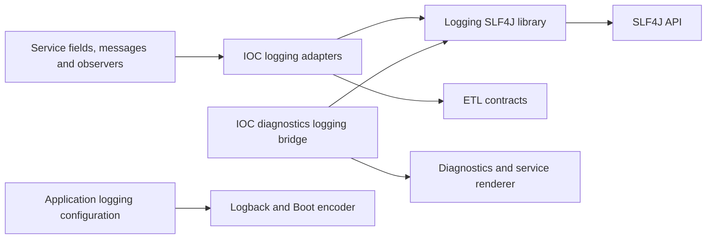

# LIB-3: SLF4J logging tools boundary proposal

Status: proposed, 2026-09-13. Code-backed design and extraction plan, not an
accepted ADR, production implementation or publication admission.

## Recommendation

Create one small Java 21 library for restoring logging context, constructing
typed event fields and explicitly preparing selected values for logs. Use SLF4J
as the logging interface. Each service owns field definitions, actions, messages,
sensitivity policy and logging configuration.

Suggested coordinates: `io.github.xorex-lc:ioc-platform-logging-slf4j`;
module: `platform/platform-logging-slf4j`;
package: `com.iocextractor.platform.logging`, with a `redaction` subpackage.
Names are proposals, not admitted coordinates. Keep lockstep `${revision}`.
Retain `platform-observability` as the internal IOC catalog/integration module;
new generic types use a separate package to avoid split packages.

Do not publish the existing observability module unchanged. Do not add a starter,
logging backend, metrics/tracing system, general execution-context framework,
automatic secret detector, separate redaction artifact or API/implementation split.
The library does not require the proposed diagnostics or configuration libraries.

Disposition: **genericity-review; boundary ready for implementation planning**.
Confirmed future consumers are the planned collectors; they are not implemented
external consumers. Admission still needs an independent consumer fixture, named
release ownership and the publication evidence described below.

## Confirmed requirements

The [interview, sections 16–20](shared-library-exploration.md) establishes:

- Logging metadata can be set around an operation and restored afterwards.
- Each service defines field names/types; shared tools process those definitions.
- Wrong field types continue throwing; producer correctness and handling remain
  developer responsibilities. Containment is deferred as
  [OBS-6](../../../KNOWN-ISSUES.md#4-наблюдаемость-obs), not an extraction blocker.
- URL credential/query sanitation is useful as an explicit helper.
- Other selected sensitive values need a constant full mask. Fingerprint-based
  correlation is unnecessary. The service selects values to hide.
- Work remains at the same design-proposal level as diagnostics/configuration.
  No production extraction or behavioral correction is authorized by this plan.

Constant whole-value masking is one small requested extension. It is not claimed
to exist as a current generic helper. Existing IOC diagnostic fingerprinting and
DEBUG/TRACE rendering remain a separate migration decision.

## Evidence and findings

Baseline: `release-0.3.0`, `0df7183fcc02cfd010104733c3608e710b059be9`.
Resolved test dependencies: SLF4J 2.0.18, Logback 1.5.38; project Boot parent 4.0.8.
The working tree already contained the interview/C0 worknotes and the OBS-6 debt
entry. This analysis preserves those changes and does not change production code.

Reviewed: observability production types and tests, diagnostic logging/formatting,
bootstrap listeners and observers, encoder wiring, architecture/catalog checks,
module POMs and publication tooling. Project references:
[observability capability](../../../dev/observability.md),
[ADR-0018](../../../ADR/0018-typed-ecs-structured-logging.md),
[ADR-0019](../../../ADR/0019-spring-boot-4-nested-ecs.md),
[module map](../../../MODULARIZATION.md),
[publication guide](../../../guides/library-publication.md), and
[diagnostics proposal](lib-2-diagnostics-design.md).
Historical ADR status/version prose is not treated as current implementation state.

| Priority / seam | Evidence | Design consequence |
|---|---|---|
| High: API coupling | `MdcScope.put/hide` and `LogEvent.field` accept IOC `LogField`; action/outcome helpers embed that vocabulary | Introduce immutable service-supplied field descriptors; keep IOC convenience methods locally |
| High: dependency coupling | `LoggingPipelineObserver` pulls `platform-etl` and its diagnostics/errors closure into observability | Keep observer local; generic JAR needs only SLF4J API |
| High: masking/type conflict | `LogValueNormalizer` rejects strings for LONG/BOOLEAN | A constant textual mask requires a STRING log field; never silently change a numeric field's wire type |
| High: scope of redaction | URL helper preserves path/fragment; diagnostic formatter selects only three IOC keys and permits raw DEBUG/TRACE values; sink passes Throwable separately | No universal safe-output promise; selected-value masking does not scrub messages, causes, other fields or ambient MDC |
| Medium: mutable scope ownership | `MdcScope` stores prior values without thread/order enforcement | Support same-thread, nested LIFO scopes only; no worker/service propagation contract |
| Medium: partial scope construction | Fluent scope population may throw before try-with-resources acquires it; `collisionScope()` populates before returning | Open the resource before population and put collision hiding inside its protected body; retain exception propagation |
| Medium: new descriptor identity | Current enum inherently prevents duplicate key/type definitions; arbitrary descriptors will not | Normalize event identity by key; reject conflicting types and collapse equivalent declarations |
| Medium: asymmetric STRING handling | MDC path uses `String.valueOf(Object)`; event path only accepts specified textual types | Specify distinct public contracts and preserve old IOC conversion through a local adapter |
| Medium: omission is not hiding | `field(key, null)` removes the event field, so same-key ambient MDC remains visible | Do not use null omission as a security mask; explicit hide/full-mask paths have different semantics |
| Medium: test lifecycle | Async log test uses a timed latch but lacks containing `@Timeout`; appender stop follows assertions rather than finally | Repair ownership discipline when migrating this suite; assertions must not strand async resources |
| Deferred by owner | Type mismatch throws during construction, before disabled-level filtering | Preserve strict behavior; do not implement OBS-6 during extraction |

These are extraction constraints and reviewed risks. No new production secret
leak or provider failure was reproduced in this analysis. Ordinary supported
scope behavior and typed event delivery have existing tests, rerun below.

## What SLF4J already provides

SLF4J 2 already provides level-specific fluent event builders, object-valued
key/value pairs, causes and backend dispatch. Retain those facilities; our
wrapper should add field-contract checks and collision handling, not a second
logging engine. Library dependencies should contain the API and leave provider
selection to the application. [SLF4J manual](https://www.slf4j.org/manual.html).

`MDC.putCloseable` removes its key on close; it does not restore a previous
overwritten value. The current `MdcScope` adds restoration of touched keys and
nested scope semantics. Copying/restoring the entire MDC map would also overwrite
unrelated changes, unlike the current scoped behavior.
[SLF4J MDC contract](https://www.slf4j.org/apidocs/org/slf4j/MDC.html).

The shared event facade must continue following the builder returned by
`addKeyValue`/`setCause`, rather than assuming a mutable builder returning itself.
The existing copy-returning-builder test protects this boundary.
[LoggingEventBuilder API](https://www.slf4j.org/api/org/slf4j/spi/LoggingEventBuilder.html).

MDC availability and final rendering depend on the provider. A compatible API
dependency does not guarantee JSON output, nested ECS shape or context inclusion
with every backend. The initial actual provider fixture is Logback; backend-free
construction can work without proving event delivery.
[SLF4J MDC contract](https://www.slf4j.org/apidocs/org/slf4j/MDC.html).

The moving manual currently illustrates SLF4J 2.0.19. This project was inspected
and tested with 2.0.18; no dependency upgrade or universal version compatibility
is inferred from the reference documentation. Boot/Logback format ownership
remains in the application, as required by the project's ADR-0019.

## Existing-type disposition

Paths below are in
[`platform-observability`](../../../../platform/platform-observability/src/main/java/com/iocextractor/observability/)
unless another module is named.

| Type | Disposition |
|---|---|
| `MdcScope` | Extract restoration/hiding mechanics; replace the IOC parameter type |
| `LogValueType` | Extract STRING/LONG/BOOLEAN vocabulary; these are log representation types, not domain types |
| `logging.LogValueNormalizer` | Keep internal to the new library; retain current supported conversions |
| `logging.LogEvent` | Extract typed fields, collision scope and SLF4J delivery; remove IOC convenience vocabulary |
| `logging.LogEvents` | Retain the five small level factories as the entry point; no new logger abstraction |
| `SensitiveLogValueSanitizer` | Move its narrow URL-component transformation behind explicitly named `LogRedaction.urlComponents`; qualify partial-input behavior |
| `LogField` | Keep IOC field names/descriptions and generated catalog local; expose/hold generic descriptors |
| `EventAction` | Keep service event vocabulary/metadata local |
| `EventOutcome` | Keep IOC's ECS convenience vocabulary local; callers can supply their own field/value pairs |
| `ObservabilityMode` | Keep oneshot/daemon vocabulary local |
| `logging.LoggingPipelineObserver` | Keep ETL-to-IOC-logging integration local |
| `diagnostics.LoggingDiagnosticSink` in diagnostics-logging | Keep bridge, severity mapping and renderer composition local |
| `diagnostics.RedactingDiagnosticContextFormatter` | Keep IOC key/severity/fingerprint policy local; do not extract the fingerprint merely because it exists |
| `diagnostics.ResilientDiagnosticSink` | Coordinate with LIB-2's separate resilience design; do not duplicate it in LIB-3 or infer resilience of all LogEvent calls |
| Bootstrap encoder, logback XML, decision/import/startup observers | Keep application configuration, message policy, schema/format and business lifecycle mapping local |

Package-info and READMEs follow the resulting ownership. A generic redaction
helper does not need a separate JDK-only module without a demonstrated independent
consumer. Its methods remain independent of IOC and do not use Spring.

## Proposed public API and contracts

Illustrative API, not implemented declarations:

```java
record LogFieldSpec(String key, LogValueType valueType) { }
enum LogValueType { STRING, LONG, BOOLEAN }

MdcScope.open()
MdcScope.put(LogFieldSpec field, String value)
MdcScope.hide(LogFieldSpec field)
MdcScope.close()

LogEvents.trace/debug/info/warn/error(Logger logger) -> LogEvent
LogEvent.field(LogFieldSpec field, Object value)
LogEvent.message(String message)
LogEvent.log()
LogEvent.log(Throwable cause)

LogRedaction.urlComponents(String value) -> String
LogRedaction.fullMask() -> String
```

The field descriptor is an immutable record, not an implementation interface
whose key/type can change during an event. A service can keep descriptors in an
enum or static catalog with its own descriptions and units. Validate non-null,
nonblank keys and non-null types. Global catalog uniqueness, reserved encoder
names and nested-name conflicts such as `task` versus `task.id` remain service
schema checks; the library does not become a catalog registry or JSON mapper.

### Typed event fields

- Retain normalization of CharSequence, Enum, Path and UUID to STRING;
  Byte/Short/Integer/Long to LONG; Boolean to BOOLEAN. Null omits a field.
  Floating point, arbitrary objects and numeric/boolean strings are rejected.
- The generic enum conversion is `toString()`. IOC `.action(...)` must still
  pass `EventAction.value()` explicitly to preserve its lower-case wire value.
- Same key and same type identifies one event field, with last supplied value
  winning. Different types for one key are a programming error, including when
  declarations came from different descriptors. Retain per-event type identity
  when a null removes the emitted value. Do not key the event map solely by
  record equality, which includes type and would allow duplicate wire keys.
- Wrong types throw before logging-level filtering, as agreed in OBS-6. Do not
  silently coerce strings or add automatic retry/fallback.
- Preserve empty default message and nullable cause semantics. The event builder
  is mutable and not thread-safe; construct one per record. Calling `log()` twice
  is two log attempts, not an exactly-once or durable-delivery guarantee.
- A local event field temporarily hides the same MDC key for that emission,
  regardless of its scalar type, and restores it afterwards. Follow returned
  SLF4J builders. Final serialization and async buffering belong to the provider.

### Logging context scopes

- `put` accepts STRING descriptors only; null removes that key for the scope.
  `hide` may hide a descriptor of any type because an ambient string can collide
  with a typed event field.
- Remember each touched key's first previous value; restore in reverse order.
  Leave untouched keys alone. Close is idempotent; writes after close fail.
- Open, populate and close on the same thread in nested LIFO order. No automatic
  capture/restore across executors, async methods, services or network boundaries.
  The current bootstrap listeners reconstruct MDC inside workers from explicit
  event metadata; preserve that pattern.
- The proposed String-only argument narrows the current `put(LogField,Object)`
  convenience. The IOC compatibility wrapper can keep its existing null and
  `String.valueOf` behavior; changing those existing callers is not implicit.
- Open the scope directly in try-with-resources, then populate inside the body.
  Apply the same structure to collision hiding so failures during preparation
  still attempt cleanup. This is resource ownership, not OBS-6 containment:
  normal Java exception propagation/suppression remains intact. No guarantee
  of successful restoration can be made if the MDC provider itself fails.

### Masking without corrupting field types

`fullMask()` returns a proposed constant `[redacted]` without accepting or
stringifying a secret. It conveys no secret prefix, suffix, length or fingerprint.
It has no severity-dependent escape hatch. The service selects where to use it;
absent/null input handling remains its decision.

```java
// Service-owned log schema; TOKEN describes its logged representation.
var taskId = new LogFieldSpec("collector.task.id", LogValueType.STRING);
var token = new LogFieldSpec("collector.auth.token", LogValueType.STRING);
var count = new LogFieldSpec("collector.items", LogValueType.LONG);

try (var context = MdcScope.open()) {
    context.put(taskId, "task-42");
    LogEvents.info(logger)
            .field(token, LogRedaction.fullMask())
            .field(count, 12)
            .message("operation completed")
            .log();
}
```

Do not send a textual mask to a LONG/BOOLEAN field. If a service needs a masked
numeric secret, define its **log representation** as STRING consistently from
the outset, or omit the numeric field and use a separate service-owned STRING
field. Changing an existing numeric field's type needs a deliberate consumer
schema migration. Raw domain values and their types remain unchanged.

Null omission alone does not mask ambient MDC. For sensitive same-key context,
use an explicit mask or protected hide scope; otherwise omitting an event field
can expose the ambient value. Prefer never inserting raw secrets into MDC.
Masking one selected field also does not alter copies in the message, other
fields or Throwable. An automatic scrubber is outside v1.

`urlComponents` remains a different operation: it preserves useful URL parts
and hides user-info/query content under the current lexical algorithm. Paths
and fragments may remain visible. Test scheme-less input, delimiter ordering,
multiple delimiters and null before publishing a precise partial-input contract;
do not claim URI parsing or arbitrary-token detection from the current name.

## Dependency direction and SOLID



The new library has no dependency on ETL, diagnostics, configuration, application,
domain, Spring, Logback main classes or IOC field catalogs. Preserve inward
dependencies: core business modules use their existing observer/diagnostic ports,
not the SLF4J helper as a new business dependency. The local observability module
can delegate to the generic JAR and retain its existing outward integrations.

| Principle | Concrete consequence |
|---|---|
| SRP | Separate field normalization, scoped MDC restoration, event emission and explicit redaction methods |
| OCP | New service field definitions require no edits to the library's field enum/catalog |
| LSP | No claim of durable delivery, universal provider rendering, arbitrary field types or automatic propagation |
| ISP | No obligation to implement diagnostic sinks, ETL observers or security policies to use a scope or typed event |
| DIP | Depend on SLF4J's logging interface and immutable field data; IOC policy never becomes a shared dependency |

Only `org.slf4j:slf4j-api` is a required external main dependency; Logback remains
test-only in the library. The application selects/configures its provider. Do not
shade SLF4J or impose a provider transitively. A single artifact is sufficient;
additional SPI interfaces or modules would add compatibility surface without a
confirmed consumer need. [SLF4J library guidance](https://www.slf4j.org/manual.html).

## Migration and publication plan

| Slice | Work | Acceptance evidence |
|---|---|---|
| L3-0: contract qualification | Small non-IOC field catalog; descriptor identity/type collision cases; masking/type/null/MDC cases; document exact URL-helper scope | Tests of the selected observable contract, no copied IOC vocabulary; distinguish baseline behavior from requested mask extension |
| L3-1: generic module | Add module and generic types/helpers; move normalization internally; fix resource acquisition structure | Sole main dependency is SLF4J API; no service imports; plain Java consumer can construct and use the API |
| L3-2: IOC adapters | Delegate existing MdcScope/LogEvent conveniences or migrate callers atomically; retain fields/actions/outcomes and pipeline observer locally | Existing keys, types, event actions, collision behavior, renderer policy, logging categories and context reconstruction preserved |
| L3-3: tests/docs/build | Migrate generic tests; keep IOC catalog and Boot wire tests local; update architecture rules, module maps, README and capability docs | Focused suites then `make verify` and `make pmd-analysis` on final production/build tree; reviewed analyzer/coverage scope changes |
| L3-4: publication qualification | Dependency-aware descriptors/POM, sources/Javadoc and independent consumer; protected publication only after admission | Cold target-repository consumption, negative dependency-resolution checks and immutable bundle identity |

IOC compatibility wrappers must delegate mechanics, not keep independent copies
of the implementation. They can remain internal while preserving current imports,
logger categories and convenience methods. The existing diagnostic fingerprint
renderer does not switch to a constant mask as a side effect of moving the URL
helper; any such product policy migration is separate and explicit.

Coordinate LIB-2 bridge/resilience changes to avoid two competing sink APIs or
an accidental dependency cycle. LIB-3 does not need LIB-2 to be published first.
Keep library versions in product lockstep and use the public group override at
the library module, following LIB-1. Manage reactor versions in the parent.

The current publisher is still concurrency-specific and rejects consumer POM
dependencies. Reuse the dependency-aware publication work described in the
[configuration proposal](configuration-library-design.md#publication-tooling-work-required):
per-library descriptors, explicit allowed dependencies, parent-independent
resolved POM and target-repository isolation with third-party resolution allowed.
For LIB-3 the expected runtime dependency is SLF4J API, not a provider. Preserve
LIB-1's zero-dependency guard and immutable published version/tag. Run local
bundle/consumer and tooling regression fixtures before protected publication.

Update architecture rules to cover the new package, not just the old
`..observability..` pattern. Review coverage/analyzer group counts when adding a
module; do not weaken baselines or exclusions to accommodate the split.
Generated logging catalog remains derived from the IOC catalog and must not be
hand-edited or moved into a universal shared schema. Promote the accepted boundary
to an ADR and capability/module documentation during implementation.

## Verification requirements

In addition to existing behavior, qualify:

- Independent descriptors: duplicate same-name/same-type replacement; conflicting
  types; null omission; no accidental duplicate wire keys or catalogue inheritance.
- Normalization boundaries and wrong types with both enabled/disabled levels,
  preserving the owner's chosen throwing contract.
- Nested/repeated/hide scopes, body exceptions, untouched keys, close idempotence
  and cleanup attempts after collision preparation or provider-write failures.
  Document thread/order misuse rather than promising implicit propagation.
- STRING mask with a non-string source concept; rejected mask for LONG/BOOLEAN;
  mask unaffected by severity; no original value passed to or retained by the
  full-mask helper; same-key ambient context does not bypass selected masking.
- Existing IOC field names/types/actions, severity-to-level mapping, URL sanitation,
  legacy fingerprint rendering, event metadata reconstruction and nested ECS output.
- Async backend delivery with bounded coordination and a containing `@Timeout`;
  stop/detach owned appenders in finally and assert bounded termination. Preserve
  the existing copy-returning-builder regression.
- Standalone Java consumer with a real test provider; separate no-provider smoke
  must not be represented as successful log/context delivery. Broaden backend
  compatibility only with actual provider fixtures.

Before publication, identify the maintainer/release owner and specify the tested
Java/SLF4J/provider range. No person or broad compatibility range is invented here.
Prior to publication, rollback is restoring IOC wiring without leaving duplicate
emitters. Published releases remain immutable; breaking descriptor/event behavior
requires normal version/API review rather than replacing existing artifacts.

## Evidence executed for this proposal

`make test-module MODULE=platform/platform-observability` passed: six local suites,
22 tests, zero failures/errors/skips. It also ran upstream module tests; their
counts are not counted as additional observability coverage.

`make test-module MODULE=platform/platform-diagnostics-logging` also passed:
four local suites, 37 tests, zero failures/errors/skips, covering the existing
bridge, redaction and resilience/MDC behavior. Upstream tests overlap the first
command; the two target modules contribute 59 distinct local test cases.
No new production API or tests were introduced by this proposal.

These checks do not qualify the proposed module, constant-mask extension, new
descriptor API, full Boot wire integration or publication. Full verify/PMD were
not rerun for this documentation-only task; local freshness still points to the
older `3307d1e2` commit. No new analyzer-finding claim is made from unrun checks.

The outcome completes LIB-3 at design-proposal level alongside diagnostics and
configuration. Further discovery or implementation order can now be selected
without implicitly starting extraction.
